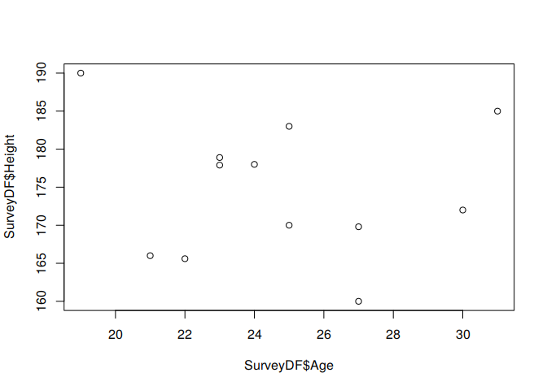
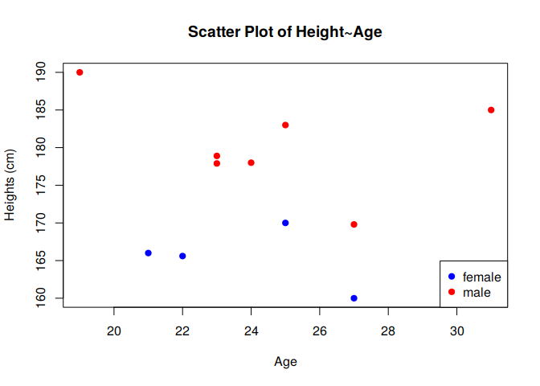
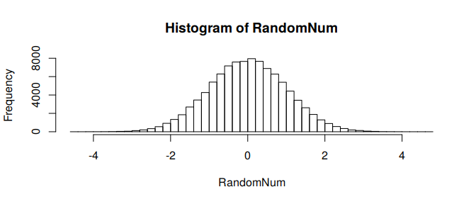

Social Data Science R Crash Course
================
Dr. David Garcia

Welcome to the R tutorial of Social Data Science\! Exercise sessions and
self-study tasks will help you to apply the knowledge learned in class
and gain experience.

# Introduction to R

R is a free software environment for statistical computing and graphics.
It compiles and runs on a wide variety of UNIX platforms, Windows and
MacOS. In this course we will be using R in the RStudio environtment to
perform our exercises. Exercise sheets and solutions will be R Markdown
documents that combine and format text, code, and code output.

Follow the instructions from the links provided below to download and
install R and RStudio on your computer:

R <https://www.r-project.org>  
RStudio <https://www.rstudio.com> R Markdown
<http://rmarkdown.rstudio.com/>

Once you have successfully installed R and RStudio, you can follow
through the basic commands below to get familiar with R. If everything
else fails, you can run this crash course in R Studio Cloud -
<https://rstudio.cloud/project/852344>

**Remember that there is a great community using R and you can always
search online for the way to do things.**

Crash course overview: - Simple operations - Control flow - Sampling and
histograms - Reading data - Data frames - Plotting and summary
statistics

# 0\. Getting help

If you don’t know what a function does, try searching for help with “?”

``` r
? mean
```

If you don’t know how to do something, your fellow programmer is your
friend. For
example:

<https://stats.stackexchange.com/questions/157661/how-to-calculate-mean-median-mode-std-dev-from-distribution>

# 1\. Simple operations

You can use either “\<-” or “=” to assign a value to a variable.

``` r
a <- 5
b = c(2,4,6,8)
d <- c(3,5,7,9)
```

The “c” in the above vector assignment stands for combine into a vector.
The elements in the array are indexed from 1 to n.

You can see the result by typing the variable name to the console.

``` r
a
```

    ## [1] 5

``` r
b
```

    ## [1] 2 4 6 8

``` r
d[3]
```

    ## [1] 7

Now we can do some arithmetic with the vectors.

``` r
a*b
```

    ## [1] 10 20 30 40

``` r
b+d
```

    ## [1]  5  9 13 17

``` r
b+1
```

    ## [1] 3 5 7 9

Notice when a vector is multiplied with a scalar, each of the element is
multiplied. And when vectors are added/multiplied, they must be the same
dimension and the arithmetic happens elementwise.

Boolean values can also be stored and manipulated in R

``` r
b1 <- TRUE
b2 <- 1>2
```

``` r
b1 & b2
```

    ## [1] FALSE

``` r
b1 | b2
```

    ## [1] TRUE

rep, seq, and rev are useful functions to produce and manipulate simple
vectors

``` r
rep(1,7)
```

    ## [1] 1 1 1 1 1 1 1

``` r
seq(1,7,by=2)
```

    ## [1] 1 3 5 7

``` r
rev(seq(1,7))
```

    ## [1] 7 6 5 4 3 2 1

Your turn:

**1.1) We create a vector V with the even numbers between 1 and 10. Show
its content.**

``` r
#Your code here
```

**1.2) We look at its third entry and test if it is larger than 3.**

``` r
#Your code here
```

**1.3) Reverse its order and divide each of its entries by 2.**

``` r
#Your code here
```

**1.4) Calculate the 10 modulo 7. (Hint: search in Google or
Stackoverflow)**

``` r
#Your code here
```

# 2\. Control flow

R is a programming language after all, how do we check for conditions or
go through iterations?

if/else statements allow you to check for conditions:

``` r
x <- 4
if (x>4)
{
  print("larger than four")
}  else
{
  print("four or less")
}  
```

    ## [1] "four or less"

for loops are fixed length iterations:

``` r
sequence <- seq(1,5)
for (i in sequence)
{
  print(i+1)
}
```

    ## [1] 2
    ## [1] 3
    ## [1] 4
    ## [1] 5
    ## [1] 6

while loops let you iterate as long as a condition is met:

``` r
i <- 1
while (i<5)
{
  print(i) #infinte loop!!!!!!
}
```

**Note:** control flow is very inefficient in R, we will learn faster
methods for large datasets later in the course

Your turn:

**2.1) Iterate over the numbers from 1 to 50 and print the ones
divisible by 7.**

``` r
#Your code here
```

# 3\. Reading data

Data is essential for our tasks. A table can be easily imported from
local files csv file via read.csv(). Or you may try other functions like
read.table() and adjust to different data formats. In this exercise, we
use a survey result stored in a .csv
file:

``` r
testDF <- read.csv("TutorialHeights_Test.csv", header = TRUE, sep = ",", quote = "\"",
                           stringsAsFactors = FALSE)
head(testDF)
```

    ##           Timestamp Age Gender Height
    ## 1 2/3/2017 14:35:29  25   Male    183
    ## 2 2/3/2017 14:40:08  25 Female    170
    ## 3 2/3/2017 15:11:44  24   Male    178
    ## 4 2/3/2017 15:12:00  27 Female    160
    ## 5 2/3/2017 15:12:12  21 Female    166
    ## 6 2/3/2017 15:56:21  30    XXX    172

``` r
SurveyDF <- testDF
```

The read.csv and read.table functions have some important parameters:

  - header (TRUE/FALSE) whether the first line of the file contains the
    names of the columns
  - sep: character that separates columns in the file
  - quote: character that defines strings in the file, to prevent
    strings to be divided in two columns
  - stringsAsFactors (TRUE/FALSE) whether strings should be converted in
    categorical factors

Your turn:

**3.1) Open the file “TutorialHeightsSurvey.dat” in a plain text reader
to see its content. Then load it into R and name it SurveyDF. Print its
first 7 lines.**

``` r
#Your code here
```

# 4\. Data frames

Data frames are a general way to store multimodal data in R. They are
composed of rows with one value in each column.

``` r
names(SurveyDF)
```

    ## [1] "Timestamp" "Age"       "Gender"    "Height"

``` r
head(SurveyDF)
```

    ##           Timestamp Age Gender Height
    ## 1 2/3/2017 14:35:29  25   Male    183
    ## 2 2/3/2017 14:40:08  25 Female    170
    ## 3 2/3/2017 15:11:44  24   Male    178
    ## 4 2/3/2017 15:12:00  27 Female    160
    ## 5 2/3/2017 15:12:12  21 Female    166
    ## 6 2/3/2017 15:56:21  30    XXX    172

You can access individual rows:

``` r
SurveyDF[2,]
```

    ##           Timestamp Age Gender Height
    ## 2 2/3/2017 14:40:08  25 Female    170

And individual values by position:

``` r
SurveyDF[3,4]
```

    ## [1] 178

Columns in dataframes are accessed with the “$”
    operator:

``` r
SurveyDF$Height
```

    ##  [1] 183.0 170.0 178.0 160.0 166.0 172.0 165.6 190.0 178.9 169.8 177.9
    ## [12] 185.0

You can index entries in the column:

``` r
SurveyDF$Height[1:3]
```

    ## [1] 183 170 178

You can add a column

``` r
SurveyDF$sequence <- seq(1,nrow(SurveyDF))
head(SurveyDF, n=3)
```

    ##           Timestamp Age Gender Height sequence
    ## 1 2/3/2017 14:35:29  25   Male    183        1
    ## 2 2/3/2017 14:40:08  25 Female    170        2
    ## 3 2/3/2017 15:11:44  24   Male    178        3

You can manually produce your own data frame. Use NA (Not Available) to
mark missing
values

``` r
newrow <- data.frame(Timestamp=NA, Age=31, Gender="Male", Height=185, sequence=0)
print(newrow)
```

    ##   Timestamp Age Gender Height sequence
    ## 1        NA  31   Male    185        0

And add to the other dataframe row-wise

``` r
SurveyDF2 <- rbind(SurveyDF, newrow)
tail(SurveyDF2)
```

    ##             Timestamp Age Gender Height sequence
    ## 8   2/3/2017 16:15:53  19   Male  190.0        8
    ## 9   2/3/2017 16:25:12  23   male  178.9        9
    ## 10  2/3/2017 16:25:29  27   male  169.8       10
    ## 11  2/7/2017 17:41:35  23   male  177.9       11
    ## 12 2/20/2017 12:13:33  31   male  185.0       12
    ## 13               <NA>  31   Male  185.0        0

Your turn:

**4.1) Save the first, third, and fifth rows of SurveyDF in another data
frame and print its first column.**

``` r
#Your code here
```

**4.2) Print the heights of the rows in SurveyDF of gender “female”.**

``` r
#Your code here
```

# 5\. Plotting and statistics: How tall are we?

We can produce a simple scatterplot of the data using the plot()
function

``` r
plot(SurveyDF$Age, SurveyDF$Height)
```

<!-- -->

We are aware that height might depend on gender. What genders do we have
in the dataset?

``` r
unique(SurveyDF$Gender)
```

    ## [1] "Male"   "Female" "XXX"    "male"

Some genders might not be in our list of values and capitalization
should be taken into account. To clean genders:

``` r
SurveyDF$Gender <- tolower(SurveyDF$Gender)
err <- SurveyDF$Gender!= "male" & SurveyDF$Gender != "female"
SurveyDF$Gender[err] <- NA
SurveyDF$Gender <- as.factor(SurveyDF$Gender)
unique(SurveyDF$Gender)
```

    ## [1] male   female <NA>  
    ## Levels: female male

Now we make a better scatter plot with points colored by gender and
proper axes labels:

``` r
plot(SurveyDF$Age, SurveyDF$Height, xlab="Age", 
     ylab="Heights (cm)", main="Scatter Plot of Height~Age", pch=19,
     col=c("blue","red")[SurveyDF$Gender])
legend("bottomright", legend = levels(SurveyDF$Gender),
       col=c("blue","red"), pch=19)
```

<!-- -->

What is the mean height of each gender, and how much do they vary?

``` r
MaleDF <- SurveyDF[SurveyDF$Gender=="male",]
mean(MaleDF$Height, na.rm=TRUE)
```

    ## [1] 180.3714

``` r
sqrt(var(MaleDF$Height, na.rm=TRUE))
```

    ## [1] 6.412154

``` r
FemaleDF <- SurveyDF[SurveyDF$Gender=="female",]
mean(FemaleDF$Height, na.rm=TRUE)
```

    ## [1] 165.4

``` r
sd(FemaleDF$Height, na.rm=TRUE)
```

    ## [1] 4.111772

Your turn:

**5.1) Sort the height values and plot them in sequence with squares as
symbols.**

``` r
#Your code here
```

**5.2) Print the mean and median height. Then print the standard
deviation of the age of females (Hint: check ?sd).**

``` r
#Your code here
```

# 6\. Sampling and histograms

Now we will learn Gaussian distribution and plot it in R. The rnorm
function lets you sample values from a normal distribution, and hist
shows a histogram of values.

``` r
# Set seed for random generator
set.seed(23-2-2017)
# Generate 100000 random numbers from normal distribution
RandomNum <- rnorm(100000, mean=0, sd=1)
# Calculate and plot histogram
hist(RandomNum,breaks=50)
```

<!-- -->

The *dnorm* function returns the value of the Gaussian density function
at the specified point. Below are a few examples and a plot for a range
of values.

``` r
dnorm(0)
```

    ## [1] 0.3989423

``` r
dnorm(1, mean=2, sd=2)
```

    ## [1] 0.1760327

``` r
x <- seq(-5,5,by=.1)
y <- dnorm(x)
plot(x,y, type="l")
```

<!-- -->

Your turn:

**6.1) Plot the histogram of 1000 values sampled from the uniform
distribution between -10 and 10. If you get lost, type ?distribution or
search online.**

``` r
#Your code here
```

# 7\. To practice more…

**7.1) Print the Fibonacci sequence up to the last number below 100.**

``` r
#Your code here
```

**7.2) Print the height values of the survey dataframe that are higher
than the height of the row above them.**

``` r
#Your code here
```

**7.3) On the same figure, plot the sorted heights of each gender with
points and lines between them, coloring them according to gender. Double
the size of points and make axis labels 50% larger.**

``` r
#Your code here
```

**7.4) Run through the following code to install and load the rtweet
package. Go through the authentication vignette to create an app and a
developer account that allows you to access Twitter data.**

``` r
install.packages("rtweet")
library(rtweet)
vignette("auth", package = "rtweet")
```

# 8\. To learn more about R and Markdown

  - Now you have learned the very basics of R. Fell free to play with
    the program a bit more. If you need more information on a function
    in regards to what it does and what input it takes, simply type
    *help(functionName)* in the console and you will get a detailed
    discription. A good resource to learn more about R can be found
    here: <http://www.cyclismo.org/tutorial/R/>

  - Furthermore a short R reference sheet with some commonly used
    functions can be found here:  
    <https://cran.r-project.org/doc/contrib/Short-refcard.pdf>

  - RStudio primers are a great way to learn more interactively:
    <https://rstudio.cloud/learn/primers>
