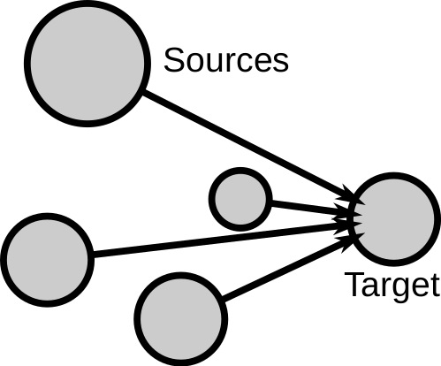
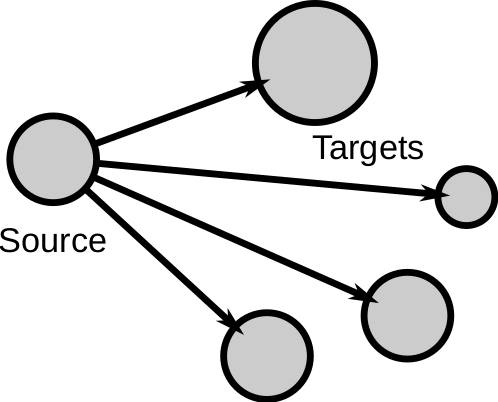

### What is Social Impact?

  
Example of social impact: [an intervention](https://www.imdb.com/title/tt1256186/).

> **Social Impact:** Changes in behavior that occur in an individual as a result of presence or actions of other individuals

Examples of behavior: subjective feelings, motives, emotions, thoughts, customs, decisions...  

The presence or actions of others can be:  

- *real:* the physical presence of others  
- *implied:* expected or manipulated presence, e.g. a cardboard policeman  
- *imagined:* mental representation of others, e.g. supporters of your team when watching TV sports

[Solomon Asch's conformity experiments](https://en.wikipedia.org/wiki/Asch_conformity_experiments) showed some early evidence of how social impact works. These experiments focused on how often people change their behavior due to peer pressure in a group. In the elevator experiment, a group of experiment helpers (also called confederates), display some behavior different to the one of an unsuspecting experiment participant. The recorded outcome is whether the participant imitates their behavior, for example looking away from the elevator entrance. In the experiment, they changed the number of confederates, finding that the more people are exerting peer pressure, the higher the probability of the participant to change their behavior. You can see a comedic version of the experiment for the Candid Camera TV show in 1962: 

[{width=100%}](https://www.youtube.com/watch?v=XZDLbbfT9_Q "Elevator experiment in Candid Camera (1962)")

### Social Impact Theory

[Bibb Latané](http://latane.socialpsychology.org/)  is a social psychologist that integrated the know experimental evidence on social impact in a mathematical theory. Experiments measured impact as the tendency of individuals to change their behavior in a social situation, which was the principal measurement of the extent of impact[^1]. The theory proposes social impact as driven by social forces and is used to derive testable hypotheses about the principles that drive social impact.

  
Schema of impact on a target.

In [Social Impact Theory](http://psycnet.apa.org/psycinfo/1982-01296-001), social impact is driven by three forces in the following equation:

$I = f (S × i × N)$

- $I$ is the magnitude of social impact, e.g. the probability of a person to turn in the elevator  
- $f()$ is a multiplicative function[^3] of three conditions of the impacting social situation:  
        1. Strength ($S$) or power of the source(s), e.g. Are the people in the elevator my bosses?  
        2. Immediacy ($i$) or proximity of the source(s), e.g. Is the elevator big and they are far?  
        3. Number of sources ($N$) or number of people, e.g. How many people enter the elevator?

The effect of these three forces is empirically testable, here we will see some examples of experiments testing hypotheses drawn from Social Impact Theory. Figures with experiment results are taken from Bibb Latané's 1981 paper ["The psychology of social impact"](http://psycnet.apa.org/psycinfo/1982-01296-001).

### N: Number of sources

  
Conformity experiment result.

SIT predicts that impact should grow with N. Asch's conformity experiments test this hypothesis. For example, high  school students are asked a simple question to which they can answer correctly or incorrectly. Confederates in the crowd give the wrong answer. In this experiment:  

- $I$: increase in percentage of wrong answers given by students that were experiment subjects
- $N$: controlled number of confederates

The result: the percentage of wrong answers grows with the amount of sources.[^2] The shape of the relationship between the extent of impact and the number of sources is an example of the Psychosocial Law:

> **The Psychosocial Law:** The extent of social impact grows sublinearly with the number of sources  

This can be translated to the equation:

$I \propto N^t, t < 1$

  

This means that the hundredth source has less additional effect than the first. It is an example of *diminishing returns*, which you might have heard in the context of economics or finance. Think that  earning \$100 is much more valuable when you are poor than when you are rich. The equation is what is called a power-law with exponent $t$. In the case of conformity among high school students, $t$ was estimated to be 0.48.

### S: Strength of sources

  
Anxiety experiment result.

The strength in Social Impact Theory is the perceived social status, power, wealth, importance, or intensity of the sources. Social Impact Theory predicts that impact will grow with the strength of sources. The embarrassment experiment shows the effect of strength by measuring the impact of audiences of different strength on the stress of a speaker. College students were asked to recite a poem in front of an audience. In this experiment:

- $I$: recorded anxiety of the students recorded with a dial they use to measure their own anxiety
- $N$: number of people in the audience
- $S$: audience is middle-aged (strong) or teenagers (weak)

The result: anxiety grows with N and is larger for the high strength condition.

> **Multiplicative effect:** The impact of the numbner of sources grows faster when they are stronger

### i: Immediacy of sources

As [Mark Zuckerberg said](https://www.forbes.com/sites/zarastone/2016/10/10/11-times-mark-zuckerberg-kept-it-real/), “A squirrel dying in front of your house may be more relevant to your interests right now than people dying in Africa.“. Despite the cynicism of the sentence, it captures the effect of the immediacy of sources (in front of your house vs Africa, assuming you don't live in Africa) and how it can replace the strength of sources (a squirrel vs people).

  
Newspaper experiment result.

Immediacy is defined as the proximity between the sources and the target of social impact. Immediacy can be spatial, as in the example of Zuckerberg's squirrel, it could be in time, where recent events are more immediate than long past ones, or social, where sources with social ties with the target or perceived as similar would have more impact.

The effect of immediacy can be observed in media bias experiments. Students are asked to write a newspaper with a fixed space, assigning space to different news pieces. The information about an accident is manipulated to measure its impact based on the space the students dedicate to the accident. In this experiment:

- $I$: number of lines used to report the news by the students
- $N$: number of people reported dead in the accident
• $i$: is the distance to the place of the accident (close vs far conditions)

Results: Space increased sublinearly with N (psychosocial law). The close condition had higher impact than the far one. There was a multiplicative effect: The amount of space given to each new person involved in the accident grows faster for the immediate event.

### Division of impact

  
Impact from a source to a group.

Social Impact Theory also covers situations with one source but when when targets are not alone. It formulates the impact $I$ on **each** target as:  

$I = f  (\frac{1}{S × i × N})$

Where the terms are:  

- $S$ strength of the targets: the stronger the targets, the harder to impact each one.  
- $i$ immediacy between the targets: the closer or more connected the targets, the harder to impact each one.  
- $N$ the more the targets in the group, the harder to impact each one.
- $f()$ is another multiplicative function but with negative exponents for the terms.

  

The most widely studied divisor of impact is group size (N). An observational study finds the effect for the case of restaurant tips to the waiter/waitress in the US, where the data traces are the final tickets of restaurant tables. Here the source of impact is the waitperson and the impacted are the customers on the table, thus:

- $I$: Percentage of tip (assumed evenly shared among customers)
- $N$: number of customers at the table

Result: $I$ decreases as $N$ increases. The more people sitting at the same table, the less obliged each one feels to leave a tip. The resulting shape of I as a function of N is well fitted by a negative power of N. For this reason, many restaurants set a minimum tip when tables have many customers.

Another example of the division of impact is the story about the murder of Kitty Genovese. Kitty Genovese was stabbed to death on the street in 1964, with many witnesses. Soon after, the New York Times had the headline: ”38 Who Saw Murder Didn't Call the Police“. This led to research in Social Psychology about the **bystander effect:** division of impact in case of intervening or helping. In this case the individual change of behavior (calling the police) decreases with the number of people impacted (number of neighbors watching). If impact per observer becomes too low, nobody might intervene, producing a paradoxical situation like the one reported by the New York Times. The bystander effect has been widely replicated in experiments and observed in many other situations.

There was a strong social shock around the murder of Kitty Genovese, impacting culture and research. Later investigations suggest that the story was distorted and exaggerated by the New York Times, as several people did call the police but it was the police who did not react because they thought it was a lover's quarrel. Nevertheless, the bystander effect is real and the story of Kitty Genovese is a cautionary parable that inspired lots of empirical research.

### Online social impact

Social impact has been studied in the case of online settings, often referred to as social influence. Here, the change in behavior tends to be an online action like watching a video, retweeting a tweet, or liking a post. 
An overview of some of these effects can be found in Kristina Lerman's review ["Information Is Not a Virus, and Other Consequences of Human Cognitive Limits"](http://www.mdpi.com/1999-5903/8/2/21). 

The psychosocial law can be observed in various social media, for example, on [Digg](https://ieeexplore.ieee.org/document/6406290) and [Twitter](https://dl.acm.org/doi/abs/10.1145/1963405.1963503):

  
You can see the sublinear curve of impact for a person (probability of digging or retweeting) as a function of the number of sources (number of friends who digged or retweeted). An interesting observation is the inverse U-shape for the case of Digg: when too many of the friends of a person have already done it, the probability decreases. Social Impact Theory predates social media by several decades and a case with such a large $N$ was beyond the implied range of number of sources. For example, the experiment in the high school had at most $N=8$. As information overload is a recent phenomenon, social science theories need to be adapted to include it.

The division of impact can be seen on Twitter too. [In my own research,](https://osf.io/preprints/socarxiv/9ve3x/) I analyzed the impact of a Twitter user as a function of the number of their followers, testing if the impact per follower decreases with the number of followers. If we sum up all cases of influences, this translates into a sublinear growth of the total impact of a user with the number of followers they have:

{width=75%}

On the above figure you can see the results of the analysis of the mean number of retweets of users as a function of their number of followers (popularity). The various lines you see correspond to users with different centralities, calculated with a method that you can learn in the [centrality topic of the course](). You can see that most lines are sublinear, lending evidence to the division of impact hypothesis. Only for very central users it seems to approach linearity, but not really becoming superlinear. The exercise of this block will be another test of the division of impact hypothesis on Twitter.

[^1]: A note on how to measure impact: Impact is not always necessarily measured as the probability of an event, it can have other magnitudes. For example the degree of stress in an embarrassing situation or the amount of lines written about news in media experiments. These are also changes on behavior but can be measured in a scale.]  
[^2]: Sometimes Asch's experiment results are cited in an exaggerated way by saying that people *always* change their answer to the wrong one due to peer pressure. That did not happen in Asch's experiment, in the figure you can see that the highest percent of changes to the wrong answer is below 40%.
[^3]: For consistency with Latané's work, I keep the same notation for the social impact formulas. However, this formula would be more clearly formulated as $I = a * S^v * i^u * N^t + c$, where $a,v,u,t,c$ are parameters that regulate the shape of the multiplicative function. This could also have additional linear term for each of the variables or for products of powers of two variables, what is sometimes called a multinomial model. Most experiments cannot generate sufficient data to fit so many parameters, and therefore Latané's formulation is more conceptual than mathematical.

