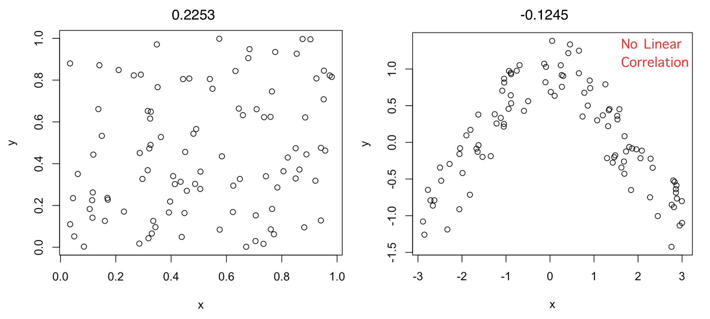

### Some univariate statistics notation

- $X$ is a random variable
- In data: $X_i$ is the value of the variable for entry $i$, for example the GDP of a country
- $E[X]$ is the expected value of $X$
  - We estimate the expected value as the mean of $X$: $\mu_X = \frac{1}{N}\sum_i X_i$
  - $N$ is the number of data points, for example the number of countries
  - In R you can calculate it with the function mean()
- $V[X]$ is the variance of $X$
  - We calculate it as the expected squared difference to the mean X: $V[X] = \frac{1}{N}\sum_i (X_i - \mu_X)$
  - The variance is measued in the square of units of X (e.g. if X is GDP measured in USD, then V[X] is USD$^2$)  
  
- $\sigma_X$ is the standard deviation of X
  -  $\sigma_X = \sqrt{V[X]}$, which is convenient because it measures dispersion in the same units as $X$
  - in R you can calculate it with the function sd()

### Pearson's Correlation Coefficient

> **Correlation:** Linear association or dependence between the values of variables X and Y

Pearson’s way to measure correlation between variables $X$ and $Y$, deonted as $\rho(X,Y)$:  

- If X and Y are independent, they satisfy that the expectation of the product equals the product of expectations:  

$E[XY] = E[X]E[Y]$  

- The principle: measure correlation as the deviation from $E[XY] − E [X]E[Y] = 0$  
- The absolute value of this difference can be at most $\sigma_X\sigma_Y$  
- $\rho(X,Y)$ rescales the difference to be between −1 and 1  

$\rho(X,Y) = \frac{E[XY] − E [X]E[Y]}{\sigma_X\sigma_Y}$  

- Can be computed in R with the function cor()

### Some examples of Pearson's Correlation Coefficient:

Independent variables will have a correlation close to zero, but a correlation close to zero does not mean independence

### Anscombe's quartet

[Anscombe's quartet](https://en.wikipedia.org/wiki/Anscombe%27s_quartet) has four examples of scatter plots for two variables. All cases have the same mean and standard deviation for the variables, and the same positive correlation coefficient: 0.816

The first case fits what we expect of linear correlation. The second shows a nonlinear correlation where the upwards trend becomes downwards, the third is a case where an outlier decreases the correlation coefficient and the fourth case is a correlation coefficient generated by a single outlier. Always look at scatter plots to know what your correlations mean!

### The Datasaurus dozen

The [Datasaurus dozen](http://www.thefunctionalart.com/2016/08/download-datasaurus-never-trust-summary.html) shows 12 (+1) examples with the same means and standard deviations and the same correlation coefficient of -0.06:

Remember, not everything that has a correlation of zero is independent! There are many kinds of relationships between variables beyond linear ones.