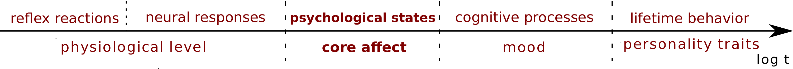

### What are emotions?

There are several definitions of emotions and theoretical approaches to study them. In this course we will follow what is called the definition of emotions as **core affect**: Short-lived psychological states that consume the individual's energy and strongly influence cognition and behavior, for example expression.

Emotional or affective behavior of an individual takes place at various timescales. Depending on the timescale we study, we refer to various types of behavior and their manifestation:

- Reflex reactions are the fastest components of emotions and manifest in very fast physiological responses. One example is jumping from your seat if you see a snake.  
- Core affect operates at a slower timescale and can be assessed by asking people to answer questions about their emotional states. These states relax quickly and are triggered by a perceived stimulus (event) that is appraised (evaluation or interpretation).  
- Mood is a slow and constant emotional state that can have various components (e.g. be positive and negative at the same time). Mood changes slowly throughout the day and does not need to change because of a stimulus.  
- Personality traits are lifelong behavior patterns, some of them relate to the way we cope with our emotions or react to the emotions of others. It takes many years for a personality trait to change.

Affective Science is the (interdisciplinary) scientific study of emotions. Computational Affective Science applies methods from Computer Science and Data Science to Affective Science. Some examples are:

- Affective Computing: Development of systems that detect, process, and elicit emotion  
- Cyberpsychology of Affect: Understanding the interplay between emotions and ICT  
- Emotion Recognition: Identification of human emotion using any kind of modality: text, voice, facial expression, physiological signals (skin conductance, muscle activity, EEG, fMRI), etc  
- Sentiment Analysis: Detection of subjective states from (textual) data, including emotion

### Measuring emotions

To empirically study emotions, we need methods to measure them. Emotions can be measured through various signals and observable behaviors of individuals.

- Emotion self-reports: individuals answer a question about their emotional state or rate their emotions in a scale  
- Facial expression: the image of the face of a person is interpreted by other people to annotate emotions or automatically processed with detection software  
- Verbal expression: spoken expression with its prosody (e.g. volume of voice) or written text annotated by other people or with sentiment analysis  
- Brain activity: based on magnetic resonance or electroencephalograms to measure activity in brain regions asociated with certain emotional states  
- Other physiological signals: Muscle activation (e.g. frowning, smiling), heart rate, skin conductance (sweating), etc. Measured with physical sensors or other passive methods like wristbands.

In the following, we are going to cover four models of how to capture emotions in quantitative research. Some approaches are better for some modes or signals (e.g. text, facial expression) than others.

### Ekman's basic emotions model

  

Ekman's basic emotions. [[Source]](https://cdn.psychologytoday.com/sites/default/files/blogs/65698/2012/05/94863-91386.jpg)

Developed by [Paul Ekman](https://psycnet.apa.org/record/1988-04343-001) to classify how emotions are expressed through faces. It is sometimes called the "universal emotions" model, although there is a lot of evidence about how facial expression of emotions has strong cultural components. It classifies emotions as the six discrete states shown in the figure.

The basic emotions model can be used to classify emotional states from facial expression, especially when the participants of a study come from the same culture and they are with someone else who sees their face. The six emotions were chosen to maximize identification of emotions in faces, thus it was not designed to measure emotions from other modes of expression (e.g. text).

Some of the original references on the model include the emotion "happiness", but this one was found to be especially culturally sensitive. Nowadays the term "joy" is used more often to refer to sort-lived very positive emotional states.

### Plutchik's wheel of emotions

  

Robert Plutchik organized emotional states and more more complex feelings starting from eight basic states. This model gives a first insight into how to classify emotions into very nuanced emotion words including terms like "terror", "vigilance", and "acceptance". The second wheel from the center is the one used the most often when generating a short list of emotional states, including the six emotions of Ekman's model (joy, fear, surprise, sadness, disgust, anger) and two other emotional states (trust and anticipation).

Plutchik's wheel was designed based on theoretical arguments and introspection, not with a measurement mode in mind. Some states are ambiguous or too complex and others are missing. 
Quoting Smith & Schneider, 2009: "researchers no longer take Plutchik's (1962, 1980, 2002) theory seriously.". Nevertheless, this model has been used as the basis for several text analysis methods you can find in the [unsupervised sentiment analysis topic](https://dgarcia-eu.github.io/SocialDataScience/3_Affect/032_UnsupervisedSentimentAnalysis/UnsupervisedSentimentAnalysis.html). More recent empirical research on self-reports finds a more comprehensive list of [27 emotional states](https://www.pnas.org/content/early/2017/08/30/1702247114) that can be used to list more complex emotions.

### The circumplex model of affect

  

Developed by James Russel to measure emotional experiences with scalar dimensions. James Russell made a long list of emotional state terms and asked several questions to participants about each emotion. Then performed dimensionality reduction on the answers and found that two dimensions explained a lot of the variance of responses between emotions:

- **Valence:** the degree of pleasure experienced in an emotion  
  - Explains the most variance with a positive/pleasant to negative/unpleasant scale  
  - It can be measured physiologically with smiling and frowning muscle activity  
  - It is the most common dimension of emotions included in text analysis  

- **Arousal:** the level of activity associated with an emotion  
  - Explains less variance than valence but it is informative to differentiate emotions  
  - Not necessarily related to sexual activity
  - It can be measured with skin conductance and heart rate sensors  
  - Not so common in text analysis but can be estimated from voice tone  
  
[Long lists of emotional words](https://link.springer.com/article/10.3758/s13428-012-0314-x) have been mapped to the dimensions of valence and arousal. Individuals can rate their own emotions in scales of valence and arousal without problems. Some theoretical approaches in affective science question emotions as discrete states, posing emotion words as necessary discrete symbols for communication but emotional states existing in a continuum of various dimensions.

Further research uses a third dimension, dominance (or its inverse, potency). Dominance measures th level of power associated with an emotion. In some modalities it is highly correlated with valence, but often it is useful when differentiating fear from anger.
  
### Positive And Negative Affect Schedule

  

Designed by Watson and Tellegen to measure affect in a questionnaire. It measures two dimensions, one for Positive Affect and one for Negative Affect. Both dimensions can be low at the same time (neutral emotion) and high at the same time (mixed emotions like nostalgia). The questionnaire, commonly called PANAS, measures the frequency and intensity of recent emotional episodes and thus is less focused on a momentary emotional state like the circumplex scales. This model is to certain extent a rotated version of the circumplex, as the union of the positive and negative scales can be used to approximate arousal and their difference to approximate valence.

The PANAS schedule is the principle behind very influential supervised and unsupervised sentiment analysis methods for text processing, in particular LIWC and SentiStrength. You can learn more about them in the [unsupervised sentiment analysis topic](https://dgarcia-eu.github.io/SocialDataScience/3_Affect/032_UnsupervisedSentimentAnalysis/UnsupervisedSentimentAnalysis.html) and in the [supervised sentiment analysis topic](https://dgarcia-eu.github.io/SocialDataScience/3_Affect/034_SupervisedSentimentAnalysis/SupervisedSentimentAnalysis.html).