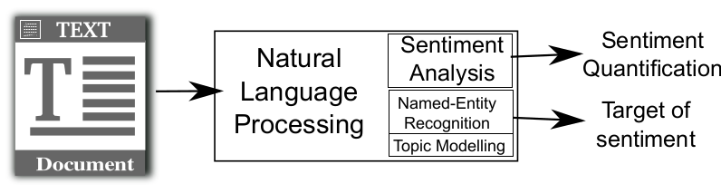

###  What is Sentiment Analysis?

> **Sentiment Analysis:** Computerized quantification of subjective states from text

- Examples of subjective states: Emotions, feelings, attitudes, opinions...  
- Often vaguely defined and roughly equivalent to the dimension of valence in Russell's model
- Sentiment quantification can have various formats    
  - Polarity of the text: positive, negative, or neutral  
  - Numeric scores of positive and negative content  
  - Labels of emotions in text: e.g. Joy, Anger, Sadness, Disgust, Surprise...

Sentiment analysis is a subfield of Natural Language Processing. It can be combined with other tools like Named-Entity Recognition or Topic Modelling to contextualize the sentiment, for example finding its origin or targets. Here we focus on how to quantify sentiment from text, especially in social media and other kinds of digital traces.



There has been a scientific boom in sentiment analysis with several workshops, journal issues, and books devoted to the topic. Every year there are hundreds of research papers on the topic. You can see this rise in the [Google Trends volume](https://dgarcia-eu.github.io/SocialDataScience/1_Introduction/017_gtrendsR/gtrendsR.html) for the term "sentiment analysis":

```{r echo=F, fig.width=8, fig.height=3}
library(gtrendsR)
library(ggplot2)
trend <- gtrends("sentiment analysis", time="all")
ggplot(trend$interest_over_time, aes(x=date, y=hits)) + geom_line() + ylab("Google search volume") + xlab("Date") + theme_bw()
```

While peak interest seems to have been reached in 2019, there is still a lot of interest and open research questions in sentiment analysis.

### Supervised vs Unsupervised sentiment analysis

**Unsupervised sentiment analysis:**  

- Uses expert knowledge (e.g. from psychologists) to quantify emotions  
- Expert knowledge is encoded as a set of rules or a lexicon (dictionary) of words  
- Pros: Simple implementation, large coverage and recall  
- Cons: Hard to customize for a particular context, low precision, expert bias

**Supervised sentiment analysis:**  

- Uses a set of annotated texts to fit a model  
- Annotations can come from readers or the authors of texts  
- Pros: Automatic calibration, high precision  
- Cons: Lower recall and coverage, need very large training datasets  
- You can find more about in the [Supervised Sentiment analysis topic](https://dgarcia-eu.github.io/SocialDataScience/3_Affect/034_SupervisedSentimentAnalysis/SupervisedSentimentAnalysis.html)

Both approaches can be combined in what is called semi-supervised or ensemble methods. Some of these approaches mix supervised and unsupervised models in one classifier. 

Evaluation and generalizability are key arguments when choosing a sentiment analysis method. You can learn more about them at the end of the [Supervised Sentiment analysis topic](https://dgarcia-eu.github.io/SocialDataScience/3_Affect/034_SupervisedSentimentAnalysis/SupervisedSentimentAnalysis.html) and compare yourself supervised and unsupervised methods in [Evaluating sentiment analysis methods exercise](https://dgarcia-eu.github.io/SocialDataScience/3_Affect/037_SentimentEvaluation/SentimentEvaluation.html).

In this topic we are going to cover various approaches to unsupervised sentiment analysis with examples of methods and software you can use.

<div style="float:right">
  
</div>
### The General Inquirer

The pioneer work of [Philip Stone in 1966](https://mitpress.mit.edu/books/general-inquirer
) proposed to process text with a computer to detect the use of words of various categories. This set the basis for **dictionary methods** in unsupervised sentiment analysis, which are based on counting the number of appearances of the words of a list in a text. The original version of the General Inquirer contained many word classes including parts of speech, topics, as well as terms for emotions and evaluative language.

The original dictionaries of the General Inquirer were merged with other later dictionaries and an [updated version](http://www.wjh.harvard.edu/~inquirer/homecat.htm) was released in the 1990s. You can access the lists of [positive words](http://www.wjh.harvard.edu/~inquirer/Positiv.html) and of [negative words](http://www.wjh.harvard.edu/~inquirer/Negativ.html) of this version, which served as input for later methods like [SentiStrength](http://sentistrength.wlv.ac.uk/).

The [SentimentAnalysis R package](https://cran.r-project.org/web/packages/SentimentAnalysis/index.html) contains the General Inquirer (GI) dictionary and methods to match words in text.

### Linguistic Inquiry and Word Count (LIWC)

LIWC (pronounced "Luke") was developed as a click-and-run software by [James Pennebaker in 2001](https://liwc.wpengine.com/). Inspired by the General Inquirer, it contains a set of word lists that are matched against words in the text to compute frequencies for each list. The word lists of LIWC were designed to cover both linguistic classes and to capture psychological processes such as cognitive processes, social processes, and emotions. Word lists for LIWC are produced by groups of experts that compare their individual word lists and expand them with synonyms. There have been three versions of LIWC in English (2001, 2007 and 2015) and dictionaries have been generated with the same method for several languages including German, Spanish, French, Arabic, and Chinese.

Here you can see an example of how LIWC words on a text:

{width=50%}

LIWC first tokenizes the text, i.e. it identifies words by looking for separations like whitespaces and punctuation. Then LIWC iterates over each token (word) and checks if it matches any word list in the dictionary. These matches can be "hard" matches for the same exact character string, or "soft" matches with Kleene stems that are prefixes of a word. These are entries in the dictionary that end with a star symbol ("\*"). You see this in the example for the entry "worr\*" that matches "worry" and for "pizza\*" that matches "pizza".

In the example above you can see that words can belong to several word lists, for example the entry for "worr*" is in the "affect" list, in the "negemo" list, and in the "anxiety" list. After running these matchings, LIWC produces a list of frequency measures as the percentage of words in the whole text that are matched against each word list. In the example above, there are 12.5\% words of the "negemo" list and 0\% words of the "posemo" list.

The 2015 version of LIWC includes netspeak terms such as "WTF" or "LOL" and emoticons like ":)", LIWC is a very popular tool due to the ease to use it, for example it offers a way to visualize which words are matched. It is very important to look at these matches to understand LIWC emotion word frequencies, as you can learn in the [Social Data Science story about 9/11 pagers](https://dgarcia-eu.github.io/SocialDataScience/3_Affect/033_PagerEmotions/PagerEmotions.html).

### SentiStrength

[Mike Thelwall](https://asistdl.onlinelibrary.wiley.com/doi/abs/10.1002/asi.21416) developed in 2010 the [SentiStrength](http://sentistrength.wlv.ac.uk/) method: a sentiment analysis method designed to quantify positive and negative sentiment from short, informal social media text.

{width=60%}

SentiStrength processess text in three steps:
  
1. Text preprocessing: correcting misspellings, vowel repetitions, translating emoticons and idioms, etc  
2. Match words from scored list of words in the scale [-5,+5]  
3. Apply modifiers (negation, amplification, de-amplification). These modifiers change the polarity of words and their strength. The final scores are an aggregate of these polarities.

SentiStrength takes two sources of expert input: a word list with sentiment scores and a list of modifier rules including terms for negation, amplification, etc.

SentiStrength outputs two scores: a positive score [+1,+5] and negative score [-1,-5]. Ths design matches the PANAS scales, you can learn more about them in the [Measuring Emotions topic]().

Sentistrength has been adapted and validated for [various languages](http://sentistrength.wlv.ac.uk/#Non-English) including Spanish, German, and Russian. It is distributed as a Java executable with available code and can be run from the command line with text files as input.

### VADER (Valence Aware Dictionary and sEntiment Reasoner)
<div style="float:right">
  
From [VADER python tutorial](
https://t-redactyl.io/blog/2017/04/using-vader-to-handle-sentiment-analysis-with-social-media-text.html
)
</div>

VADER is a tool very similar to SentiStrength, tailored to detect sentiment on Twitter by [C.J. Hutto and Eric Gilbert in 2014](https://www.aaai.org/ocs/index.php/ICWSM/ICWSM14/paper/view/8109). It applies the same three steps as SentiStrenght:

1. Text preprocessing  
2. Word matching from a lexicon of positive/negative scored words  
3. Application of modifiers to the scores based on language rules
 
VADER's name suggests it is the "dark version" of LIWC ("Luke"). As the authors of VADER say: *"VADER distinguishes itself from LIWC in that it is more sensitive to sentiment expressions in social media contexts."*

VADER was implemented in Python and distributed as an [open source package on Github](https://github.com/cjhutto/vaderSentiment) and as part of the [NLTK python library](https://www.nltk.org/_modules/nltk/sentiment/vader.html) for NLP. Its performance was validated against annotated tweets, correlating the scores given by tweet readers with the output of VADER. VADER can be run in R with the [package vader](https://cran.r-project.org/web/packages/vader/index.html). You can learn more about how to use it in the [Running sentiment analysis tutorial](https://dgarcia-eu.github.io/SocialDataScience/3_Affect/035_UnsupervisedToolsR/UnsupervisedToolsR.html).


### Evaluating Unsupervised Sentiment Analysis
<div style="float:right">
  
</div>

Sentiment analysis methods are very easy to use, but that does not mean that their output is always accurate. It is important to choose a sentiment analysis method that captures the type of expression we want and that has been validated for the text we plan to analyze. Even if it has been validated before, you can always do a small validation yourself by annotating a random sample of texts from your dataset and following the steps of the [evaluating sentiment analysis exercise](https://dgarcia-eu.github.io/SocialDataScience/3_Affect/037_SentimentEvaluation/SentimentEvaluation.html).

A guide to see an overview of off-the-self (i.e. ready to use) sentiment analysis methods is [SentiBench](https://epjdatascience.springeropen.com/articles/10.1140/epjds/s13688-016-0085-1). The figure shows a summary of the accuracy of 24 methods and the original article reports various quality metrics for different kinds of texts like movie reviews, newspaper comments, and tweets. The review includes SentiStrength, LIWC, and VADER, which for some datasets can be the best performing among the surveyed methods.

Once we choose a method, then we run the analysis and assess the results. It is important not to choose a lot of different methods to see "which one works" in the statistical analysis, reporting only the ones that give results that we like. This is what is often called [p-haking](https://osf.io/preprints/socarxiv/np5wa/) and can give you misleading results. The best is to run an evaluation like in our [evaluating sentiment analysis exercise](https://dgarcia-eu.github.io/SocialDataScience/3_Affect/037_SentimentEvaluation/SentimentEvaluation.html) to make an informed decision about which method to use before applying it.
