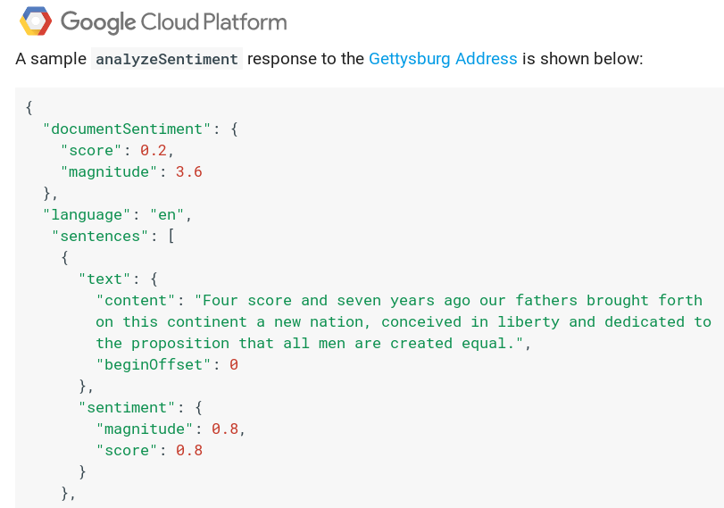

### How to train your model

Supervised sentiment analysis trains a predictive model $M$ from text in three steps:  

 {width=60%}
  

1. **Training**  
    - Texts with annotations of sentiment are used to fit the model  
2. **Validation**  
    - A second set of annotated texts not used for training are used to evaluate the quality of the model: $Q_{1}$  
    - Training and validation steps might be repeated many times to avoid overfitting  
3. **Testing**  
    - One last evaluation run of the fitted model with a leave-out sample of annotated texts. None of these texts should have been part of the validation or training steps  
    - The predictive power of the model is measured by the quality in this testing step: $Q_{2}$

In general, $Q_1 > Q_2$, but for a model that generalizes well the difference should not be large. It is very important to separate the test sample at the very beginning, before any training is done. The test phase should only be done once after all training and validation has been done, if we go back and forth between test and training, we risk overfitting.

### Gold Standards and Ground Truths

A key aspect of supervised sentiment analysis is having accurately labeled texts. The most accurate sentiment annotation would be given by the author right before or after writing the text (gold standard). This is the case for product reviews, where the star rating is provided by the author and it measures a kind of sentiment, in this case the evaluation of the product. 

In some cases we cannot ask the authors for their sentiment or the text was written too long ago. In those cases, scientists ask readers to provide annotations of the text written by other people (silver standard). This assumes that readers understand the sentiment of authors of texts, and in practice the annotations of readers can vary and disagree.

A third approach is using contextual information, for example tweets ending in an emotion hashtag (#sad, #angry) or in an emoticon or emoji. The text used for classification in this case is everything before the hashtag or emoticon. This is an easy way to generate lots of data, but it might not generalize to cases when people would not use that hashtag or emoji in the end.

After choosing a standard, supervised learning requires that we build a Ground Truth dataset to train, validate, and test. The example below is taken from a real case of social media text annotations:

pos | neg | text  
| ----------- | ----------- |  ----------- |
0 | 0 |  I wana see the vid Kyan  
0 | 1 | I cant feel my feet.. that cant be good..  
1 | 0 | 10 absolutely jaw dropping concept car designs http://ow.ly/15OnX  
0 | 0 | Phil Collins- You Can’t Hurry Love

The above dataset contains two annotated classes per text, one labelling whether the text is positive or not, and one whether it is negative or not. In this scheme it would be possible for a text to be both positive and negative.  Other cases might have numeric scores in a scale or text labels for basic emotional states.

### What model to use?

Predictive models use features of the text to predict sentiment labels or scores. First you have to choose what features to calculate. A common approach is called bag-of-words, in which you just make a vector of word counts in the text, ignoring their order. Another approach that uses part of the order is called N-gram counts, which is similar to bag-of-words but you count series of N words instead. For example you could use 2-grams (bigrams) and have a longer vector with the frequency of every possible word pair.

The longer the feature vector, the larger the training dataset you will need to fit your model. Researchers often apply text processing to try to keep the vectors short. For example, they remove stopwords, which are short and frequent words that structure text but do not carry a lot of meaning (e.g. "of", "the", "and"). They also apply spellchecking steps to correct typos, or stemming that simplifies words to their stem (e.g. "lover" to "lov").

After building feature vectors, the model can be trained and evaluated against the dataset, which now is a set of feature vectors each with an annotation (e.g. sentiment score). Then a Machine Learning model is used to learn how to predict the annotation from the feature vector. Common approaches are:  

1. Naive Bayes: Takes features as independent signals and fits the label according to Bayes Rule  
2. Support Vector Machine: Finds a separator given a (non-)linear combination of features  
3. Random Forest: Finds hierarchical decision rules that divide the texts in classes

Often, researchers try several Machine Learning models for the same task and take the one that works the best in the test dataset. But be careful, do no try too many models or you might just find one that works well in the test dataset by chance.

In supervised sentiment analysis, generating the ground truth data is the most critical part and is required to train the model. Producing sufficient annotations from readers or authors can be expensive. Supervised methods are usually not out-of-the-box like unsupervised tools, you would have to fit your own model to a ground truth dataset.

### Evaluating classifiers 

Supervised classifiers train their model by finding the values for parameters that minimize an error measure or that maximize a goodness of fit measure. When we talk about a classification exercise, we can measure the quality of a classifier by using its error matrix. For example, imagine that we try to classify if a text expresses anger (positive case) or does not express anger (negative case). The classifier make a prediction that might match or not the true class. This way we can have four cases

- True positives ($TP$): All positive cases that are correctly predicted, e.g. the text expressed anger and the classifier said the same  
- False positives ($FP$): All negatives that were wrongly predicted as positive, e.g.the text did not express anger but the classifier detected it as angry  
- True negatives ($TN$): All negative cases that are correctly predicted, e.g. the text did not express anger and the classifier said the text is not angry  
- False negatives ($FN$): All positive cases that were incorrectly predicted as negative, e.g. the text does express anger but the classifier said the text is not angry  

  
Visualization of precision and recall. [[source]](https://en.wikipedia.org/wiki/Precision_and_recall)

The most basic measure of performance is **accuracy**, which in this case is the fraction of correct predictions over all predictions:  
$Accuracy = \frac{TP+TN}{TP+FP+TN+FN}$  
However, there can be an imbalance between positives and negatives that gives too much importance to the majority class in the calculation of accuracy. To give a more nuanced understanding of the performance of the classifier, we have two measures:

- **Precision:** the fraction of all positive predictions that are correct  
$Precision = \frac{TP}{TP+FP}$  
The measure of precision answers the question "How sure am I of this prediction?"
- **Recall:** the fraction of all true positives that are correctly predicted  
$Recall = \frac{TP}{TP+FN}$  
The measure of recall answers the question  "How many of the things that I’m looking for are found?"

Classifying everything as positive gives very high Recall but a low Precision. Not predicting anything or saying always false can give high Precision but low Recall. Predictor quality or performance is a trade-off between Precision and Recall. How to find the trade-off depends on risks. For example, if a disease is life-threatening and the treatment is non invasive, Recall is more important than Precision when diagnosing it. If a disease is not very threatening but the treatment has significant side effects, Precision is more important than Recall.

A way to compute a trade-off between Precision and Recall is the $F_1$ score, which is a harmonic mean of Precision and Recall:

$F_1= 2 ∗ \frac{ Precision ∗ Recall} {Precision + Recall}$

The $F_1$ score is often used as a way to summarize the quality of classifiers. When more than one class is possible, you should look at the mean of $F_1$ over the classess or to the $F_1$ of each class separately. The $F_1$ score is often used in sentiment analysis competitions to chose the best tools, for example in the [SemEval 2017 competition](https://alt.qcri.org/semeval2017/index.php?id=tasks).

### Let someone else do it: Black-box APIs

Private companies have set up online services to classify sentiment from text. Two popular examples are [IBM Watson](https://natural-language-understanding-demo.ng.bluemix.net/) and [Google NLP](https://cloud.google.com/natural-language/docs/basics). You need to create an account and get API keys to send your texts to classify. In the response you will receive scores or classes based on their models. Use carefully because they charge for the service, but often you have few thousand requests for free to try. Their output looks like this:

{width=50%}{width=50%}  

In general, there is scarce or absent documentation on the way models are designed or even on the quality of their methods and which data was used to train and evaluate them. These APIs are conventient and can even allow fitting your own ground truth data, but you should always keep your own leave-out sample to measure their quality in your case. 
