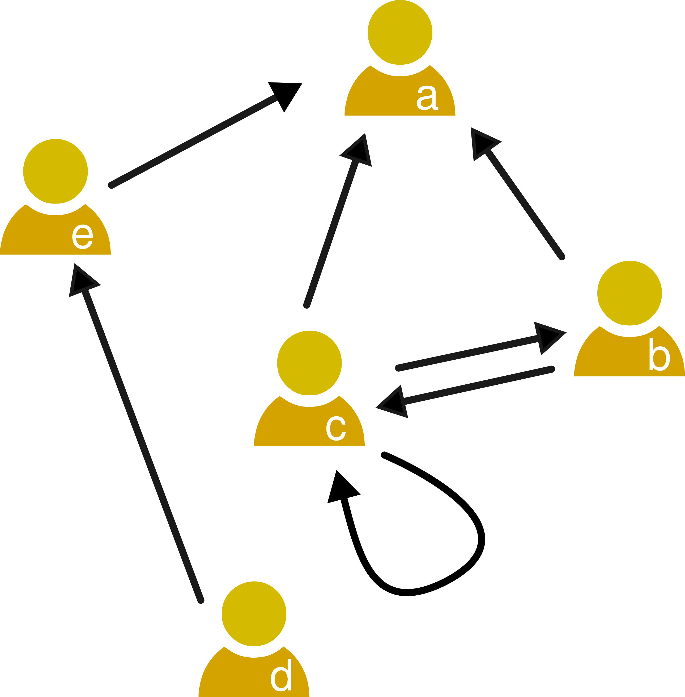

### Social networks

  

Social Networks are models to represent individuals and the relationships between them. The minimal components of a social network are:  

- **Nodes** (or vertices), which represent individuals. These individuals are social actors, for example humans, animals, fictional characters...
- **Links** (or edges) are relationships between individuals, for example friendship, family ties, interaction, communication...

Social network analysis is a research field that systematically collects relational data and analyzes it with visual, statistical, and mathematical methods to understand properties and mechanisms of social interaction.

While early approaches in sociology considered network structures (for example Georg Simmel, whose [work on fashions](https://dgarcia-eu.github.io/SocialDataScience/2_SocialDynamics/022_SimmelEffect/SimmelEffect.html) we already covered), [Jacob Moreno](https://en.wikipedia.org/wiki/Jacob_L._Moreno) is often credited as the "father" of modern Social Network Analysis in the 1930s. In his 1934 book "Who Shall Survive?", Moreno shows how to construct *sociograms* that capture the structure of social relations. The book reports a study of behavior spreading on a boarding school. The figure on the right shows another example of Moreno's sociograms, this time a social network with positive (friends) and negative (enemies) links between people in a town. 

You can find a more complete history of the field in [Linton Freeman's 2004 book](https://www.amazon.com/Development-Social-Network-Analysis-Sociology/dp/1594577145), where he shows how Jacob Moreno's work on the topic was taken from the work of his assistant [Helen Hall Jennings](https://en.wikipedia.org/wiki/Helen_Hall_Jennings). You can find more examples of important women in Social Network Analysis in this [brief list by Brian Keegan](https://twitter.com/bkeegan/status/980658687747416065/photo/2).

### Representing social networks

  

A graph or network is a tuple $G = (V, E)$  
  - V is a set of vertices or nodes  
  - E ⊆ V × V is a set of edges or links  
  - V × V is the Cartesian product (i.e. the set of all possible links)  

Edges are denoted as ordered pairs $(i, j)$, which means that a link points from node $i$ to node $j$. 

The example of the picture can be written as:  
$V = {a, b, c, d, e}$  
$E = {(b, a),(c, a),(e, a),(d, e),(c, b),(b, c)}$

The above list is what is called an *edge list*, but there are other ways to represent a network. A common one is to use an **adjacency matrix** $\mathbf{A}$, defined as:
			{\small
				\vspace{-.1cm}
				\[ A_{ij} = \left\{
				\begin{array}{l l}
				1 & \quad \text{if }(i,j) \in E \text{ (i.e. there's an edge from } i \text{ to } j) \\
				0 & \quad \text{else}
				\end{array} \right.
				\]
			}

where $i$ refers to the **row** and $j$ refers to the **column**. For the example of the figure, the adjacency matrix is: 
$$
\mathbf{A}= \left[\begin{array}{cccccc} 
 &a&b&c&d&e\\
			a&0&0&0&0&0\\
			b&1&0&1&0&0\\
			c&1&1&0&0&0\\
			d&0&0&0&0&1\\
			e&1&0&0&0&0
\end{array}\right]
$$ 
Adjacency matrices are useful to think about networks because we can model network changes and other properties as linear algebra operations over the adjacency matrix. They are not so useful as a way to store social network data in memory because the required memory grows with the squared number of nodes in the network. As social networks tend to be **sparse**, i.e. they have few edges per node, large network datasets are better stored as edge lists. If Facebook stored the friendship network data of 2.7 Billion users as an adjacency matrix and each entry in the matrix took just one bit, it would take 455 Petabytes (455.000 Terabytes) to store that data alone.

### Types of networks

  

The first network example above is what is called a **directed** network, where links have a starting point and an endpoint. These links are commonly visualized as arrows pointing in that direction. A natural example of a directed social network is the network of follower relationships on Twitter. In such networks, edges are sorted pairs.

Other networks might be **undirected** if a link between two nodes is always reciprocal. I that case, edges are unsorted pairs and they are commonly visualized with links as straight lines without arrowheads, as in the example of the right. An example of an undirected social network is the case of Facebook friendships, as you cannot be friend of someone on Facebook without them accepting to be friends with you. The adjacency matrices of undirected networks are symmetric over the diagonal, as they satisfy the condition $A_{ij}=A_{ji}$. The adjacency matrix in this case is:
$$
\mathbf{A}= \left[\begin{array}{cccccc} 
 &a&b&c&d&e\\
			a&0&1&1&0&1\\
			b&1&0&1&0&0\\
			c&1&1&0&0&0\\
			d&0&0&0&0&1\\
			e&1&0&0&1&0
\end{array}\right]
$$ 

  

In a **multi-edge network**, multiple links are allowed from one node to another. Multi-edge networks can be both directed and undirected. The adjacency matrix of multi-edge networks is not well-defined, as each entry of the matrix would have to contain more than just a number. In some cases, scientists use *tensors* to represent multi-edge networks, or richer data structures beyond edge lists when they store the data in a database. The notation and representation of multi-edge networks depends on the application and additional data that might differentiate links. A common example is a network of phone calls between people, where edges can be differentiated by the timestamp when the call was initiated. This is a case of a directed multi-edge network, where links start at the node of the person that initiated the call.

The nodes of a network can have weights associated to them, then we talk about a **weighted network**. The weighting function $w$ maps links to weights:  $w:E \rightarrow \mathbb{R}$. Weighted networks can be represented by adjacency matrices with real values in their entries that correspond to the link weights: $A_{ij}= w(i, j)$. The example on the right corresponds to the following adjacency matrix:

  

$$
\mathbf{A}= \left[\begin{array}{cccccc} 
 &a&b&c&d&e\\
			a&0&0&0&0&0\\
			b&3&0&1&0&0\\
			c&3&2&0&0&0\\
			d&0&0&0&0&5\\
			e&1&0&0&0&0
\end{array}\right]
$$ 
Weighted networks can be use to simplify multi-edge networks. The count of edges from one node to
another can be replaced by one weighted edge having weight equal to the count or to the sum of their weights. 

Link weights can capture different aspects of *link strength* between two nodes. Example of edge weights are:  
- the frequency or duration of contacts between two actors in a social network  
- the level of trust between two actors in a social network  
- the number of co-authored papers in a co-authorship network  
- the bandwidth of a network connection in a communication network  
- the number of passengers traveling on a route between two airports  
- the voltage of a transmission line in a power grid  
- the trade volume in a network representing economic transactions  

### Network structures

  

One of the most important concepts in a network is that of a **path**. A path is defined as a sequence of nodes, where any pair of consecutive nodes is connected by a link. The length of the path is the number of links traversed by the path. In communication networks, this definition has a natural interpretation as the number of hops a message requires to move from the origin to the destination.

For any two nodes, there can be many different paths which connect them. For the example on the right, there is only one path of exactly length two from node $b$ to node $e$, but there is another path of length three which first passes through $c$. Note that a path between two nodes does not necessarily need to follow the shortest route.

A path between nodes *v* and *w* can be formalized as a sequence of nodes $(p_0, ... , p_l)$ such that:  
1. $p_i \in V$  
2. $p_0 = v$, $p_l = w$  
3. $(p_i, p_{i+1}) \in E$  
The length of the path is the number of edges in it, i.e. $len(p_0, ... , p_l) = l$

A **cycle** is a path starting and ending in the same node, which means that $p_0=p_l$. A **triangle** is a cycle of length 3, in the example the nodes $a$, $b$ and $c$ form a triangle.

  

Some networks might contain **self-loops**, which are links that start and end in the same node, i.e. they have the form $(i,i)$. Self-loops appear as ones in the diagonal of the adjacency matrix. The adjacency matrix of the example of the right is:
$$
\mathbf{A}= \left[\begin{array}{cccccc} 
 &a&b&c&d&e\\
			a&0&0&0&0&0\\
			b&1&0&1&0&0\\
			c&1&1&{\bf 1}&0&0\\
			d&0&0&0&0&1\\
			e&1&0&0&0&0
\end{array}\right]
$$ 
Social networks with self-loops are rare because many relationships only make sense if they involve two people. In some cases they can appear in the data, for example if you analyze an e-mail communication network, self-loops will appear when a person e-mails themselves. Or when you study retweet networks, when a user retweets an old tweet they wrote themselves.

  

Sometimes, adjacency matrices are defined such that self-loops are represented with a 2 on the diagonal for each self-loop. This has some mathematical advantages, since the node is both the starting and the endpoint of a link. In particular, this definition ensures that the sum of all matrix elements is $2m$ where $m$ is the total number of links.

A network is **connected** if, for each pair of nodes in the network, there is at least one path connecting them. If a network is not connected, it can be divided in **connected components**, which are maximally connected subgraphs. The example is not a connected network, as it has two connected components.

For networks which are not connected, we are often interested in the largest connected component, i.e. the largest subset of nodes where all pairs of nodes are connected via paths. Social networks tend to have relatively large largest connected components, often spanning about 80% of the nodes in the network.

### Network measures

A node's **degree** measures the number of links connected to it. In undirected networks there is only one measure of degree $d(i)$, which is exactly the number of edges connected to the node $i$. In directed networks there are two kinds of degree: **in-degree** $d_{in}(i)$ that is the number of edges ending in $i$, i.e. $(j,i)$ and **out-degree** $d_{out}(i)$ that is the number of edges leaving from $i$, i.e. $(i,j)$. In the first network example above, $d_{in}(c) = 1$ and $d_{out}(c) = 2$.

In weighted networks, **weighted node degrees** are sums of incoming and outgoing link weights. This way there are two weighted node degrees, the weighted in-degree and the weighted out-degree:
$$w_{in}(i)= \sum\limits_{j}w(j,i)$$

$$w_{out}(i)= \sum\limits_{j}w(i,j)$$
In the weighted network example we saw earlier, $w_{in}(c) = 1$, $w_{out}(c) = 5$

The **distance** between nodes $v$ and $w$ is denoted as $dist(v,w)$ and measures the minimum length among all the paths connecting $v$ and $w$. If there is no path between $v$ and $w$, the distance between them is defined as $dist(v,w) := \infty$. In the first undirected network example above, $dist(b, e) = 2$ due to the path $(b, a, e)$, which is the shortest path between $b$ and $e$. In that case there is only one shortest path, but there could be more than one, for example if $c$ and $e$ were connected by a link.

In directed networks, paths have to follow the direction of links. If there is no link from $i$ to $j$, no path can contain $(i,j)$, even if there is a link $(j,i)$. In a directed network, the distance from a node to another does not have to be the same as the distance in the opposite direction, i.e. it might happen that $dist(v,w) \neq dist(w,v)$. In the first network example, the distance from $d$ to $a$ is 2, but the distance from $a$ to $d$ is $\infty$.

It is sometimes useful to think in terms of **proximity** between nodes instead of distance, measuring proximity as $prox(v,w)=\frac{1}{dist(v,w)}$. In this definition, the proximity between connected nodes is 1. When there is no path between two nodes, their proximity is $0$.

