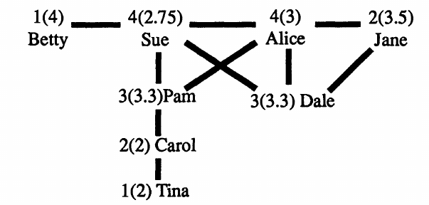
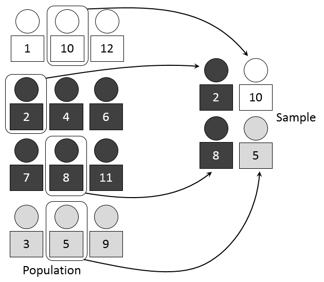
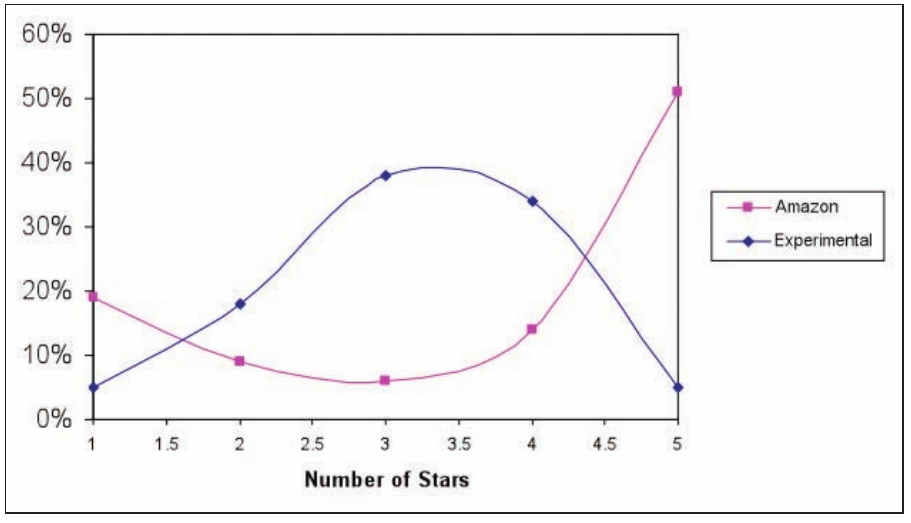

### Friendship and social comparison

Individuals often compare themselves to others, trying to conform to norms or positively stand out. Within social networks, a common question for an individual is "What is the right number of friends?". To answer that question, individuals can only explore their friends and try to assess what is the "typical" number of friends and compare with themselves. This process of social comparison can lead to paradoxical situations. Take this example of a social network:

This network shows the relationships found among  eight girls in "Marketville" one of the high schools included in a [social network study](http://www.jstor.org/stable/2781907). The number beside each name is her number of friends. The number in parentheses beside each name is the mean number of friends of her friends, what they would consider as "normal" if they can only see the number of friends of their friends.

In the above network:  

- **five** girls have fewer friends than the average of their friends (Betty, Jane, Pam, Dale, Tina), two have more friends  
- **two** have more friends than the average of their friends (Sue and Alice)  
- **one** has as many friends as the average of her friends (Carol)  

Most girls will think that they have less friends than the norm! If we average all numbers, the average number of friends is **2.5** and the average number of friends of friends is **3**. 

### The Friendship paradox

Most people expect that roughly half of nodes in a social network will have a lower degree than the average degree of their friends. In reality, this number is much higher, leading to a phenomenon commonly known as the friendship paradox:

> **The Friendship Paradox**:
The fact that most people have less friends than the average number of friends of their friends

The friendship paradox can be seen when comparing guesses of individuals on what is the mean number of friends in an online social network versus the actual mean when analyzing a large dataset. For example, Facebook users guessed that the mean number of friends of other users should be around 300. However, the analysis of [721 million Facebook users](https://www.facebook.com/notes/facebook-data-science/anatomy-of-facebook/10150388519243859) showed that the real mean is around 190.

This paradox can be understood through [Stephen Wolfram's analysis of the data donated by one million users of a Facebook self-analysis app](http://blog.stephenwolfram.com/2013/04/data-science-of-the-facebook-world/). Through that app, Wolfram collected personal information of users who donated their data and from their friends^[Note that this was before the Cambridge Analytica scandal, when thousands of apps gave permissions to see personal information of the friends of the user who installed the app]. In the following figure from Wolfram's blog post, you can see the distribution of the number of friends of users in light yellow and the same distribution but for the friends of the users who installed the app.  

 
Even though both distributions measure the same, the number of friends over the friends of users is clearly skewed to the right when compared to the sample of users who installed the app. The peak you see at 5000 is due to the maximum number of friends allowed by Facebook. The difference between these two samples of Facebook users is how they are sampled. The users are sampled because they chose to install Wolfram's app, while the other sample is discovered because one of their friends installed the app and thus gave their information away^[This kind of leaking of personal information through a social network has serious privacy consequences. If you want to learn more, you can check my work on [shadow profiles](https://advances.sciencemag.org/content/3/8/e1701172.full) and on [location inference on Twitter](https://epjdatascience.springeropen.com/articles/10.1140/epjds/s13688-018-0130-3)]. This difference in sampling is what explains the friendship paradox, it is not the same to measure the mean number of friends of an individual sampled at random than one sampled through one of their friendships.

### Sampling biases

  

The Friendship Paradox is an example of a sampling bias. You compare two means based on different samples. When sampling among your friends, you are more likely to sample people with more friends, which pushes the mean upwards than what is measured when you take all people into account. The impact of the paradox increases with the variance of the number of friends: the more diverse the numbers of friends, the stronger the paradox.

This is an example of the [*Class Size Paradox*](http://www.umasocialmedia.com/socialnetworks/glossary/class-size-paradox/), which appears when we count the size of things indirectly. The term comes from a survey that tried to measure the mean size of a class in a university. They asked a random sample of students what was the size of their class and took the mean. The number was surprisingly high compared to the actual mean of class sizes. You can see that in the plot with four classes. The mean class size is $(5+10+20+5)/4=10$, but the mean *experienced* class size by the students is $(5*5+10*10+20*20+5*5)/40=13.75$. This paradox makes the mean experience of people to be larger than the actual mean, for example the mean of experienced queue length in a shop is larger than the mean queue length as long as not all queues are the same length all the time.

When analyzing data, we have to pay a lot of attention to the **data sampling**. When we do not have access to all data, we can analyze a representative sample, for example if we are able to completely **random sample** people from a population. However, this way we might need very large samples to discover people of small groups that do not appear so frequently at random. To have a more representative measure with less data, you can perform **stratified sampling** by selecting individuals from groups or clusters keeping the same distribution of groups as known from larger samples. The figure below compares random sampling versus stratified sampling by color:  
{width=64%}{width=35%}

You can see the problem that in the random sample, by chance no white individual was sampled and, if they are different than the rest, this could affect the analysis. Sociologists take this into account when they study a question about opinions or behaviors that are different across genders and age groups. In that case, they use data from the census to know the sizes of those groups over the total population and then recruit from *strata* with different combinations of age and genders to be able to generalize their opinion estimates to the whole population.

We say that a method suffers a **sampling bias** when the sampling method is more likely to select some elements over others and this difference is relevant to the analysis. One of the most common and problematic examples of sampling bias in Social Data Science is the **self-selection bias**, which is present when the sampling method selects individuals who choose to be included in the study. The case of Facebook users in the Wolfram study has a self-selection bias, since only users who chose to analyze their data through the app were included. This can be very important if the behavior you analyze is related to the choice to be included in the sample. For example, if users with more friends are more likely to install the app, the mean number of friends of this sample will overestimate the real mean.

  

A typical example of self-selection bias appears when studying the distribution of how people like a product. Market researchers usually recruit random people and give them the product to experience, asking them for a rating of the product afterwards. In this case, the distribution of ratings is usually unimodal with a mean that is usually around the middle. You see an example of this distribution from a [product reviews study]({http://dl.acm.org/citation.cfm?doid=1562764.1562800) in the blue line of the plot.

Another way to sample user experiences is to look at the star-ratings of products in product review platforms like Amazon. In that case, the distribution of ratings usually has a J-shape with two peaks, one very low and one very high. This happens because users who rate the product are users who chose to buy it first and their experiences become more extreme due to their prior expectations about the product.

The case of the market research survey is what is called *forced exposure*, as participants are asked to (and usually paid for) experience the product. The case of online product ratings is a case of *natural exposure*, in which participants found the product and bought it by themselves. Whether this self-selection bias is a problem for a research study depends on the question, studies about the potential satisfaction of a product want to assess it with a random sample, while studies of the past satisfaction among the buyers of a product can use self-selected ratings instead.

The J-shape distribution of ratings has made many platforms to change their star-rating system for a like/dislike system, as for example YouTube did a few years after starting. This J-shape has a higher positive peak than negative one, creating a positivity bias that can be seen in the average star rating per product, as [XKCD rightfully observed](https://xkcd.com/1098/):

