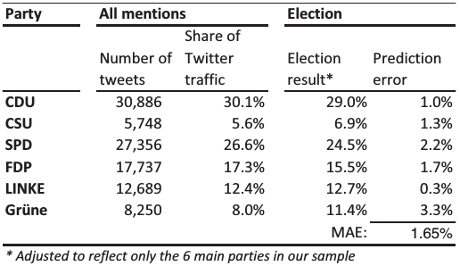

<div style="float:right">
  
German politicians on Twitter, [from Lietz et al, 2014](http://www.aaai.org/ocs/index.php/ICWSM/ICWSM14/paper/viewPaper/8069)
</div>
### Political data on Twitter

Twitter can be a very influential platform for political processess around the world. A [survey by Pew Internet research](pewresearch.org/fact-tank/2019/08/02/10-facts-about-americans-and-twitter/) showed that 22% of people in the US use Twitter and that 71% of those get news through Twitter. An [analysis of the trends in Twitter content](https://doi.org/10.1017/S0003055419000352) has shown how Twitter can set the agenda of politics, influencing mass media and politician discussions. Twitter was also of great importance for politicians to reach their audience, as Donald Trump showed during his presidency, ending in the [permanent suspension of his Twitter account](https://blog.twitter.com/en_us/topics/company/2020/suspension.html).

Twitter data has been used in lots of articles to analyze political systems in many countries beyond the US. The example of the figure is from an [analysis of German politicians](http://www.aaai.org/ocs/index.php/ICWSM/ICWSM14/paper/viewPaper/8069) by Haiko Lietz and colleagues that showed in 2014 that the follower network of politicians has a community structure corresponding to political parties. [My own research](https://onlinelibrary.wiley.com/doi/abs/10.1002/poi3.82) looked at Swiss politicians in the social network Politnetz and found similar structures. You will study these structures in Twitter in the [exercise about assortativity of Swiss politicians.](https://dgarcia-eu.github.io/SocialDataScience/5_SocialNetworkPhenomena/058_PoliticianAssortativity/PoliticianAssortativity.html)

### Predicting the German elections
<div style="float:right">
<center>
  
</center>
German election Twitter prediction, from [Tumasjan et al, 2010](http://www.aaai.org/ocs/index.php/ICWSM/ICWSM10/paper/view/1441)
</div>
Making political surveys before elections is costly and can be inaccurate. Many scientists have looked at Twitter data to see if elections could be predicted based on the content of tweets before the election. Tumasjan and colleagues did a [retrospective study](http://www.aaai.org/ocs/index.php/ICWSM/ICWSM10/paper/view/1441) to assess whether Twitter could have been used to predict the results of the German federal elections of 2009 The table shows the result of a simple comparison between the share of tweets mentioning each of the six major parties and the election results. The ranking was the same and prediction errors were on average less than 2%! 

With these results in mind, Tumasjan and colleagues conclude that *"the mere number of messages reflects the election result and even comes close to traditional election polls"*. Why are we still using traditional surveys if this was found back in 2010?  

### The Victory of the Pirate Party^[No, it didn't win]

In 2012, Andreas Jungherr and colleagues [replicated the Twitter retrospective analysis of the German elections.](https://journals.sagepub.com/doi/abs/10.1177/0894439311404119?journalCode=ssce). Not to judge parties beforehand, they included the Pirate Party too, not just the six most voted parties in the previous election. Using exactly the same method as in the other paper, they found that the Pirate Party would have won by landslide, with almost double the mentions the second party got on Twitter:
<center>
{width=800px}
</center>

Comparing the results of both studies and the issue with the Pirate Party becomes evident if you plot the tables as scatterplots next to each other witht a regression line:

```{r echo=F, warning=F, message=F, fig.width=7, fig.height=3, fig.align="center"}
library(ggplot2)
library(patchwork)
df <- read.csv("ElectionPrediction.csv", sep="\t")
g1 <- ggplot(aes(x=Twitter1, y=result), data=df) + geom_point() + geom_text(label=df$Party, hjust = 0, nudge_x = 0.5) + theme_bw() + xlab("Twitter prediction 1 (%)") + ylab("Election result") + xlim(c(3,35)) + geom_smooth(method = "lm", se = F,col=rgb(0,0,0,0.25))
g2 <- ggplot(aes(x=Twitter2, y=result), data=df) + geom_point() + geom_text(label=df$Party, hjust = "inward", nudge_x = c(0,rep(0.5,5),-0.5)) + theme_bw() + xlab("Twitter prediction 2 (%)") + ylab("Election result")+ xlim(c(3,35)) + geom_smooth(method = "lm", se = F, col=rgb(0,0,0,0.25))
g1 + g2
```

Jugherr and colleagues found other issues with the original prediction, for example how small changes in the dates considered for the analysis had a dramatic impact on the results.


> Take home message: Estimating public opinion through tweets suffers self-selection bias

<div style="float:right">
<center>
  
by Daniel Gayo-Avello
</center>

### Can we predict election results with Twitter?

For few years, researchers were very excited about the idea of predicting elections with Twitter. This led to several overstatements about the power of Twitter data to predict elections. Daniel Gayo-Avello wrote [a review of Twitter election prediction studies in 2012](https://arxiv.org/abs/1204.6441).  titled *"I Wanted to Predict Elections with Twitter and all I got was this Lousy Paper” – A Balanced Survey on Election Prediction using Twitter Data*. His review concluded that most predictive studies were *retrodictive*, looking for what data could have predicted elections but not really making predictions. 

Twitter is still very important for politics, but studying who talks about politics on Twitter suffers various biases with respect to the population of people who end up voting. For example in the US, Twitter users tend to be more liberal and younger than the average voter. In addition, by measuring the volume of party mentions, the sample has a self-selection bias in which only users who choose to be part of the sample can be seen. However, this does not mean that Twitter data and digital traces in general are useless to study public opinion, especially when combined with traditional polling methods. John Bohannon recently [reviewed in Science what Internet data can contribute to election polling](https://www.sciencemag.org/news/2017/02/election-polling-trouble-can-internet-data-save-it), highlighting how Wikipedia view data could be useful as an additional data source when polling is inaccurate, for example for the case of emerging parties.
