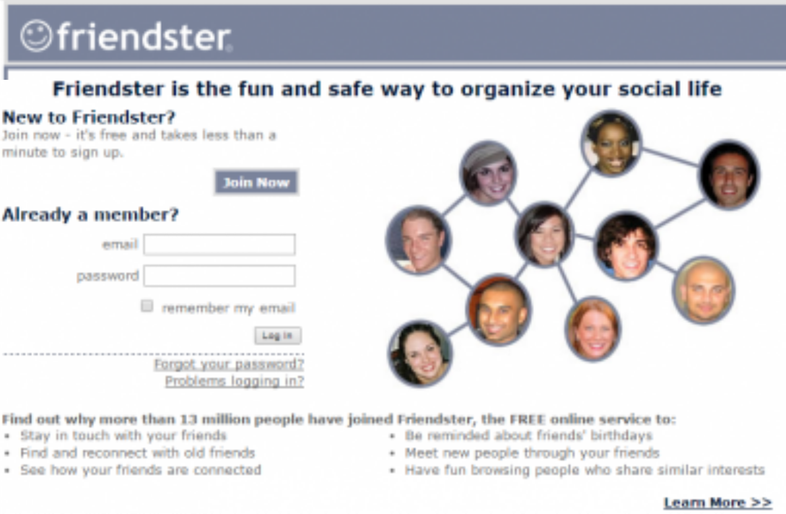
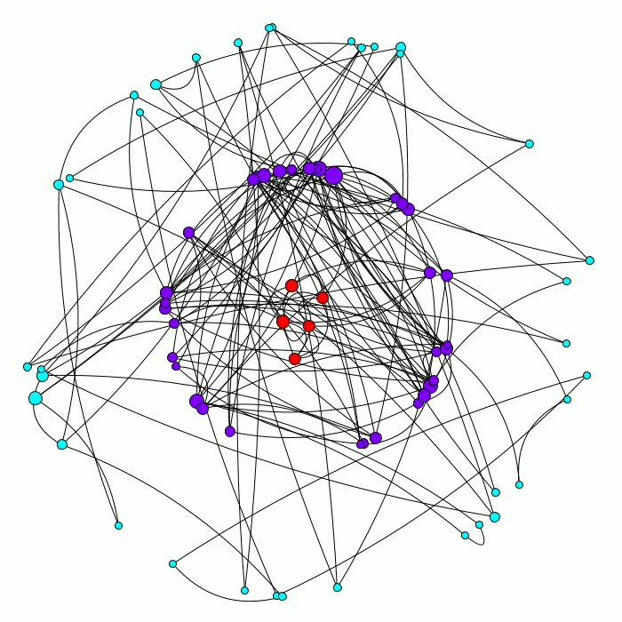
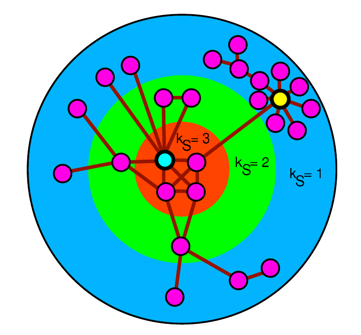

### The question of social resilience

 
Satellite image of Nauru.

> **Social Resilience:** The ability of a community to withstand external stresses, disturbances, and environmental changes

The Pacific island nation of Nauru was a good example of lack of social resilience. Its phosphate mining industry brought lots of wealth to the nation, making it the one with the highest GDP per capita in the World for few years. One day, phosphate deposits were depleted, an environmental change that tested the social resilience of the society of Nauru. [Nauru lost a large share of its population who emigrated](en.wikipedia.org/wiki/Economy_of_Nauru) due to the lack of employment after that, its national bank had to declare insolvency, and its unemployment rate increased to 90%.

When a society loses little in terms of wealth, inhabitants, and social capital after a disaster, we say that it has high social resilience. Even some societies might gain value from the reconstruction efforts, especially after small disasters that cause damage but not at a very large scale. You can learn more about the environmental and social conditions for collapse of society in this [UN Trade and Environment Review from 2013](http://unctad.org/en/pages/PublicationWebflyer.aspx?publicationid=666)

 
Old login page of Friendster.com

Online societies can also be resilient or not. Some online platforms, in particular online social networks, lost many users after reaching high peaks of adoption and activity. [Friendster](https://en.wikipedia.org/wiki/Friendster) was one of the first online social networks, launched in 2003 when other like MySpace and Facebook were also starting. Friendster was adopted very fast, especially around young US users looking for dating opportunities. It reached more than 80 Million active users and its popularity spread to other countries, especially in Asia. However, a series of technical problems and competition with other social networks, especially MySpace and Facebook, made Friendster lose a lot of active users. Friendster was discontinued as a social network in 2013, but all its publicly available information was stored in the [Internet Archive](https://archive.org/details/archive-team-friendster).

You can find other stories of social network collapses in the [Social Data Science story on the topic](https://dgarcia-eu.github.io/SocialDataScience/5_SocialNetworkPhenomena/052_SocialNetworkDeath/SocialNetworkDeath.html). On the contrary, Facebook, with more than 2 Billion users in 2020, has remained stable in terms of user base on the contrary, bringing the question of how to understand online social resilience.

### Modelling social resilience online

Social resilience can be modelled as a process of how users stay active or inactive in a social networking site. Here, we will learn about a model I presented in [one of my papers](https://dl.acm.org/doi/10.1145/2512938.2512946) and that has been [improved in later research](https://www.pnas.org/content/113/42/11726.short). If we consider social network users as rational, they will respond to incentives to stay active or to abandon social networks depending on **benefits and costs**.

**Benefits:** The purpose of Information and Communication Technologies (ICT) is to overcome the cognitive constraints of humans. Online social networks help us to overcome some social cognitive constraints, for example the limit and time involved in maintaining social relationships. Online social networks provide a persistent memory of social interaction and enable one-to-many communication through groups. Benefits can be quantified through the content users receive from their friends (shares, comments) and through the attention and support given by their friends (likes, votes). This way, more friends mean more benefits, and thus the total benefit that a user receives from being active in the social network grows monotonically (not necessarily linearly) with the number of active friends they have in the social network^[I found limits to this assumption in my first paper and in a [follow-up study on Twitter](https://onlinelibrary.wiley.com/doi/full/10.1002/poi3.151). Some users might lose benefits with more friends, but these tend to be users with a huge number of friends. For a very large range of friendship numbers, more friends means higher chances to stay active.]. A simple way to model this is benefits as proportional to the active friends of a user ($k_u$):
$$benefit_u = b * k_u$$
This concept is related to [Metcalfe's Law](http://www.cs.umd.edu/~golbeck/downloads/Web20-SW-JWS-webVersion.pdf), which measures the total benefit or value of a communication channel. If each user can access every other in a communication channel, then the value for each user grows with the total number of connected users, and thus the total value of the channel grows superlinearly with the number of users connected to it.

 
User when costs are 
 
higher than benefits

**Costs:** Using social network is not only benefits, there are also costs associated with being active, for example:  

- Time spent to learn to use the interface of the platform  
- Risks of disclosing personal information  
- Opportunity costs: you could be doing something else  
- Economic costs, for example membership fees.

Some socks and external factors can suddenly change the cost, for example an interface redesign, technical problems to access the network, privacy leaks or manipulation scandals, or large-scale disruption like power outages or governments banning the network. A common assumption about costs is that they are relatively similar for all users, thus modeling them as a constant $c$.

The above definition of costs and benefits leads to the decision rule of users becoming inactive in a social network. A user will become inactive if costs are higher than benefits, which means:

$$ b *k_u < c $$
Where $k_u$ is the number of active friends of user $u$, $b$ is the benefit received per active friend, and $c$ is the cost of using the social network. Note that becoming inactive does not mean deleting your account, it only implies not logging in or not using the network sufficiently to generate benefit to other users.

This models a dependency between users becoming inactive. When a user becomes inactive, it does not generate benefit for its friends any more, possibly bringing their total benefit below the cost and making other users inactive. The animation below shows what happens in a mock-up network when the benefit suddenly increases. Before, any user with at least two friends would be active, but if the cost is too high for that, some users will leave and trigger a cascade of other users leaving too.

{width=50%}    

After the cascade, the resulting network has only nodes with a degree of at least three, as all the nodes with degree two or less have left during the cascade.

### The k-core decomposition

The graph remaining after the cascade above is what is called a k-core. It is formally defined as:

> **k-core**: A k-core of a graph $G$ is a maximal connected subgraph of $G$ in which all vertices have degree at least k.

For any network, you can calculate its k-core decomposition as follows:  

- Start with $k_s=1$  
- Remove all nodes with degree less than or equal to $k_s$ and all their connected links  
- After that, some nodes might be left with a degree less than or equal to $k_s$, remove them and their links  
- Repeat until all nodes have degree larger than $k_s$  
- Increase $k_s$ by one and repeat until no nodes are left

The nodes and the edges removed for certain value of $k_s$ is called the **k-shell**, with k being the $k_s$ when they were removed. A **k-core** is the set of all k-shells with $k_s \geq k$.

{width=27%}{width=72%}

The figure above, from [Kitsak et al.](https://www.nature.com/articles/nphys1746), illustrates the process of the k-core decomposition. Nodes are pruned iteratively for increasing values of $k_s$ and each node is assigned to the k-shell corresponding to the $k_s$ when it was removed.

The k-shell number of a node is also called **coreness centrality**. [Kitsak et al.](https://www.nature.com/articles/nphys1746) showed that coreness centrality is a better predictor of simulated spreading cascade sizes than other centrality measures like degree and betweeness.

### Coreness and social resilience

When considering the inactivity decision rule $b *k_u < c$, the cost to benefit ratio $c/b$ defines a critical value of the degree $K$, below which users with degree $k_u<K$ will leave the social network. The remaining active social network is the k-core corresponding to $K$. The animation above shows an example when $K=3$.

{width=80%}

This way, we can analyze the structure of a social network with the k-core decomposition to calculate a *resilience function* as shown above. The resilience function maps each possible cost to benefit condition ($K$) to the number of active users that would remain under those conditions. This function can be calculated as $N(k_s>K)$ which is the number of nodes in the network with coreness centrality above the critical value $K$. The area under the resilience function helps us to compare networks. In the example above, the blue function corresponds to a social network with lower social resilience as the one of the red function.

{width=50%}

The figure above shows the resilience functions for various online social networks from [this paper](https://dl.acm.org/doi/10.1145/2512938.2512946), rescaled by dividing the number of remaining users over the total number. You can see that some online social networks have lower fractions of active users for the same $K$, but that the lines cross. This means that no social network from the example is always better than all the others, some might seem less resilient for low $K$, but might have larger remaining fraction of active users for high $K$.
