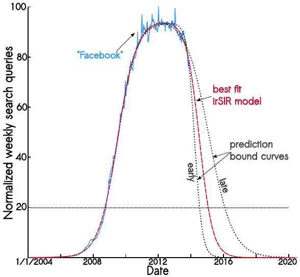
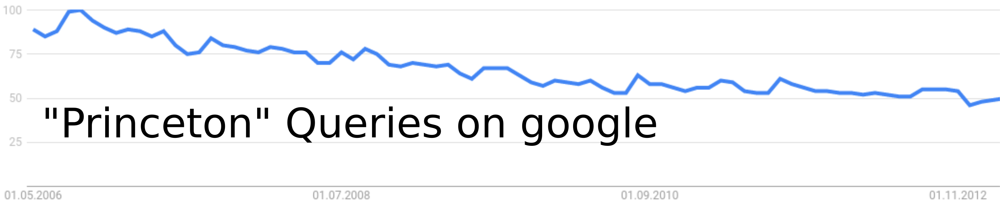

### Why did some online social networks collapse?

Some online social networks lost so many users at such a fast speed that they can be considered collapsed. Some lost millions of users in a matter of weeks. You can see this in the Google trends volume for some deceased online social networks:

**Friendster,** as we saw in the [social resilience topic](), went from 80 Million active users to disappear completely.

```{r echo=F, fig.width=8, fig.height=3, message=FALSE}
library(gtrendsR)
library(ggplot2)
library(dplyr)
trend <- gtrends("Friendster", time="all")
trend$interest_over_time %>% filter(hits!="<1") %>% mutate(hits=as.numeric(hits)) -> interest
ggplot(interest, aes(x=date, y=hits)) + geom_line() + ylab("Google search volume") + xlab("Date") + ggtitle("Friendster") + theme_bw()
```

**MySpace** went from being valued more than 12 Billion USD in 2008 to be bought by [Justin Timberlake for 35 Million USD](https://www.theguardian.com/technology/2011/jun/30/myspace-internet). It's still online, but not very far from the user base it had in the past.

```{r echo=F, fig.width=8, fig.height=3}
trend <- gtrends("MySpace", time="all")
trend$interest_over_time %>% filter(hits!="<1") %>% mutate(hits=as.numeric(hits)) -> interest
ggplot(interest, aes(x=date, y=hits)) + geom_line() + ylab("Google search volume") + xlab("Date") + ggtitle("MySpace") + theme_bw()
```

**Orkut** was the first attempt of Google to launch an online social network. It was very popular in some countries but lost users to Facebook and it was eventually taken offline.

```{r echo=F, fig.width=8, fig.height=3}
trend <- gtrends("Orkut", time="all")
trend$interest_over_time %>% filter(hits!="<1") %>% mutate(hits=as.numeric(hits)) -> interest
ggplot(interest, aes(x=date, y=hits)) + geom_line() + ylab("Google search volume") + xlab("Date") + ggtitle("Orkut") + theme_bw()
```

**Google+** was the much promoted second attempt at social networks by Google. Despite the initial hype, it lost users pretty quickly and it has been discontinued too.

```{r echo=F, fig.width=8, fig.height=3}
trend <- gtrends("Google Plus", time="all")
trend$interest_over_time %>% filter(hits!="<1") %>% mutate(hits=as.numeric(hits)) -> interest
ggplot(interest, aes(x=date, y=hits)) + geom_line() + ylab("Google search volume") + xlab("Date") + ggtitle("Google+") + theme_bw()
```


### Predicting Facebook's collapse

In 2014, Cannarella and Spechler uploaded a [preprint to Arxiv](https://arxiv.org/pdf/1401.4208v1.pdf) presenting an epidemics model applied to the decay of online social networks. The measured the number of active users on Facebook using Google trends as above and fitted their model on the time series of interest. They extrapolated in the future and predicted that Facebook would lose 80% of its users by 2017:

<center>
{width=60%}
</center>
Canarella and Spechler's article got lots of attention in news media, being covered by [Time](https://time.com/1405/facebook-is-about-to-lose-80-of-its-users-study-says/) and [The Guardian](https://www.theguardian.com/technology/2014/jan/22/facebook-princeton-researchers-infectious-disease). Now in 2021, not only Facebook hasn't collapsed, but it has more users than ever and that Arxiv preprint hasn't passed peer-review yet. What happened?

Data scientists at Facebook [replied to the Arxiv paper](https://www.facebook.com/notes/mike-develin/debunking-princeton/10151947421191849/) showing the problem with measuring social network use levels using Google Trends data. Applying the same methodology, Facebook researchers reached the conclusion that Princeton would lose 80% of its students by 2021:

<center>
{width=70%}
</center>


You can even apply it to air and come to the conclusion that the athmosphere will runt out of air by 2060:
<center>
{width=70%}
</center>

The Facebook examples show that decrease in search volume is a decrease in information searching about the social network, not a decrease in access and use. This was accurate for very early social networks like Friendster, when users where automatically Googling the name to log in, but in an era with mobile phone apps, bookmarks, and social networks as starting pages in many browsers, Google Trends is quite a bad approximation for use and it is bound to show downward trends.

For you to take the plots at the beginning of this topic with a grain of salt, here are the equivalent for Facebook and Twitter:

```{r echo=F, fig.width=8, fig.height=3}
trend <- gtrends("Facebook", time="all")
trend$interest_over_time %>% filter(hits!="<1") %>% mutate(hits=as.numeric(hits)) -> interest
ggplot(interest, aes(x=date, y=hits)) + geom_line() + ylab("Google search volume") + xlab("Date") + ggtitle("Facebook") + theme_bw()
```

```{r echo=F, fig.width=8, fig.height=3}
trend <- gtrends("Twitter", time="all")
trend$interest_over_time %>% filter(hits!="<1") %>% mutate(hits=as.numeric(hits)) -> interest
ggplot(interest, aes(x=date, y=hits)) + geom_line() + ylab("Google search volume") + xlab("Date") + ggtitle("Twitter") + theme_bw()
```

Facebook surely hasn't lost that many users and Twitter is not living a second growth, in fact it's growth has been rather slow to stagnant for a few years, even though it appears it is [gaining users after Trump's permanent suspension](https://www.wsj.com/articles/twitter-adds-users-through-trump-ban-11612906287).

> **Take home message:** Your measures based on today's digital traces might not work on tomorrow's

A more accurate way to measure activity in a social network is Bruno Ribeiro's [approach using Alexa data](https://dl.acm.org/doi/abs/10.1145/2566486.2567984), but Alexa focuses on website visits without considering access through mobile apps. The best way is to get direct activity traces, for example through observable actions on Twitter, but this only measures active use and tracking passive use without posting requires special access. For Facebook, the [ads API provides estimates of daily active users by country](https://www.pnas.org/content/115/27/6958), but this data is not available retrospectively. Measurement is always an important issue in Social Data Science, and just because a paper used a measurement method few years ago, it does not mean it is valid today.
