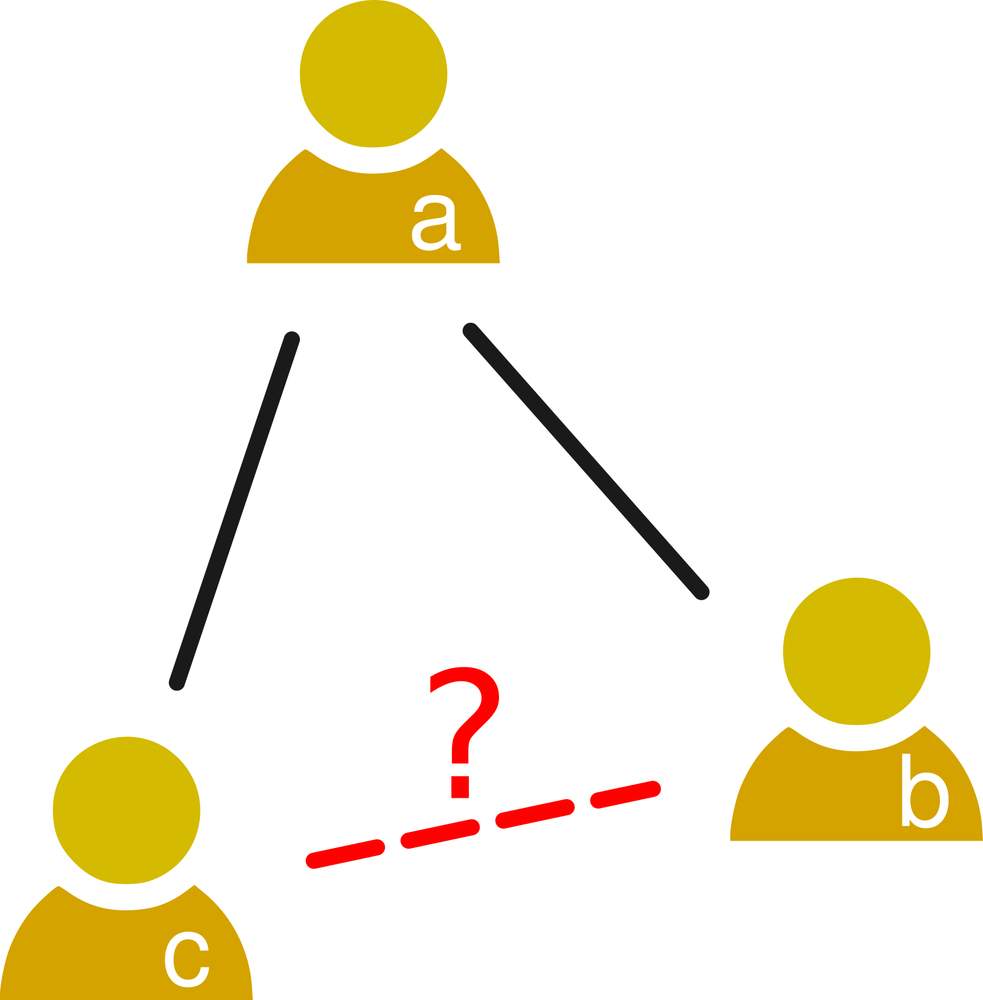

### Triadic closure

If a node $a$ has two neighbours $b$ and $c$: does a link exist between $b$ and $c$? If that is the case, we call the edges $(a, b)$, $(a, c)$ and $(b, c)$ a closed triad. Close triads are common in social networks due to the process of triadic closure:

>  **Triadic closure:** The tendency of individuals in social networks to create links to neighbors at distance 2

This property is also called *transitivity* and it captures the tendency of nodes to form triangles in the network. In social network terms, it shows the phenomenon of becoming friends of our friends, thus making densely connected communities.

The concept of triadic closure can be measured with the **clustering coefficient**. In an undirected network, the clustering coefficient of a node $i$ with degree larger than $1$ is measured as:

$$ C_i = \frac{2*t(i)}{d_i *(d_i−1)}$$
Where $d(i)$ is the degree of $i$ and $t(i)$ is the number of pairs of neighbors of $i$ that are connected, i.e. they form a triangle with $i$. The factor $2$ above comes from making a fraction between the number of connected neighbors and all unsorted pairs of neighbors, which is $\frac{d_i(d_i-1)}{2}$. 

The above equation measures the **local clustering coefficient** of each node. A **global clustering coefficient** can be calculated by dividing the number of triangles in the network over the number of wedges (pairs of two edges that share a node). The mean of local clustering coefficients and the global one do not need to agree, as nodes contribute to different numbers of wedges depending on their degree.

### The strength of weak ties

> **Strong ties:** People who are very close to you (family, friends, etc.)

> **Weak ties:** People you know but not very close to you (colleagues from work, school, etc.)

Strong and weak ties have different social functions. Strong ties provide reciprocal emotional and social support and are long-lasting relationships. Weak times serve as information sources, are faster to establish but also might disappear faster. For example, hearing about new job opportunities often happens over weak ties, but talking about a relationship breakup (social sharing of emotions) tends to happen over strong ties.

[Mark Granovetter](https://press.uchicago.edu/ucp/books/book/chicago/G/bo3636056.html) tested the hypothesis that weak ties are an important resource in occupational mobility. He interviewed 100 professional, technical and managerial workers. Those who found jobs through personal contacts (54) reported seeing that specific contact:

- often: 16.7%
- occasionally: 55.6%
- rarely: 27.8%

Mark Granovetter used the frequency of contact to measure tie strength. The most frequent answer to the question of who helped you to find a job was "not a friend, an acquaintance". That led Mark Granovetter to formulate [the strength of weak ties](http://www.journals.uchicago.edu/doi/pdfplus/10.1086/225469):

> **The strength of weak ties:** Weak ties are weaker than strong ties, but are also many more than strong ties.

### Structural holes

Triadic closure is much higher among strong ties than among weak ties, which means that pairs of individuals connected by a strong tie are more likely to share common friends than pairs of individuals connected by weak ties. Strong ties link families and long-lasting groups of friends, while weak ties connect individuals in different groups of society.

A **structural hole** is the disconnected area of the social network between highly connected groups. You can imagine a structural hole as a "missing" part of the network as in the picture.

Strong ties bring support, but in terms of information they tend to be redundant. Weak ties, since they connect groups across structural wholes, carry novel information from one group to another.

The counterpart of structural holes are **network communities**. Communities are densely connected subgraphs of the social network, where often strong links are contained. Communities have high average clustering coefficient.

The figure on the right is an example of a community structure among Twitter users who discussed a controversial topic in one [of my articles](https://www.thelancet.com/journals/lancet/article/PIIS0140-6736(19)32526-7/fulltext). Analyzing the follower network, we can find four communities that can be seen when visualizing the graph with a force-directed layout.

### Measuring modularity

The measure of [**modularity**](https://www.pnas.org/content/103/23/8577.short) quantifies the tendency of a network to be divided in densely connected subgroups that are sparsely connected across groups. Q-modularity measures this tendency:

$$ Q = \frac{1}{2m} \sum_{u,v} [ A_{u,v} - \frac{k_u k_v}{2m} ]\delta(c_u, c_v) $$
In the above equation:

- $u$ and $v$ are two nodes of the network. The sum goes over all pairs of nodes.
- $m$ is the number of edges  
- $A$ is the adjacency matrix ($A_{u,v} = 1$ if and only if u and v are connected)  
- $k_u$ and $k_v$ are the degrees of $u$ and $v$  
- $c_u$ is the community of $u$ and $c_v$ is the community of $v$  
- $δ(c_u,c_v)$ takes value $1$ if and only if u and v are in the same community, otherwise it's $0$  

A network with a partition of its nodes into communities with a substantial modularity (e.g. above 0.25), can be considered modular or having a community structure.

The measure of modularity serves as a way to find a community structure by trying different assignments of nodes to communities and measuring their modularity. Finding the partitioning that gives the highest Q modularity is computationally expensive, but there are approximated methods that can give you good solutions. There are several algorithms to find community structures, many of them usable through tidygraph. In the [network analysis exercise](https://dgarcia-eu.github.io/SocialDataScience/5_SocialNetworkPhenomena/058_PoliticianAssortativity/PoliticianAssortativity.html), we will use the Louvain algorithm, which is illustrated below in a figure from [Campigotto et al.](https://arxiv.org/abs/1406.2518)

The [Louvain algorithm](https://arxiv.org/abs/0803.0476) is a kind of greedy method, finding a community structure with maximal modularity by making small changes to the solution that increase its modularity. It works as follows:

1. Start with each node assigned to its own community
2. Repeat until no changes happen:
  - For each node:
    -  Calculate the modularity change if you introduce the node in the community of each of its neighbors
    - If any of the changes is positive, move the node to the community that increases modularity the most
3. Merge communities into amalgam nodes
4. Run 2 over the resulting network
5. Repeat until no changes happen

The result is a partition of nodes into communities with maximal modularity, which means that moving a single node from one community to another does not increase the modularity. There could be better partition of nodes, but would require more changes of nodes. You can run this method with tidygraph using the group_louvain() function.

### When holes are bridged: The small world concept

Small world networks have the following three properties:

1. Most nodes are not neighbors (sparse network)  
2. The mean distance between two nodes is small  
3. They have high global clustering coefficient  

In the literature, the "small world property" is defined in two different ways:

a. The average distance between pairs of nodes is much shorter than in a random network  
b. As the network grows, the average distance between pairs of nodes grows sublinearly  

To apply the second version, it is necessary to have information on the growth of the network. The first version is commonly applied when only static information is available.

The small world phenomenon became popular after an experiment by [Stanley Milgram's](https://en.wikipedia.org/wiki/Stanley_Milgram)^[The ideas was pat of a 1929 theater play by Hungarian author Frigyes Karinthy, as explained by Albert-László Barabási in his book [Linked](https://barabasi.com/book/linked)] experiment. He chose 160 random people in Omaha, Nebraska. He asked them to send a letter to a particular stockbroker in Boston, Massachussetts. The experiment participants were asked to contact only acquaintances that they knew on a first-name basis, asking them to forward the letter to their contact that they thought it was the closest to reach the target.

Out of the 160 letters, [44 reached the target](http://snap.stanford.edu/class/cs224w-readings/milgram67smallworld.pdf). On average, letters required six hops, a length much shorter than initially estimated, although this calculation underestimates the real distance between the sources and the target because many letters were lost. Nevertheless, the experiment shows two things: social networks have short distances even between random nodes, and they are navigable, i.e. people knew how to route the letters so that they were getting closer to their destination.

Later studies have confirmed the same observation with other kinds of social network data, including large-scale [analysis of Facebook data that showed a mean distance of 4.5](https://research.fb.com/blog/2016/02/three-and-a-half-degrees-of-separation/). You can find more context about that analysis in this [blog post by Duncan Watts](https://medium.com/@duncanjwatts/how-small-is-the-world-really-736fa21808ba).

