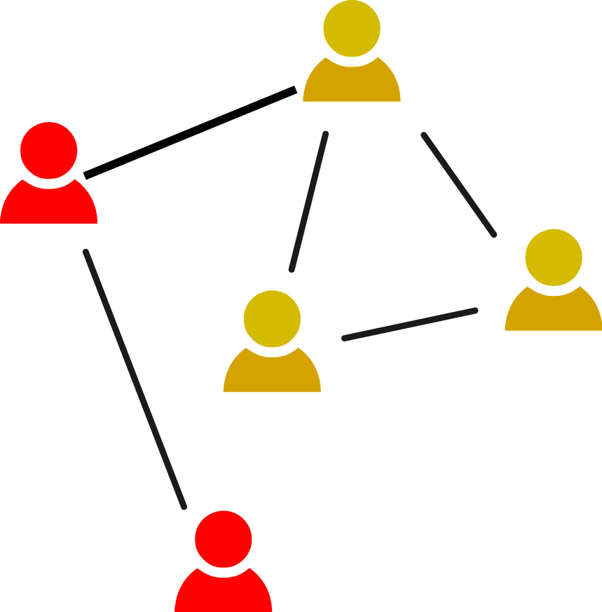
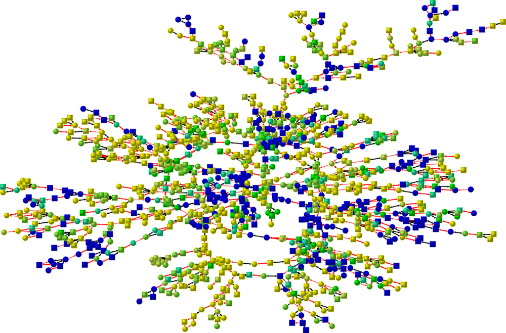

### Measuring Assortativity

> **Assortativity:** A network property by which similar nodes are more likely to be connected than dissimilar nodes

Similarity is based on some node property, e.g. degree, age, political orientation, gender... 
Can be measured with the [assortativity coefficient](https://journals.aps.org/pre/abstract/10.1103/PhysRevE.67.026126): 

\begin{equation*}
r=\frac{\sum_c e_{cc}-\sum_c a_c b_c}{1-\sum_c a_c b_c}
\end{equation*}

- $c$ are the classes of nodes
- $e_{cd}$ is the \textbf{fraction of all edges} connecting nodes of class $c$ with nodes of class $d$
- $e_{cc}$ is the fraction of all edges connecting two nodes of class $c$
- $a_c=\sum_d e_{cd}$, and $b_c=\sum_d e_{dc}$ (endpoint class fractions)

For example, the network of the figure is assortative with respect to color. You can notice that just by looking at it, four out of five links happen between nodes of the same color. However, it is always good to calculate the assortativity coeffcient, especially when networks are a bit larger. The way the network is laid out on the picture can be deceiving.

The figure on the right shows the example of an assortative online social network appearing in [my previous research about Swiss politicians in the Politnetz platform](https://arxiv.org/abs/1503.07711). The property of nodes is the party politicians belong to, and the edges are determined by the support relationships among politicians. You can do a similar analysis for [Swiss politicians using Twitter data in our exercise on that topic](https://dgarcia-eu.github.io/SocialDataScience/5_SocialNetworkPhenomena/058_PoliticianAssortativity/PoliticianAssortativity.html).

Networks can also be \textbf{disassortative} if $r<0$, i.e. nodes have a tendency to be connected to dissimilar nodes rather than similar nodes. An example of a disassortative network is the network of contact in a job fair with respect to being seeking or offering employment. Job seekers tend to have contact with job providers more than with job seekers.

# Three mechanisms that generate assortativity

Assortativity is just some type of correlation you can observe in a social network. There are several processes that can generate it, here we cover three common ones in social networks: homophily, social contagion, and confounding.

## Homophily

> **Homophily:** Phenomenon in which people are more likely to create social links to similar than to dissimilar people

The mechanism of homophily captures the popular proverb "Birds of a feather flock together". It tells us that the individuals in the network create links in a way that favor connecting to other individuals of the same property. In the case of homophily, attribues of the nodes might not change but the network must change or be formed to be influenced by the attributes.

In the network example, if homophily is present and a new green node $f$ enters the network, it would have a stronger tendency to connect to $e$ and $d$ than to $a$, $b$, or $c$. 

Typical examples of homophily are company directors becoming friends of other company directors but not the average workers of the other company, people dating others of similar age, etc.

## Contagion

> **Social contagion:** Phenomenon in which people tend to adopt behaviors of their social contacts

In the process of contagion, the network structure might not change but the attributes can change. In the example, the color of nodes $e$, $b$ and $c$ might change to the color of $a$, generating assortativity due to contagion.

The idea of contagion is related to the topics of [Social Impact Theory](https://dgarcia-eu.github.io/SocialDataScience/2_SocialDynamics/021_SocialImpactTheory/SIT.html), which focused on the individual-level forces of behavior change, and the [Simmel Effect](https://dgarcia-eu.github.io/SocialDataScience/2_SocialDynamics/022_SimmelEffect/SimmelEffect.html), which focused on the temporal dynamics of aggregated behaviors like fashions. Here the perspective is the structure of the whole network, as we can see the traces of social contagion if we have network and attribute data that we analyze through assortativity.

Examples of social contagion are clothing fashions, food habits, sometimes political orientation, etc.

## Confounding

> **Confounding:** External effects can produce both link creation and node attributes (independent of the network topology)

In the case of confounding, there might be no causal relationship between attributes and links, they are causally related to another third factor.  The figure illustrates the case when children in a school tend to be friends and learn the same content. Their link is not due to learning nor learning due to the link, they are confounded with the school.

Confounding creates assortative networks without causation between links and node attributes, so it is important to argue about what could be confounding factors when analyzing assortativity and trying to account for them in the analysis.

# Assortativity of happiness

An interesting case of assortativity in social networks is the study of happiness. [James Folwer and Nicholas Christakis studied a longitudinal analysis of happiness](https://www.bmj.com/content/337/bmj.a2338) and social contacts in a community and found a clear assortativity structure, which is shown in the figure. Explaining whether it was homophily, contagion, or confounding requires more information than just a network snapshot, but this kind of assortativity can be found in many other behaviors such as smoking or obesity. 

On social media, [Johan Bollen and colleagues found out that there is assortativity of sentiment expressed by Twitter users](http://www.mitpressjournals.org/doi/abs/10.1162/artl_a_00034#.WQigr98xBph). In that case, identifying the mechanism is even harder because the link between social media sentiment and subjective well-being or happiness of an individual is very weak, as [shown by later studies](https://dl.acm.org/doi/abs/10.1145/2786451.2786473). That doesn't mean that social media data is useless, but we surely have to think about what is the meaning of our measurements on digital traces and what could be other explanations for what we find!