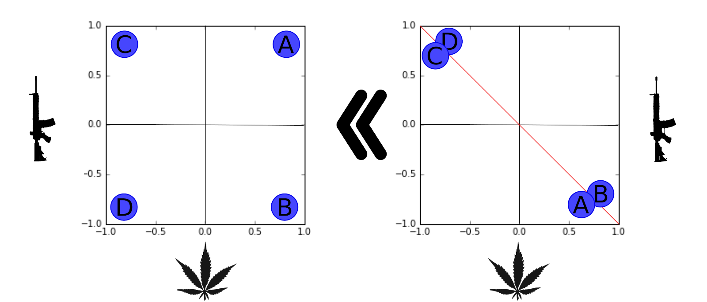
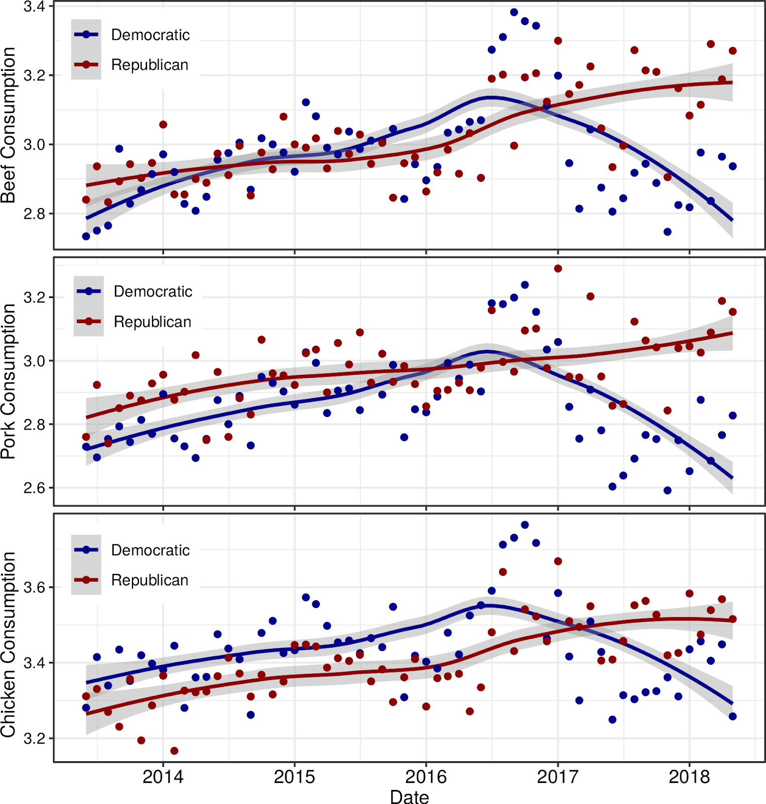
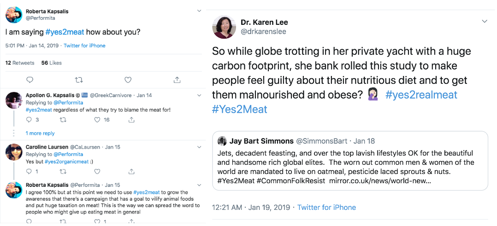
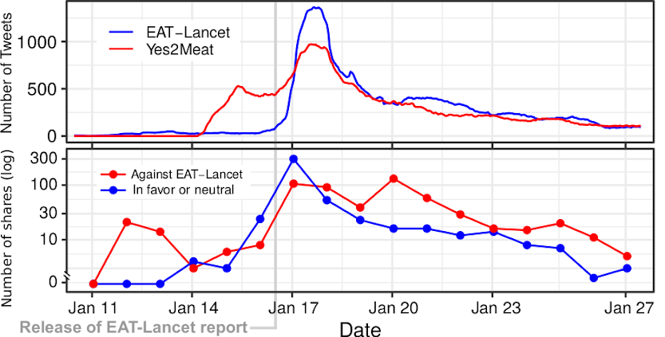
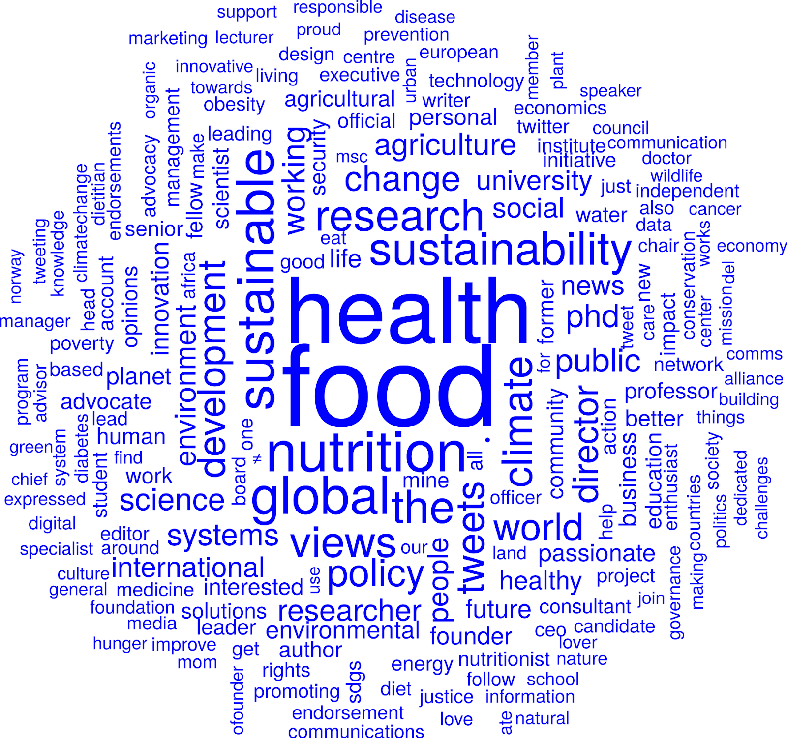
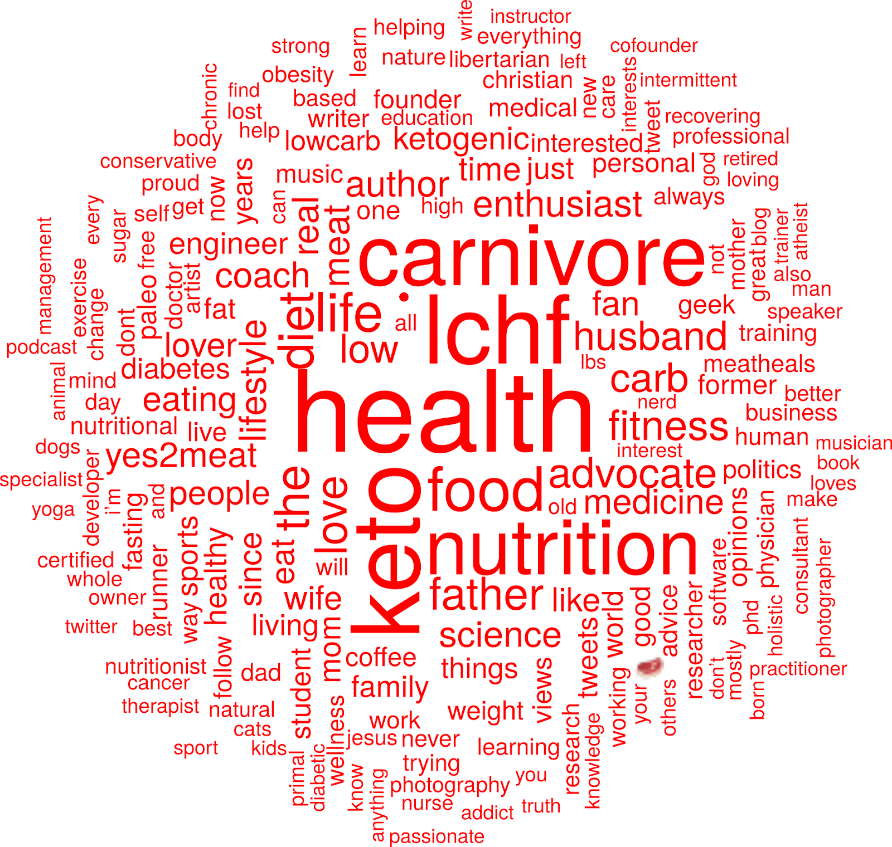
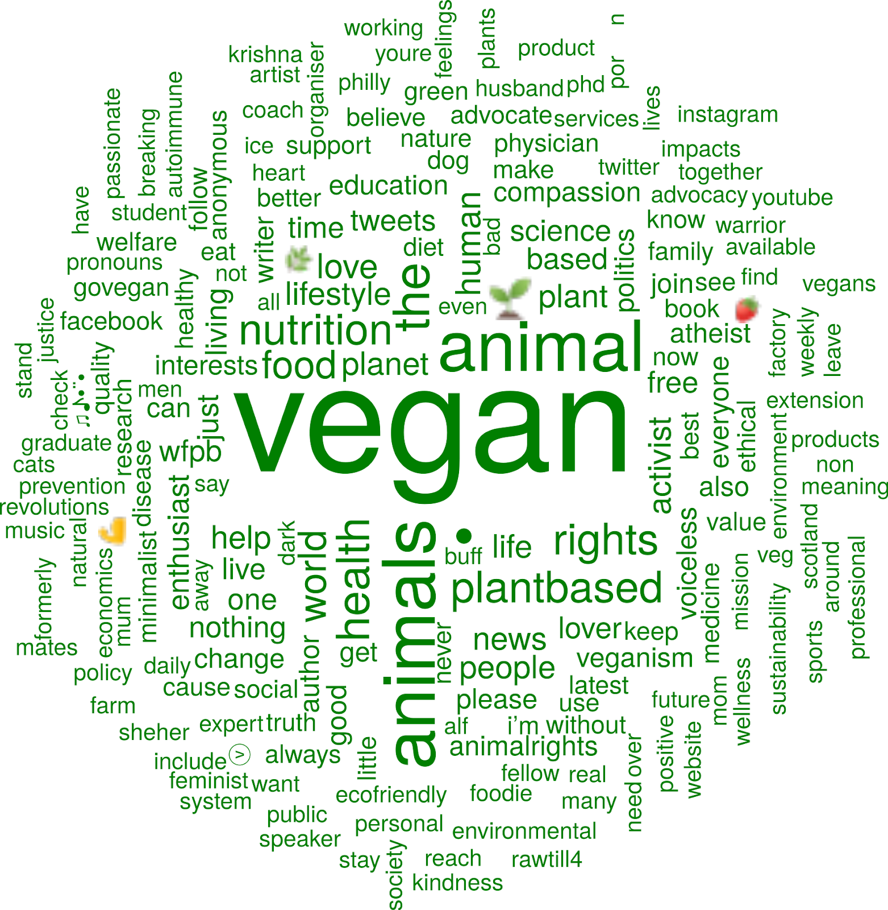
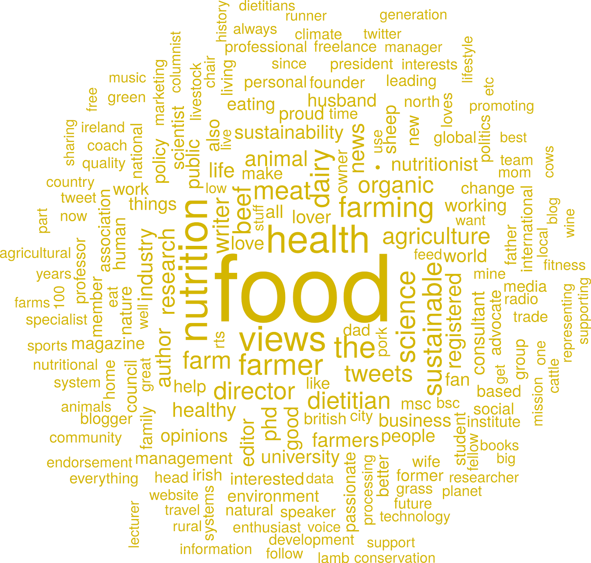
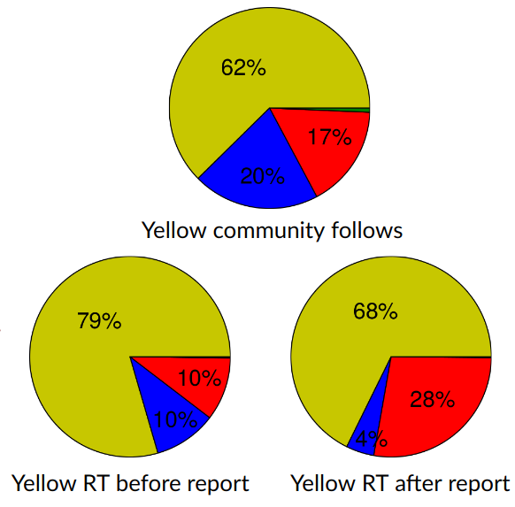

```{r xaringan-themer, include=FALSE, warning=FALSE}
#This block contains the theme configuration for the CSS lab slides style
library(xaringanthemer)
library(showtext)
style_mono_accent(
  base_color = "#5c5c5c",
  text_font_size = "1.5rem",
  header_font_google = google_font("Arial"),
  text_font_google   = google_font("Arial", "300", "300i"),
  code_font_google   = google_font("Fira Mono")
)
```

```{r setup, include=FALSE}
options(htmltools.dir.version = FALSE)
```


## Approaches to Polarization

**Opinion polarization:** Two opinion groups with extreme distance in between
[Political Polarization in the American Public. Fiorina & Abrams. Annual Review of Political Science (2008)](https://www.annualreviews.org/doi/10.1146/annurev.polisci.11.053106.153836)

**Relational polarization:** Social structure divided into two groups with high internal connectivity and low inter-group connectivity  
[A sign of the times? Weak and strong polarization in the U.S. Congress, 1973–2016. Neal. Social Networks (2020)](https://www.sciencedirect.com/science/article/abs/pii/S0378873317303039)

**Affective polarization:** Extreme support within groups and hate across groups
[The Origins and Consequences of Affective Polarization in the United States. Iyengar et al. Annual Review of Political Science (2019)](https://www.annualreviews.org/doi/abs/10.1146/annurev-polisci-051117-073034)


**Political sectarianism:** Integration into an interdisciplinary theory  
[Political sectarianism in America. Finkel et al. Science (2020)](https://science.sciencemag.org/content/370/6516/533)

---

# Hyperpolarization

```{r, echo=FALSE, out.width=950, fig.align='center'}

```
<center>
*Hyperpolarization: Opinion extremeness x Opinion constraint*

---

## Weighted Balance Theory and hyperpolarization

.pull-left[
- Cognitive balance +   
 evaluative extremeness

- ABM show emergence of hyperpolarization

- **Predicts that issues become aligned and polarized over time**
]

.pull-right[
```{r, echo=FALSE, out.width=450}
knitr::include_graphics("figures/WBT.png")
```
]

[A Weighted Balance Model of Opinion Hyperpolarization. Schweighofer, Schweitzer & Garcia, JASSS (2020)](http://jasss.soc.surrey.ac.uk/23/3/5.html)

---
class:center

## Hyperpolarization in Weighted Balance Theory


<iframe width="800" height="500" src="https://www.youtube.com/embed/y4rvLMgqwXQ" frameborder="0" allow="accelerometer; autoplay; encrypted-media; gyroscope; picture-in-picture" allowfullscreen></iframe>

---

layout: true
<div class="my-footer"><span>
<a href=https://doi.org/10.1016/S0140-6736(19)32526-7> EATLancet vs yes2meat: the digital backlash to the planetary health diet. David Garcia, Victor Galaz, Stefan Daume. The Lancet (2019)</a></span></div>

---

## Emergence of polarization in food habits

.pull-left[
- US Food demand Survey

- Self-reported meat consumption intention over time

- Color: party alignment

- Initial increasing trend for both parties

- Start of alignment with party from 2016: eating meat becomes a political issue

]
.pull-right[

```{r, echo=FALSE, out.width=450}

```
]

---

## A case of food polarization: the EAT-Lancet report

```{r, echo=FALSE, out.width=1000}
knitr::include_graphics("figures/eatlancet.png")
```

*The first full scientific review of what constitutes a healthy diet from a sustainable food system, and which actions can support and speed up food system transformation. (eatforum.org)*

---

## \#yes2meat: the digital backlash to EAT-Lancet

```{r, echo=FALSE, out.width=1100}

```
---

## Twitter data on EAT-Lancet and yes2meat

- List of original tweets that contain “EAT-Lancet” (or similar) or “yes2meat” from Twitter search interface (Dec 2018 - April 2019):
  - 7281 EAT-Lancet tweets, 8586 yessmeat tweets, 347 tweets mention both
- Tweet metadata from Twitter API: retweets, links, user profile (4278 users)
  - User profiles and self-description from Twitter API
  - Retrieved list of accounts they follow: 4.9 Million follower links
  - Retrieved timeline up to last (approx)  3200 tweets. 8 Million tweets in total
  - Analyzed automated behavior with botometer (4,203 users)
  - 2,376 unique links shared from tweets

- Manual sentiment annotations (Pro EAT-Lancet, Against EAT-Lancet, neutral, irrelevant) for varous samples (top URLS and samples from each community)
---

class:center

## Time series and URL shares

```{r, echo=FALSE, out.width=950}

```

---

## Social network analysis
.pull-left[
```{r, echo=FALSE, out.width=500}
knitr::include_graphics("figures/Net.png")
```
]
.pull-right[

]
---

## Social network analysis
.pull-left[
```{r, echo=FALSE, out.width=500}
knitr::include_graphics("figures/Net.png")
```
]
.pull-right[
```{r, echo=FALSE, out.width=950}

```
]
---

## Social network analysis
.pull-left[
```{r, echo=FALSE, out.width=500}
knitr::include_graphics("figures/Net.png")
```
]
.pull-right[
```{r, echo=FALSE, out.width=950}

```
]
---

## Social network analysis
.pull-left[
```{r, echo=FALSE, out.width=500}
knitr::include_graphics("figures/Net.png")
```
]
.pull-right[
```{r, echo=FALSE, out.width=490}

```
]
---

## Social network analysis
.pull-left[
```{r, echo=FALSE, out.width=500}
knitr::include_graphics("figures/Net.png")
```
]
.pull-right[
```{r, echo=FALSE, out.width=950}

```
]
---

## Retweet changes in yellow community
.pull-left[
```{r, echo=FALSE, out.width=500}
knitr::include_graphics("figures/Net.png")
```
]
.pull-right[
```{r, echo=FALSE, out.width=450}

```
]
---

## EAT-Lancet and yes2meat: Summary

- We mapped the digital backlash to EAT-Lancet on Twitter through #yes2meat
- Birth of #yes2meat preceded the release of the report
- Four communities: pro-EAT-Lancet, skeptic, pro-yes2meat, and vegan
- Information flow from pro-yes2meat to skeptic community after report
- Diet polarization: liberal vegan vs conservative keto

Example of emerging polarization towards hyperpolarization as in Weighted Balance Theory

**EATLancet vs yes2meat: the digital backlash to the planetary health diet.**  
David Garcia, Victor Galaz, Stefan Daume. The Lancet 394(10215) (2019)
https://doi.org/10.1016/S0140-6736(19)32526-7
