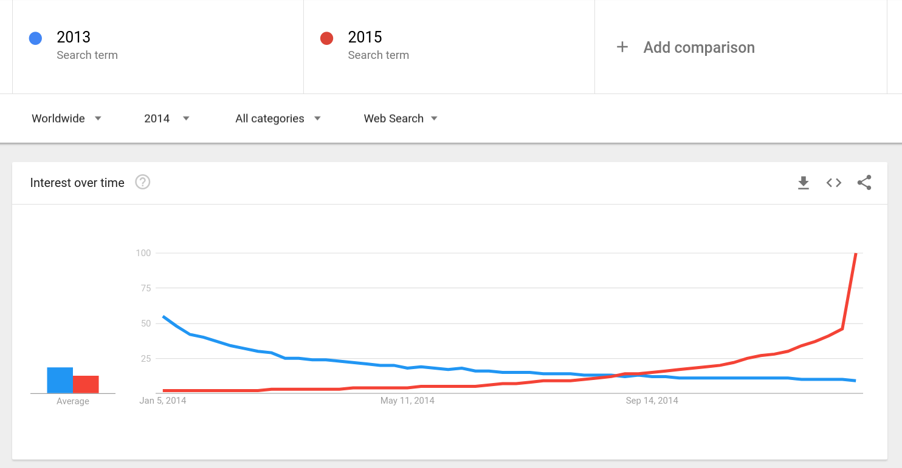
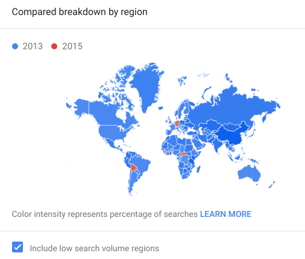

### Time, culture, and the economy

What is the relationship between culture and the economy? Max Weber proposed that culture shapes economic activity, especially as individualist cultures develop free markets. Karl Marx proposed the opposite: that economic relationships shape cultural values and shape institutions. These are not exclusive, there is an interplay between culture and the economy, and this topic focuses on a particular aspect of culture:

> **Long-Term Orientation (Geert Hofstede)**  
Long-term oriented societies believe that the most important events in life will occur in the future; short-term oriented societies believe that those events occurred in the past or take place now.

Geert Hofstede developed a model of culture based on surveys to IBM employees around the world, which then he expanded to culture in general. He identified six dimensions that differentiated work cultures:
individualism, uncertainty avoidance, power distance, masculinity, long-term orientation, and indulgence. You can see the values measured for various cultures on [this website](https://www.hofstede-insights.com/product/compare-countries/).

Long-term orientation is postulated to have a relationship with economic development. In particular [Hofstede hypothesizes](http://mchmielecki.pbworks.com/w/file/fetch/64591689/hofstede_dobre.pdf) that a poor country that is short-term oriented usually has little to no economic development, while long-term oriented countries continue to develop up to a certain point. 

If we measure economic development as the Gross Domestic Product per capita of a country, this hypothesis can be depicted as a function like this:

### Measuring the Future Orientation Index

[Pres et al. 2012](https://www.nature.com/articles/srep00350) proposed a way to measure how much a society looks towards the future with Google Trends, the Future Orientation Index (FOI). The FOI for a country *c* on year *y* is calculated as:

$FOI_{c,y} = \frac{G(y+1,y,c)}{G(y-1,y,c)}$

where $G(y_1,y_2,c)$ is the Google Trends volume for searches for $y_1$ during year $y_2$ from country $c$. Essentially, this measures the ratio of search volume from a country for next year divided by the search volume for the previous year.

Remember that Google trends gives you search volume information for a search query, in this case a year expressed with Arab numerals (e.g. "2016"). Check out the [Social Data Science story about Google Flu Trends](https://dgarcia-eu.github.io/SocialDataScience/1_Introduction/012_GoogleFluTrends/GoogleFluTrends.html) to learn more about Google Trends.

A measurement of the FOI for a year in many countries can be done with one visit to Google Trends. For example, for the year 2014:

{width=60%}{width=40%}

You can see that the search volume for "2013" decreased over the year 2014 and that the volume for "2015" increased over the year and had a spike close to the end of the year. The map shows you that most countries searched more for "2013" than for "2015" in 2014.
