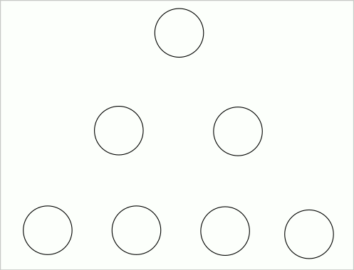
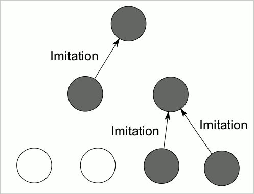
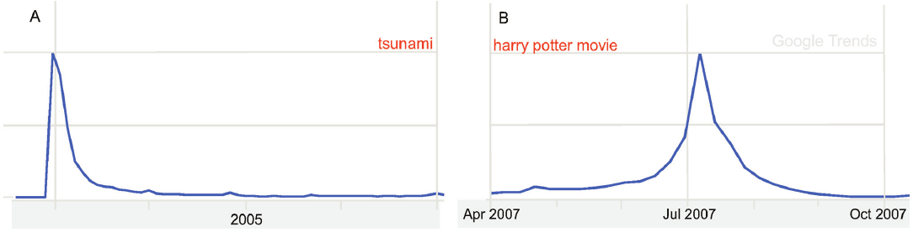
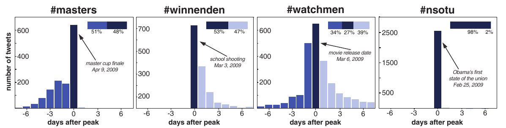

### How does social impact aggregate in a society?

  
Cascade of social sharing from [Rimé, 2009](https://journals.sagepub.com/doi/10.1177/1754073908097189)

Social impact does not happen in isolation because individuals influence each other. One example is influence cascades where social impact events trigger further social impact events. The figure shows an example of this kind of cascade described in 2009 by Bernard Rimé in his [review about social sharing of emotions](https://journals.sagepub.com/doi/10.1177/1754073908097189). One person experiences an emotion and tells their social contacts. Then those experience an emotion as result and they might express it to other contacts who might now know the first person reporting the emotion. This can happen further, for the case of emotions it has been documented up to three steps far.

The case of Twitter retweets is a similar one. We do not measure just how many of the followers of a user are influenced, but how many in total including followers of their followers and further down the follower network. The research question about predicting social media cascade sizes has been studied a lot and thus many different approaches exist. [A 2017 essay by Jake Hofman, Amit Sharma, and Duncan Watts](https://science.sciencemag.org/content/355/6324/486.abstract) shows an example of various approaches and how this research question can serve as an example for testing the predictive power of social science theories.

### Theory of fashion: the Simmel Effect

One of the first scientists to think about how influence aggregates at the collective level is Georg Simmel. Simmel is one of the fathers of sociology, especially with respect to the principles of social identity and social circles. Today we will focus on [his work on fashion](https://www.jstor.org/stable/2773129?seq=1). Simmel defined fashion as the *non-cumulative change in cultural features*, where cultural features are displayed as *status symbols*. Status symbols are externally displayed traits associated with high social class, e.g. surnames, clothing, sport, food, etc. With these definitions in mind, Simmel observed this effect:

> **The Simmel effect:** The persistence of social differences under the instability of status symbols

Simmel noticed that fashions come and go, but fashion is always present. When something becomes popular, it is bound to lose its popularity. Simmel introduced this theory in his 1904 article ["Fashion"](https://www.jstor.org/stable/2773129?seq=1), describing observations that are still relevant, such as how going against fashion is a way to acknowledge its relevance (the hipster paradox). Simmel's theory explains the emergence and instability of fashions based on two mechanisms: imitation and differentiation.
  

  
Animation of the imitation mechanism.

### The mechanisms of Simmel's theory

The mechanism of **imitation** describes how individuals adopt the symbols displayed by others, in particular of other individuals of higher social class. Here, social class serves as a a measurement of strength in social impact theory: those with higher visibility or wealth will have stronger impact for others to change their behavior and adopt their symbols.

Individuals are motivated to display the symbols of higher social classes to receive the benefits of being perceived as of higher social class (e.g. wearing a suit to be seated at a better table in a restaurant). These symbols are also used to establish social contacts, thus upwards mobility in the social ladder can be influenced by the display of status symbols. In addition, the mechanism of imitation is grounded on biological observations in which individuals conform to perceived group norms to fit in.  

  
Animation of differentiation and imitation.

The mechanism of **differentiation** is what high-status individuals follow when the don't have who to imitate. Once a status symbol has been adopted by a majority of the population, it loses its association with status. In this case, high-status individuals choose new symbols that make them look different from the rest, signaling their status by that differentiation. Thse new symbols might be arbitrary new ones, can be exotic symbols from far cultures, old symbols not widely adopted any more, or niche symbols from the least visible parts of society. 
The mechanism of differentiation is also observable in animals when they display distinctive visible traits (e.g. coloring of a bird's feathers) to attract the attention of others, especially in reproductive scenarios.

An example of differentiation is *countersignalling*, which is adopting a symbol as different as possible to the current norm, specially when the current trend has lasted long. You can see an example of countersignalling in the color of the logo of the [death metal band *Party Cannon*](https://www.buzzfeed.com/patricksmith/party-cannon).

### The case of baby names

First names can be status symbols and carry subjective and social values. Copying the name of your baby from someone else is an example of imitation (social impact where behavior is naming your baby). Even though adoption is very slow, baby names can be subject to the Simmel effect.

First names can be the basis of discrimination and stereotypes once they become widely adopted. An example is the stereotypes about the name "Kevin" in German-speaking countries. A German dictionary asked young people for neologisms to include in the dictionary and "Alpha-Kevin" was one of the runner ups. This [derogatory term](https://www.welt.de/kultur/article144361408/Alpha-Kevin-laeuft-bei-Dir.html) is used to stereotype misbehaving or unintelligent children and teenagers, and thus was [excluded from the dictionary to avoid promoting discrimination](http://www.spiegel.de/kultur/gesellschaft/
alpha-kevin-darf-nicht-jugendwort-des-jahres-werden-a-1045350.html).

The figure shows the number of new Kevins in the US and in Switzerland per year. While in the US it was popular for a long time and slowly lost popularity as a traditional name, the trend in Switzerland is typical of the Simmel effect, with a sharper increase and decrease in the adoption of this initially foreign status symbol. The data for Switzerland in the plot is taken from the [BFS database of baby names](https://www.bfs.admin.ch/bfs/de/home/statistiken/bevoelkerung/geburten-todesfaelle/vornamen-schweiz.assetdetail.969898.html). The [US Social Security reports naming data](https://catalog.data.gov/dataset/baby-names-from-social-security-card-applications-national-level-data) for more than 300 million babies since 1880. It is often used to study baby name trends, as we will see in our [Social Data Science story about baby names](https://dgarcia-eu.github.io/SocialDataScience/2_SocialDynamics/023_BabyNameTrends/BabyNameTrends.html).

### Social trends in online platforms

In online platforms, behavior spreads much faster than in offline cases like when naming babies. A useful way to analyze trends is to study them as responses to some newly generated content. Google search trends can capture data about these large-scale social trends:

The left figure shows the volume of searches for the word "tsunami" in the aftermath of the catastrophic Asian
tsunami. Such sudden peak is what is called an exogenous burst of activity, which is triggered by a large event that is seen by a lot of people at the same time. The right figure is the volume of searches for the term "Harry Potter movie". Here you see a much more symmetric trend, what is called an endogenously driven trend, where search in this case follows the word of mouth about the release of a movie.

[The endo-exo model of Riley Crane and Didier Sornette](http://www.pnas.org/content/105/41/15649.abstract) captures these types of dynamics. In this model, a trend can have two properties:  

- It can have an **exogenous trigger** when a central event influences lots of people at the same time, as in the tsunami example.
- It can be **critical** when the social interaction between individuals leads to further responses and it is stronger than the rate of losing interest.

These two properties are not exclusive, leading to four types of responses:  

1. Endogenous sub-critical: no clear peak, absence of trend.
2. Endogenous critical: "viral" peak driven by word of mouth.
3. Exogenous sub-critical: sharp peak but fast decay due to lack of strong social interaction.
4. Exogenous critical: sharp peak but slow decay due to strong interaction after shock.

These trends can be classified by comparing the proportions of volume at the peak, before the peak, and after the peak.

My research shows evidence of the existence of a fifth class that does not fit the model: [Anticipated shocks](https://dl.acm.org/doi/10.1145/2908131.2908191). These can be seen on Youtube, for example before the release of information or before scheduled events like the "Earth hour". If the criticality of the trend changes on that anticipated point, the result is an asymmetric peak that rises slowly and decays fast

### Trends on Twitter

This model has been applied to classify Twitter hashtag trends by [Lehmann et al.](http://dl.acm.org/citation.cfm?id=2187871). The figure shows activity volumes related to three of the classes in the model. 

The four examples shown in the figure are:  

- \#nsotu: Obama's fist state of the union address. It was widely seen (exogenous) but did not lead to lots of discussions (sub-critical).
- \#winnenden: a school shooting, thus it was widely seen (exogenous) and led to lots of discussions (critical)
- \#watchmen: discussions about a movie release that started before the movie (endogenous) and were discussed also afterwards (critical)
- \#masters: discussions before a sports event that lost interest after the event (anticipated shock).

Gathering this kind of volume data is best done by using the Twitter API. You can learn how to do this from R in the [Twitter API tutorial.](https://dgarcia-eu.github.io/SocialDataScience/2_SocialDynamics/027_rtweet/rtweet.html)