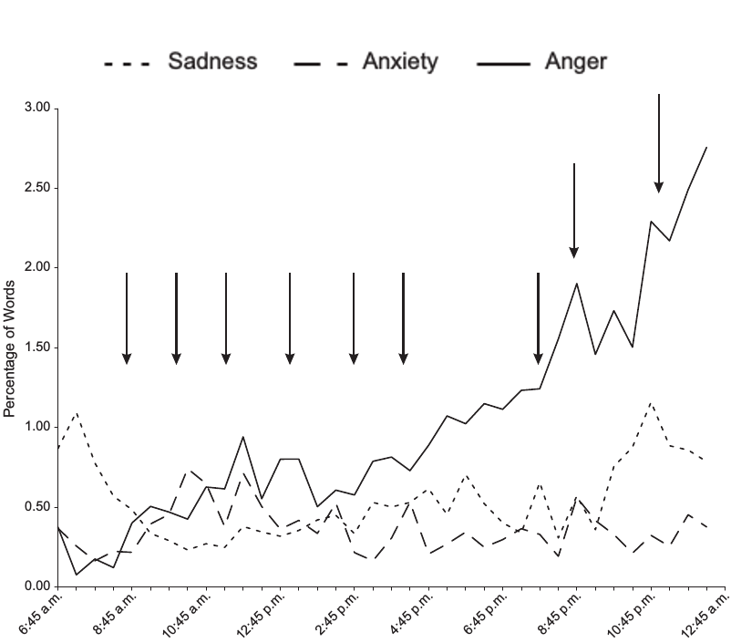
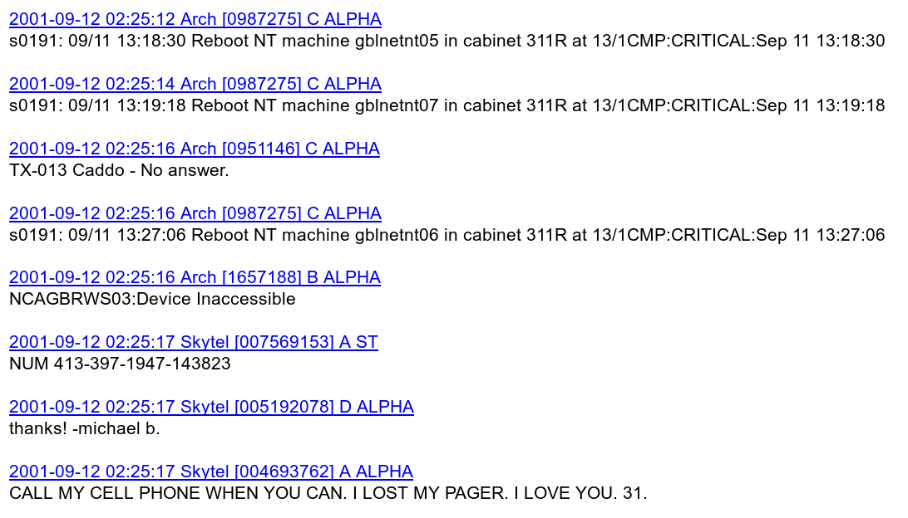
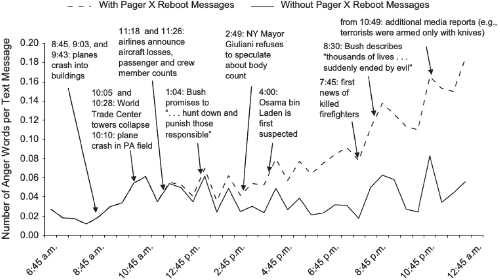

###  Emotions in pagers after 9/11

Back in the 90s, [pagers](https://en.wikipedia.org/wiki/Pager) were a common form of mobile communication in the US. To send a message to a pager, you could call a special phone number, say your message, and the text of the message would appear in the screen of the pager.

<div style="float:right">
  
</div>

Wikileaks hacked their way into the data produced by pagers around the terrorist attacks of 9/11 in 2001. They released all data publicly on [this website](https://911.wikileaks.org/files/index.html). This data was analyzed to measure the [emotional response of americans to the terrorist attacks](https://journals.sagepub.com/doi/abs/10.1177/0956797610382124). Previous works on emotions after 9/11 are among the first cases of the analysis of emotions in social media data, in particular the analysis of [blogs by Cohn, Mehl, and Pennebaker](https://journals.sagepub.com/doi/10.1111/j.0956-7976.2004.00741.x).

The original analysis of pager data by Back, Küfner, and Egloff used the LIWC method to measure the frequency of use of words expressing sadness, anxiety, and anger. They calculated the mean percentage of words in each class over windows of 30 minutes. The figure on the right shows the result, a steady increase of anger term frequency. Quoting the article itself:  
*"We were able to determine that people did not react primarily with sadness; that they experienced a number of anxiety outbursts, but recovered quickly; and that they steadily became angrier."*


### Not so angry americans

[Cynthia Pury inspected the results](http://journals.sagepub.com/doi/abs/10.1177/0956797611408735) and found a repeating pattern in the Wikileaks data. Out of the 16,624 instances of anger words 5,974 (35.9%) were in nearly identical messages:  

{width=50%}

These messages all looked like this:  

"Reboot NT machine [name] in cabinet [name] at [location]:CRITICAL:[date and time]."  

The word "critical" is contained in the anger word list of LIWC and thus it was being counted in each of these messages. These were automated error messages sent by servers to system administrators, probably from systems that were affected by the infrastructure damage of 9/11. A reanalysis of the data removing these messages leaves a result like this:

{width=60%}

After removing the automated messages, the steady increase in anger disappears, which was the main result of the original paper.

### The issue of machine-generated text

<div style="float:right">
  
https://botometer.osome.iu.edu/
</div>

Not all digital traces are generated by humans, a large volume of data is generated by machines. In the case of pagers is automated IT messages, but on social media this problem is generated by bots: automated accounts that might or might not try to imitate humans. The issue of social bots has been researched in depth, especially for the case of Twitter. During the summer of 2018, Twitter made a big bot cleanse, but independent estimates before reported that between [9% and 15% of Twitter accounts were likely to be bots](https://ojs.aaai.org/index.php/ICWSM/article/view/14871/14721). 

One of the most widely used methods to detect bots on Twitter is [Botometer](https://botometer.osome.iu.edu/), which is in constant development by the [OSoMe lab at Indiana University](https://osome.iu.edu/). As of 2021, their API allows to analyze Twitter accounts and gives scores for various types of bots including political bots (astroturfers), fake followers, financial bots, self-declared bots, and spammers.

Even if you clean bots from your data, you should always take a good look at your text. You can make word clouds, word shift graphs, or just browse through it to see if you notice anomalous patterns. To sum up:

> Take home message: Do not just analyze text, also look at it!


### Appendix: Do it Yourself

You can find the text of the pagers on the [github repository of this topic](https://github.com/dgarcia-eu/SocialDataScience/tree/master/3_Affect/033_PagerEmotions). Using LIWC requires you to request a license, but you can do a similar analysis with the [NRC emotion lexicon](https://saifmohammad.com/WebPages/NRC-Emotion-Lexicon.htm) through the [syuzhet R package](https://cran.r-project.org/web/packages/syuzhet/index.html). Here you have the code to start with, but be careful because running syuzhet might take some time!

```{r eval=F}
text <- readLines(gzfile("messages_all.txt.gz"))

timestamps <- as.POSIXct(substr(text, 1, 19))
msg <- substr(text, 21, nchar(text))

library(syuzhet)
emotions <- get_nrc_sentiment(msg)

emotions$timestamp <- timestamps
write.csv(emotions, "emotions.csv", row.names=F)
```
