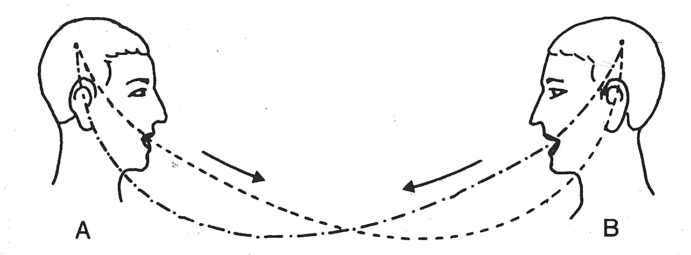
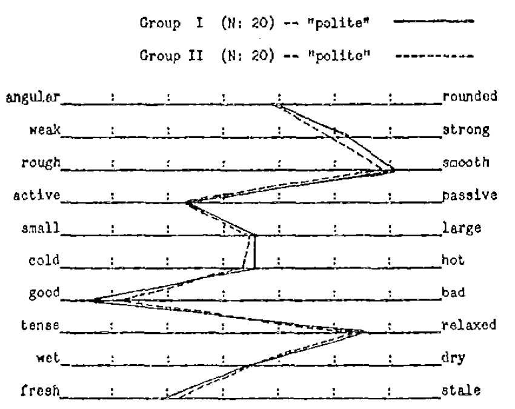
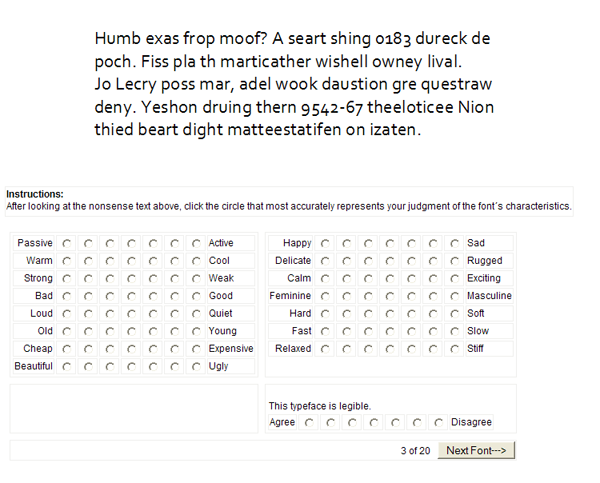

Psycholinguistics is the science of how individuals use and adopt language. While linguistics studies languages, their structures, and how they change over time, psycholinguistics studies how people use and shape languages, how their subjective states or social relationships shape the way they communicate. Language and communication are not restricted to spoken or written words, other modes of communication replace words with other kinds of symbols, such as body movements, word signs, pictorial expression, etc

  

**De Saussure's model of language**

Ferdinand De Saussure was a Swiss linguist that introduced some of the basic concepts that linguistics and psycholiguistics use. In his mode, language is an association between signified (meaning) and signifier (word). Associations are normative, which means that they are to a great extent agreed upon by the set of people who use the language. Communication is composed of two steps:

  1. Encoding: Transforming thoughts into words, for example what happens when you say the word "fire" when you want to warn others.
  2. Decoding: Translating words into thoughts, for example when you hear "fire" said by someone else and you notice there is a danger.

### Connotative vs denotative meanings

Meaning is the information communicated by a word or symbol. There are two broad classes of meanings

- Denotative meaning: The definition of a word in reference to other meanings, sometimes also called referential meaning or literal meaning. Dictionaries formalize denotative meanings, explaining what information is expressed by a word.

- Connotative meaning: The emotional association of the use of a word. This subjective component of meaning is hard to capture by dictionary definitions and is largely influenced by culture. There is more room for individual interpretation and local differences in connotative meaning. It is also called affective meaning or evocative meaning. Sentiment analysis aims to measure the connotative meaning of texts, not its denotative meaning.

### The Semantic Differential

Charles Osgood was a psycholinguist that developed a very early approach to quantify connotative meaning. 
This is Osgood's Semantic Differential, which is composed of rating scales to measure the connotative meanings of words, objects, events (or symbols in general)

Osgood method to find the dimensions of meaning contained five steps:

1. Select a set of objects/words/symbols to measure their meaning
2. Design a large set of questions or scales about the symbols, preferably with adjectives at the ends of the scale
3. Ask some people to rate the symbols according to the scales
4. Apply dimensionality reduction/factor analysis
5. Interpret factors into dimensions of meaning

He summarized many yaers of research on this topic in his 1957 book [The measurement of meaning](https://www.amazon.com/Measurement-Meaning-Charles-Osgood/dp/0252745396). An example of word ratings produced by step 3 can be seen below:

In this case, participants rated the word *polite* in the set of scales with adjectives at the end that Osgood designed for the task. Each participant rated the word in relation to these scales and the line in the plot shows the averages of 20 participants in two different studies. You can see that the lines are very close to each other, suggesting that these ratings are accurate. Some ratings show how polite is closer to good than bad, closer to smooth than to *rough*, and around the middle between *wet* and *dry* and *small* and *large*. You can learn more about this particular example in [The nature and measurement of meaning. C. Osgood, Psychological bulletin, 1952.](http://www.communicationcache.com/uploads/1/0/8/8/10887248/the_nature_and_measurement_of_meaning.pdf)

### Semantic differential example: fonts

Not only the meaning of words can be measured with the semantic differential, but many other symbols and modes of communication that can carry connotative meaning. For example in [Know Your Typefaces! Semantic Differential Presentation of 40 Onscreen Typefaces. A. D. Shaikh.](http://usabilitynews.org/know-your-typefaces-semantic-differential-presentation-of-40-onscreen-typefaces/), you can find how text fonts can be rated according to Osgood's Semantic Differential. The study shows participants a text and scales as shown below:

The text is a *pseudotext*, which is a meaningless text but still composed of pronouncable words. This way the text looks as natural as possible without carrying any meaning, only the meaning attributed to the font can be rated. Below you can see the ratings for the *French Script* font:

Word fonts are a great example of encoding connotative meaning without changing the denotative meaning of a text, as a pseudotext in Frenc Script is perceived as soft, delicate, and relaxed. 

### Dimensionality reduction

In the French Script example above, the scales are grouped in four groups called Potency, Evaluative, Activity, and Non-loading. This is the result of steps 4 and 5 of Osgood's method: dimensionality reduction and interpretation of the dimensions. 

One of the most common methods for dimensionality reduction, often applied in the case of meanings, is Principal Component Analysis (PCA). The figure above shows how PCA works. Figure[^1] a shows the cloud of points in which each word is a point in a space with as many dimensions as rating scales in our study. The case of the figure has three dimensions (three scales), but the first case we showed for the word *polite* would have ten dimensions. The location of a point is the average of responses in that rating dimension for a word.

The PCA method formulates a set of N linear equations with N terms each, where N is the number of dimensions (rating scales). Each of these equations is called a principal component (PC), shown on figure b. The coefficients of equations are fitted such that the first component explains as much variance as possible of the whole cloud, with each subsequent additional component being the one that explains the most variance of what remains. This way, you have N principal components, sorted by the proportion of variance they explain. The figure shows that the cloud of points can be well captured by the two first components, as shown of figure c, as the points lied in an ellipse on a plane in the three dimensional space.

### Three dimensions of meaning

The factor analysis of Osgood's method gives consistently 3 principal components, also called dimensions of meaning because have been replicated for words in many languages, paintings, inkblots, etc. Interpreting the meaning of these is the result of the fifth step of the method, and these common dimensions are often called EPA:

- **Evaluation:** good, desirable -- bad, undesirable
- **Potency:** strong, powerful -- weak, powerless
- **Activation:** active, fast -- passive, slow

Evaluation usually explains most variance of participant ratings, i.e is the most explanatory and if we have to choose one dimension only, this would be the choice. Potency and Activation have similar explanatory level below Evaluation. Evaluation is similar to Valence for the case of emotion word, Activation is similar to Arousal, and Potency is related to Dominance. Osgood's method is a very simple and initial approach to measure meaning, more current and advanced methods in Natural Language Processing, such as Latent Semantic Analysis or word embeddings, can measure a much more nuanced basis of meaning, for example to detect topics. This course will not cover those, but other courses at TU Graz cover them in detail. 

[^1]: Dimensionality Reduction Methods for Molecular Motion](http://archive.cnx.org/contents/02ff5dd2-fe30-4bf5-8e2a-83b5c3dc0333@10/dimensionality-reduction-methods-for-molecular-motion)

