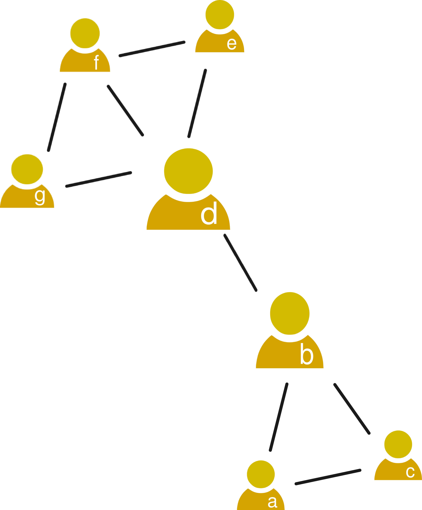
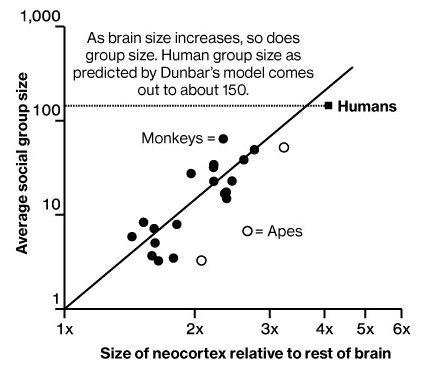
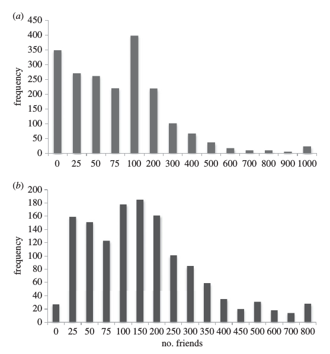
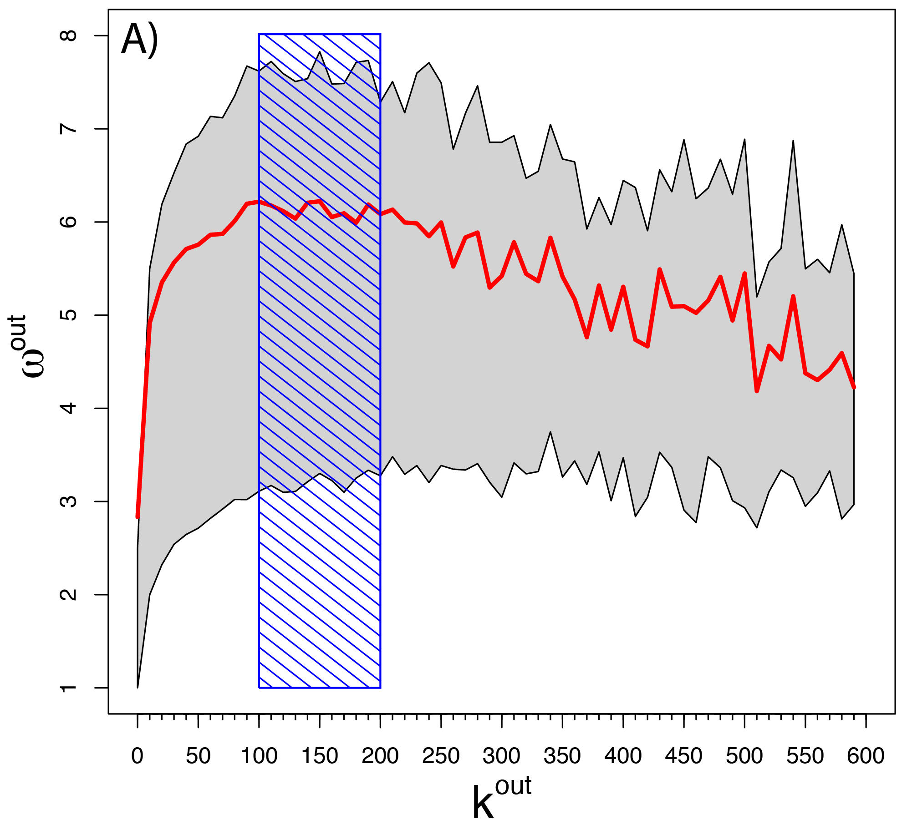

### The concept of centrality

A common question when analyzing organizations or societies is how important an individual is. Social network analysis can be used to measure the importance of a person as a function of the social structure of a community or organization. In social networks, **centrality** measures this kind of structural importance of the node of a person. There are various centrality measures that stem from different kinds of structural importance. In this topic you will learn about three centrality measures:

1. Degree centrality
2. Betweenness centrality
3. Closeness centrality

In the [social resilience topic](https://dgarcia-eu.github.io/SocialDataScience/5_SocialNetworkPhenomena/051_SocialResilience/SocialResilience.html) you can learn about a fourth centrality topic, coreness centrality.

### Degree centrality

  

The importance of a node might grow with number of other nodes you can reach from it. In this case, degree centrality can be used to measure importance. As we saw in [the introduction to social networks](https://dgarcia-eu.github.io/SocialDataScience/4_SNA/041_SNAIntro/SNAIntro.html), a node's **degree** measures the number of links connected to it. In undirected networks, there is only one measure of degree $d(i)$, which is exactly the number of edges connected to the node $i$. This can be a measure of importance for example in a friendship network like we saw for the friendship paradox, where importance is the number of friends of a person.

In directed networks there are two kinds of degree: **in-degree** $d_{in}(i)$ that is the number of edges ending in $i$, i.e. $(j,i)$ and **out-degree** $d_{out}(i)$ that is the number of edges leaving from $i$, i.e. $(i,j)$. In the network example of the right, $d_{in}(c) = 1$ and $d_{out}(c) = 2$. If importance on Twitter is the number of followers of an account, in-degree centrality is a way to measure it. An example of out-degree centrality as a measure of importance is an information forwarding network in an organization, where the person that forwards information to the most people would be the most important.

The weight of a link can play a role in the calculation of importance, for example when the strength of social relationships is measured in a social network. In weighted networks you can have the measures of weighted in-degree centrality and weighted out-degree centrality, which are the sum of the incoming and outgoing weights of a node respectively. 

### Betweenness Centrality

  

Sometimes the importance of a person is quantified as the number of shortest paths between two other people that pass through this person. This can happen for example when you look at how information flows in an organization, where usually secretaries and other administration personnel lie on many paths connecting departments and many other people. In these cases, betweenness centrality measures the importance of people in a social network, calculated as:

$$C_B(i) = \sum_{s \neq i, t \neq i} n_i(s,t) $$
Where $n_i(s,t)$ is the number of shortest paths from $s$ to $t$ that pass through $i$. In the example on the right, $C_B(b) = 16$, as all the shortest paths from any node from the set ${a,c}$ to any node from the set ${d,e,f,g}$ pass through $b$. Keep in mind that the count is from all sorted pairs of nodes, so paths are counted in one direction and back. This is rather trivial in undirected social networks, but can easily make a difference in directed ones.

Sometimes betweenness centrality is normalized by dividing over the number of all shortest paths between all pair of nodes, thus giving a measure in which values in [0, 1] give the fraction of shortest paths on which a node lies from among all paths. Betweenness centrality is a non-local measure, i.e. the centrality of a node depends not only on the neighbors of a node, but also on the remaining topology of the rest of the social network. You need to know all social network data to calculate it, which makes it unsuitable for cases with partial network data.

### Closeness Centrality

Sometimes the most important people in a group are the ones that can reach everyone with the least effort. Those people can contact few friends to establish a path to each other person in the group and for example, inform everyone of something importance. In that case, closeness centrality is a good measure of importance. Closeness centrality is calculated as:

$$C_C(i) = \frac{n-1}{\sum_{j\neq i} dist(i,j)} $$
Where $dist(i, j)$ is the distance from $i$ to $j$ and $n$ is the number of nodes in the network. Closeness centrality measures an inverse mean distance from node $i$ to all other nodes $j\neq i$. The numerator is the number we use to divide when computing the mean, in this case the number of other nodes with is $n-1$.

On the example above, $C_C(d)=0.75$, as $d$ is at distance 1 from 4 nodes and at distance 2 from 2 nodes. Then $\sum_{j\neq d} dist(d,j) = 1 + 1 + 1 + 1 + 2 + 2 = 8$. Since there are 7 nodes in the network, the numerator of the equation above is 6, then the closeness centrality of $d$ is $6/8=0.75$. If there was one node connected to all others, as in a star, the closeness centrality of that node would be the maximum value of $1$.

Different from betweenness centrality, the closeness centralities of neighboring nodes are usually correlated. Closeness centrality is also a non-local measure as betweenness centrality.

### Neocortex Size as a limit to degree centrality

  

[From Dunbar, 1992](https://www.sciencedirect.com/science/article/abs/pii/004724849290081J)

The average degree centrality or the number of contacts of each individual has been studied in Anthropology across many species. Social animals have social networks structured in groups in which all individuals can recognize each other, thus the group size measures the average degree. [Robin Dunbar](https://en.wikipedia.org/wiki/Robin_Dunbar) found a correlation between the average group size (degree) of species and the ratio of the size of their Neocortex to the rest of the Brain. The Neocortex is a large part of the brain that is active in moments of rational thought and remembering of the identity of others.

The figure comes from [Dunbar's work](https://www.sciencedirect.com/science/article/abs/pii/004724849290081J) that showed a power relationship between brain structure and the average group size in different species. It shows how neocortex size is a limit to the average number of contacts a member of a species can remember, thus limiting the size of groups.

In human social networks, the typical group size predicted by Dunbar's finding is about 150. This number is commonly known as "Dunbar's number" and in a complex society it means that a person knows on average 150 people. His work confirmed this prediction and [revealed additional patterns](https://pubmed.ncbi.nlm.nih.gov/22506741/) on the relationship between the strength of social contacts and their number in circles around a person.

### Dunbar's number in Online Social Networks

[From Dunbar, 2016](https://royalsocietypublishing.org/doi/10.1098/rsos.150292#d3e431)

Information and Communication Technologies help us to overcome some of our cognitive limits. Your phone lets you talk with people far away and your contact lists help you to be in touch with them without having to remember their numbers or where they live. Online social media might serve the same purpose and allow us to have more contacts than we can have in offline life, thus increasing the average number of friends that people have in society.

Robin Dunbar [tested this in a survey study](https://royalsocietypublishing.org/doi/10.1098/rsos.150292#d3e431) asking people how many friends they have on Facebook in two different surveys. You can see the distribution of responses in the figure on the right, both distribution have means around Dunbar's number (155 and 182). You might remember similar observations from the big data study from Facebook in the [friendship paradox topic](https://dgarcia-eu.github.io/SocialDataScience/4_SNA/042_FriendshipParadox/FriendshipParadox.html), where the mean was 190.

Social media allow some people to have lots of friends, even thousands, but the average person still has a number of friends close to the same number they have offline. Seems that the limit for the number of friends is not just about remembering them, but also about having time to invest in keeping in contact with them.

### Dunbar's number on Twitter

  

[From Gonçalves et al, 2011](https://journals.plos.org/plosone/article?id=10.1371/journal.pone.0022656)

Bruno Gonçalves and colleagues [measured Dunbar's number on Twitter](https://journals.plos.org/plosone/article?id=10.1371/journal.pone.0022656) in a different way. They took a large sample of Twitter users and calculated the number of people they communicated with (degree) versus the average weight of their outgoing links, measured as the number of reply tweets they send over a period of time. The figure on the right shows the relationship between these two quantities. The average weight grows with the number of contacts but starts to decrease after a number between 100 and 200. Gonçalves and colleagues interpreted this as evidence of a maximum in communication efficiency when a Twitter user has a number of friends close to Dunbar's number. Twitter users who talk with a number of users around 150 would this way be able to keep better in touch with them.

A later [paper replicating a lot of Twitter findings](https://journals.plos.org/plosone/article?id=10.1371/journal.pone.0134270) repeated the analysis four years later and found a lower number for this maximum, a bit below 100, but still a similar shape. This should remind you that social media like Twitter are not a static research subject. The findings of few years ago might be different from what we can measure today because the people involved are different, the design of platforms might have changed, and even the behavior of who still use the platform might be different than few years ago.

