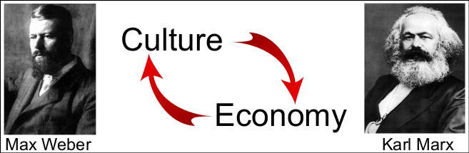

```{r xaringan-themer, include=FALSE, warning=FALSE}
#This block contains the theme configuration for the CSS lab slides style
library(xaringanthemer)
library(showtext)
style_mono_accent(
  base_color = "#5c5c5c",
  text_font_size = "1.5rem",
  header_font_google = google_font("Arial"),
  text_font_google   = google_font("Arial", "300", "300i"),
  code_font_google   = google_font("Fira Mono")
)
```

```{r setup, include=FALSE}
options(htmltools.dir.version = FALSE)
```

layout: true

<div class="my-footer"><span>David Garcia - Social Data Science - ETH Zurich, Chair of Systems Design</span></div> 

---

# Time, culture, and the economy

What is the relationship between culture and the economy?  



---

## Long-term orientation and economic development
> **Long-Term Orientation (Geert Hofstede)**  
Long-term oriented societies believe that the most important events in life will occur in the future; short-term oriented societies believe that those events occurred in the past or take place now.

.center[]

---

## Measuring the Future Orientation Index

[Pres et al. 2012](https://www.nature.com/articles/srep00350) proposed a way to measure how much a society looks towards the future with Google Trends, the Future Orientation Index (FOI). The FOI for a country *c* on year *y* is calculated as:  

.center[
$FOI_{c,y} = \frac{G(y+1,y,c)}{G(y-1,y,c)}$
]

where $G(y_1,y_2,c)$ is the Google Trends volume for searches for year $y_1$ during year $y_2$ from country $c$. 

The FOI measures the ratio of search volume from a country for next year divided by the search volume for the previous year in the same country.

---

# Example of trends for FOI

.center[]

---

# Example of trends for FOI
.center[]

