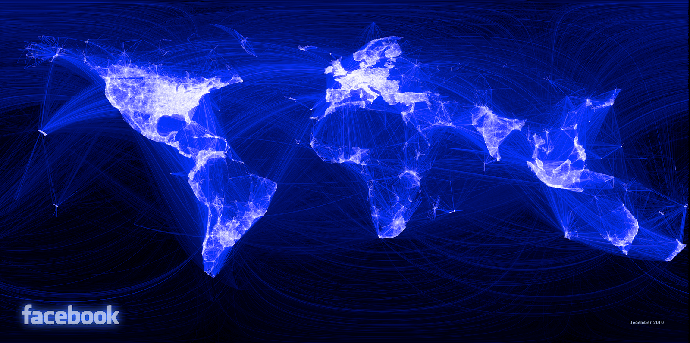
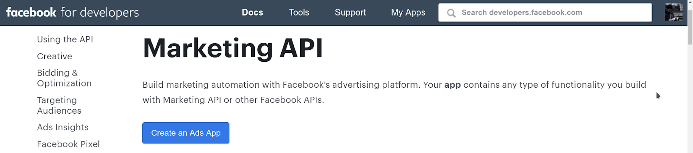
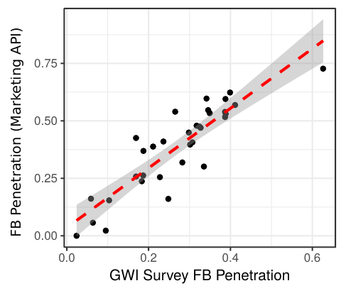
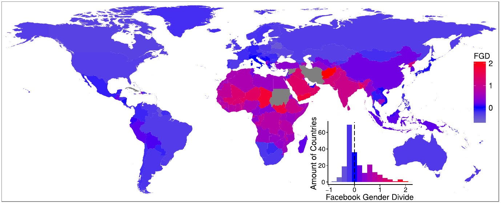
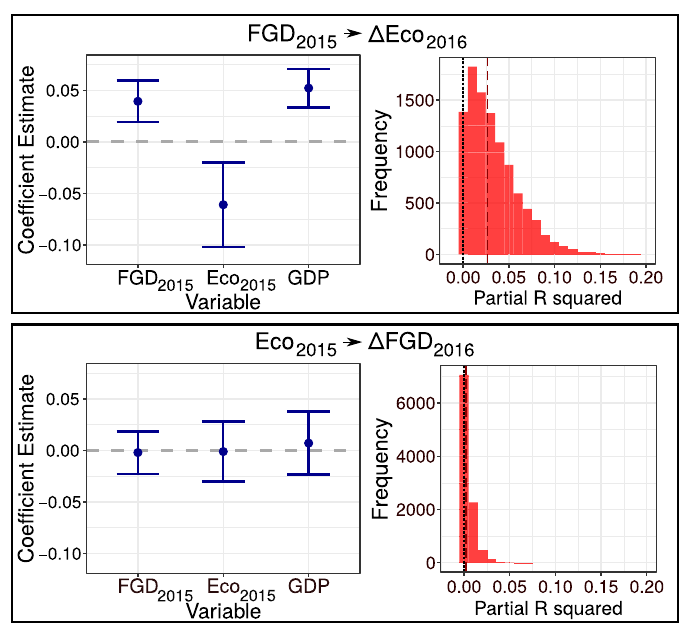
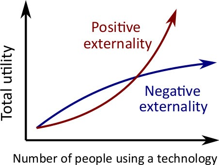
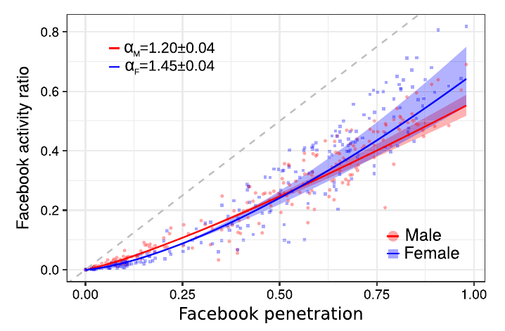
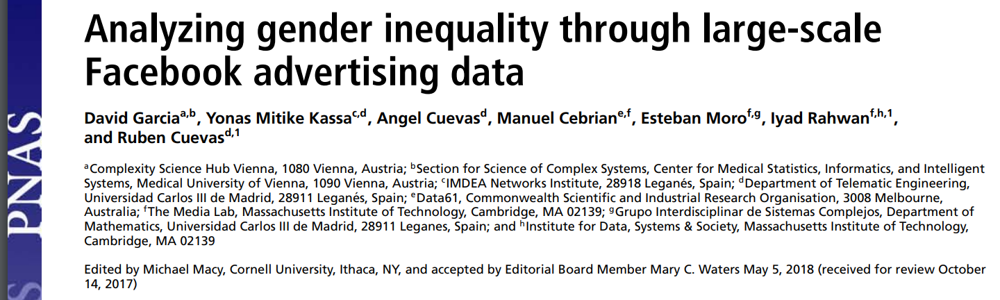

```{r xaringan-themer, include=FALSE, warning=FALSE}
#This block contains the theme configuration for the CSS lab slides style
library(xaringanthemer)
library(showtext)
style_mono_accent(
  base_color = "#5c5c5c",
  text_font_size = "1.5rem",
  header_font_google = google_font("Arial"),
  text_font_google   = google_font("Arial", "300", "300i"),
  code_font_google   = google_font("Fira Mono")
)
```

```{r setup, include=FALSE}
options(htmltools.dir.version = FALSE)
```


layout: true
<div class="my-footer"><span>David Garcia - Social Data Science</span></div> 

---
class:center

# How can social media affect our society?

.pull-left[
Opportunities and benefits

```{r, echo=FALSE, out.width=950}

```
]
--
.pull-right[
Risks and problems

```{r, echo=FALSE, out.width=950}

```
]
---

layout: true
<div class="my-footer"><span>
<a href=http://www.pnas.org/content/early/2018/06/12/1717781115> Analyzing gender inequality through large-scale Facebook advertising data. David Garcia et al. Proceedings of the National Academy of Sciences (2018)</a></span></div>

---


# Inequality and gender in social media

- The Internet as the Great Potential Equalizer (Hargittai & Hsieh 2013): 
  - Providing opportunities and  information access to everyone?

- "Unequal distribution of Internet access might exacerbate socioeconomic inequalities."
<div style="text-align: right"> <em property="italic"> World Bank: World Development Report 2016: Digital Dividends </em></div>

- "One in five female Internet users live in countries where harassment and abuse of women online is extremely unlikely to be punished." 
<div style="text-align: right"> <em property="italic"> The Web and Rising Global Inequality.  World Wide Web Foundation, 2015 </em></div>

---

## The Facebook Ads API in demographics

```{r, echo=FALSE, out.width=800, fig.align='center'}

```
- Programmatic Interface to automate marketing campaign in Facebook
- Audiences can be tuned by demographic attributes (gender, age, income...) or interests (sports, political parties, entertainment...) 
- Accessible for everyone with a Facebook account - audience metrics for everyone
- Used in demographics and development research (e.g. [Zagheni, Weber, & Gummadi, 2017;](https://doi.org/10.1111/padr.12102) [Mejova et al., 2018;](https://dl.acm.org/doi/abs/10.1145/3209811.3212698) [Fatehkia, Kashyap, & Weber, 2018](https://www.sciencedirect.com/science/article/pii/S0305750X18300883))
- Python package to use it: https://github.com/maraujo/pySocialWatcher

---

## The Facebook Gender Divide 

$R_{g,c}$: Ratio of Facebook active users of gender *g* over all inhabitants of gender *g* in country *c*

<center>

Facebook Gender Divide for country c:  
<br>$$FGD_c= log\left(\frac{R_{Male,c}}{R_{Female_c}}\right)$$</center>

Validation with survey data:
- FGD (217 countries)
- Global Web Index (34 countries)
- Pew Internet research (19 countries)

---

# Validation against international surveys

.pull-left[
```{r, echo=FALSE, out.width=500, fig.align='center'}

```
]

.pull-right[
```{r, echo=FALSE, out.width=550, fig.align='center'}
knitr::include_graphics("figures/FGDval2.png")
```
]


---
## The Facebook Gender Divide across countries

```{r, echo=FALSE, out.width=1100, fig.align='center'}

```

---
# Basics: Linear Regression

Regression models formalize an equation in which one numeric variable $Y$ is formulated as a linear function of other variables $X_1$, $X_2$, $X_3$, etc: <center>
$Y = a + b_1 X_1 + b_2 X_2 + b_3 X_3 ... + \epsilon$
</center>
- $Y$ is called the dependent variable

- $X_1$, $X_2$, $X_3$, etc are called independent variables

- $a$ is the intercept, which measures the expected value of $Y$ that does not depend on the dependent variables

- $b_1$, $b_2$, $b_3$, etc are called the slopes or the coefficients

- $\epsilon$ are the residuals, the errors of the equation in the data


---

## The FGD and offline gender inequality

```{r, echo=FALSE, out.width=1100, fig.align='center'}
knitr::include_graphics("figures/FGDreg.jpg")
```
- Regression of FGD rank on WEF gender indices and controls
- Most explanatory variable: Education Gender Equality
---


## The FGD and changes in gender inequality

.pull-left[
```{r, echo=FALSE, out.width=550, fig.align='center'}

```
]
.pull-right[
- Changes in FGD and WEF gender equality indicators (2015-2016)
- FGD in 2015 improves prediction of changes in economic gender equality
- The reverse case is not present
- Not observable for other equality indices

On average, countries with high FGD rank 
in 2015 (low FGD) tended to approach economic gender equality in 2016
]
---

## Positive externalities in Facebook use

.pull-left[
```{r, echo=FALSE, out.width=450, fig.align='center'}

```
]
.pull-right[
```{r, echo=FALSE, out.width=550, fig.align='center'}

```
]
- Superlinear scaling of activity ratio versus total penetration
- Positive externality: value of using Facebook grows with other people using it

---

## The Facebook Gender Divide: Summary

- Measure of gender divide with FB data comparable to surveys
- This measure captures offline gender equality indices across countries
- Temporal correlation between FGD and changes in economic gender eq.
- Superlinear scaling of FB activity with penetration: positive externality

Social media might also work as a *digital provide*. Is Facebook helping women to find employment in countries with high gender inequality?

---

# To learn more


```{r, echo=FALSE, out.width=1100, fig.align='center'}

```

[**Analyzing gender inequality through large-scale Facebook advertising data.** David Garcia et al. Proceedings of the National Academy of Sciences (2018)](http://www.pnas.org/content/early/2018/06/12/1717781115)


