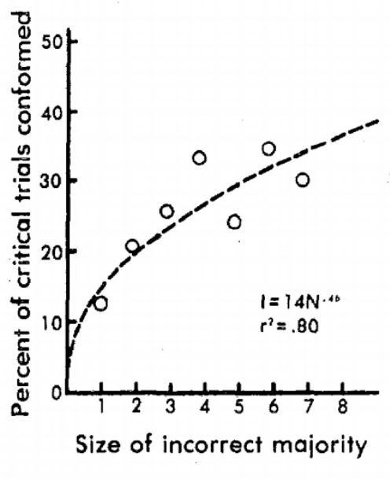
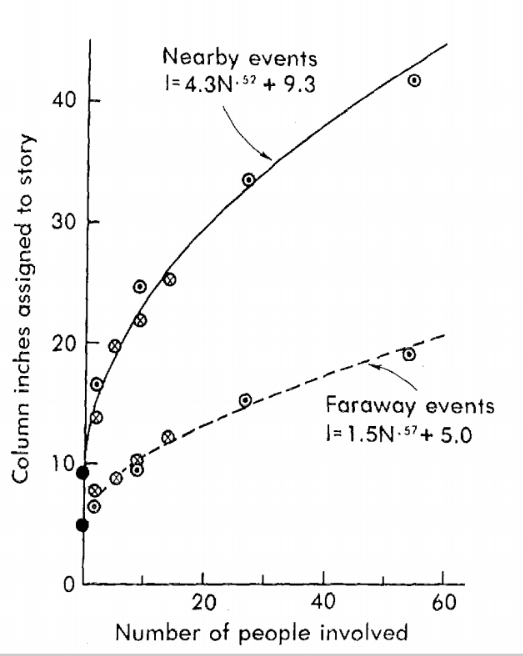
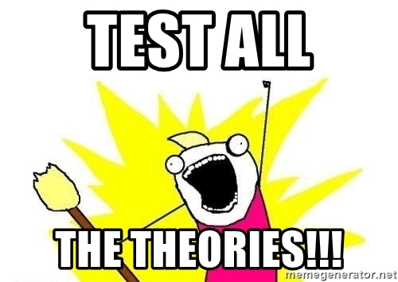

```{r xaringan-themer, include=FALSE, warning=FALSE}
#This block contains the theme configuration for the CSS lab slides style
library(xaringanthemer)
library(showtext)
style_mono_accent(
  base_color = "#5c5c5c",
  text_font_size = "1.5rem",
  header_font_google = google_font("Arial"),
  text_font_google   = google_font("Arial", "300", "300i"),
  code_font_google   = google_font("Fira Mono")
)
```

```{r setup, include=FALSE}
options(htmltools.dir.version = FALSE)
```

layout: true

<div class="my-footer"><span>David Garcia - Social Data Science - ETH Zurich, Chair of Systems Design</span></div> 

---

# What is Social Impact?

<div style="float:right">
  
</div>

> **Social Impact:** Changes in behavior that occur in an individual as a result of presence or actions of other individuals

Examples of behavior: subjective feelings, motives, emotions, thoughts, customs, decisions...  

The presence or actions of others can be:  

- *real:* the physical presence of others  
- *implied:* expected or manipulated presence, e.g. a cardboard policeman  
- *imagined:* mental representation of others, e.g. supporters of your team when watching TV sports

---

# Asch's conformity experiments


Elevator experiment in Candid Camera (1962)

---

# Social Impact Theory (Bibb Latané)
<center>

</center>

---

# Social forces in SIT

In [Social Impact Theory](http://psycnet.apa.org/psycinfo/1982-01296-001), social impact is driven by three forces in the following equation:
<p align=center>
I = f (S × i × N)
</p>

- $I$ is the magnitude of social impact

- $f()$ is a multiplicative function of three conditions of the impacting situation:

  1. **Strength** $S$ or power of the source(s)  

  2. **Immediacy** $i$ or proximity of the source(s)

  3. **Number of sources** $N$ or number of people

---

# N: Number of sources

<div style="float:right">
  </div>
</br>
</br>
SIT predicts that impact should grow with N. Asch's conformity experiments test this hypothesis, where:

- $I$: increase in percentage of wrong answers given by students that were experiment subjects

- $N$: controlled number of confederates

The result: the percentage of wrong answers grows with the amount of sources.

---

# The Psychosocial Law

<div style="float:right">
  </div>

> **The Psychosocial Law:** The extent of social impact grows sublinearly with the number of sources  

This can be translated to the equation:
<center>
$I \propto N^t, t < 1$
</center>  

This means that the hundredth source has less additional effect than the first (*diminishing returns*).

The equation is what is called a power-law with exponent $t$. In the case of conformity among high school students, $t$ was estimated to be 0.48.

---

<div style="float:right">
  
</div>

# S: Strength of sources

The strength in SIT is the perceived social status, power, wealth, importance, or intensity of the sources. Poem experiment example:

- $I$: anxiety of the students recorded with a dial they use to measure their own anxiety

- $N$: number of people in the audience

- $S$: audience is middle-aged (strong) or teenagers (weak)

**Multiplicative effect:** The impact of the number of sources grows faster when they are strong than when they are weak

---

# i: Immediacy of sources

<div style="float:right">
  
</div>

Immediacy is defined as the proximity between the sources and the target of social impact. Immediacy can be spatial, temporal, or social.
The effect of immediacy in media bias experiments: 
- $I$: number of lines used to report the news by the students
- $N$: number of people reported dead in the accident
- $i$: is the distance to the place of the accident (close vs far conditions)

Results: The growth of impact with N was steeper for the close condition

---

# Division of impact
<center>

</center>
---

# Division of impact

Social Impact Theory also covers situations with one source but when when targets are not alone. It formulates the impact $I$ on **each** target as:  
<center>
$I = f(\frac{1}{S × i × N})$
</center>
Where the terms are:  

- $S$ strength of the targets: the stronger the targets, the harder to impact each one.  
- $i$ immediacy between the targets: the closer or more connected the targets, the harder to impact each one.  
- $N$ the more the targets in the group, the harder to impact each one.
- $f()$ is another multiplicative function but with negative exponents for the terms.

---
<div style="float:right">
  
</div>
# Division of impact

The most widely studied divisor of impact is group size (N). An observational study finds the effect for the case of restaurant tips:

- $I$: Percentage of tip (assumed evenly shared among customers)
- $N$: number of customers at the table

Result: $I$ decreases as $N$ increases. The more people sitting at the same table, the less obliged each one feels to leave a tip. The resulting shape of I as a function of N is well fitted by a negative power of N. 

---

# Online social impact

The psychosocial law can be observed in various social media:
<center>

</center>
Probability to Digg or Retweet as a function of number of friends who already did so. Taken from Kristina Lerman's review ["Information Is Not a Virus, and Other Consequences of Human Cognitive Limits"](http://www.mdpi.com/1999-5903/8/2/21). 

---

<center>

</center>