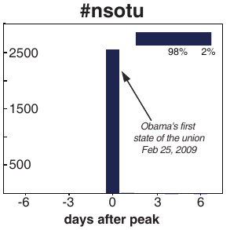
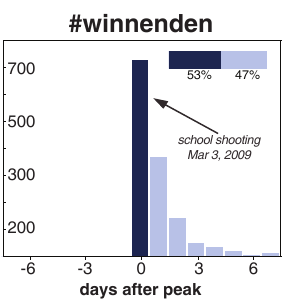
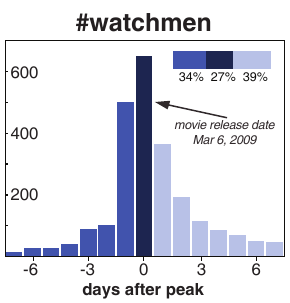
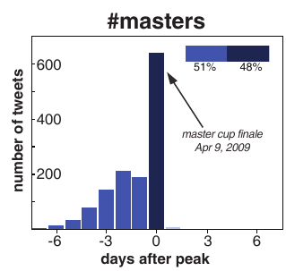
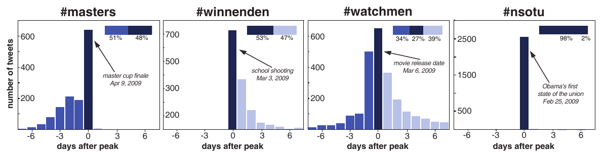

```{r xaringan-themer, include=FALSE, warning=FALSE}
#This block contains the theme configuration for the CSS lab slides style
library(xaringanthemer)
library(showtext)
style_mono_accent(
  base_color = "#5c5c5c",
  text_font_size = "1.5rem",
  header_font_google = google_font("Arial"),
  text_font_google   = google_font("Arial", "300", "300i"),
  code_font_google   = google_font("Fira Mono")
)
```

```{r setup, include=FALSE}
options(htmltools.dir.version = FALSE)
```

layout: true
<div class="my-footer"><span>David Garcia - Social Data Science - ETH Zurich</span></div>

---

## How does social impact aggregate in a society?

.center[]

---

# Theory of fashion: the Simmel Effect

Georg Simmel defined fashion as the *non-cumulative change in cultural features*, where cultural features are displayed as *status symbols*. Status symbols are externally displayed traits associated with high social class, e.g. surnames, clothing, sport, food, etc.

> **The Simmel effect:** The persistence of social differences under the instability of status symbols

Simmel noticed that fashions come and go, but fashion is always present. When something becomes popular, it is bound to lose its popularity. Simmel introduced this theory in his 1904 article ["Fashion"](https://www.jstor.org/stable/2773129?seq=1), describing observations that are still relevant, such as how going against fashion is a way to acknowledge its relevance (the hipster paradox).

---

## The mechanisms of Simmel's theory: </br> Imitation

.center[]

---

## The mechanisms of Simmel's theory: Differentiation

.center[]
---
.center[]
---

# The case of baby names
.center[]
First names can be status symbols and carry subjective and social values. Copying the name of your baby from someone else is an example of imitation.
---

# Social trends in online platforms

Google search trends can capture data about these large-scale social trends:

.center[]

Exogenously triggered search volume after a tsunami (left) and endogenously driven search for the Harry Potter movie (right).

---

# The endo-exo model

<div style="float:right">

</div>

[The endo-exo model of Riley Crane and Didier Sornette](http://www.pnas.org/content/105/41/15649.abstract) captures these types of dynamics. In this model, a trend can have two properties:  

- It can have an **exogenous trigger** when a central event influences lots of people at the same time, as in the tsunami example.
- It can be **critical** when the social interaction between individuals leads to further responses and it is stronger than the rate of losing interest.

---

# The endo-exo model

<div style="float:right">

</div>

These two properties are not exclusive, leading to four types of responses:  

1. **Endogenous sub-critical**: no clear peak, absence of trend.
2. **Endogenous critical**: "viral" peak driven by word of mouth.
3. **Exogenous sub-critical**: sharp peak but fast decay due to lack of strong social interaction.
4. **Exogenous critical**: sharp peak but slow decay due to strong interaction after shock.

---

# What trend class is this Twitter trend?
.center[
]
---

# What trend class is this Twitter trend?
.center[
]
---

# What trend class is this Twitter trend?
.center[
]
---

# What trend class is this Twitter trend?
.center[
]
---


# Trends on Twitter

This model has been applied to classify Twitter hashtag trends by [Lehmann et al](http://dl.acm.org/citation.cfm?id=2187871). 


- The case of #winnenden is exo-critical, the case of #watchmen is endo-critical, the case of #sotu is exo-subcritical
- The case of the #masters hashtag is an anticipatory trend that does not fit the endo-exo classification.