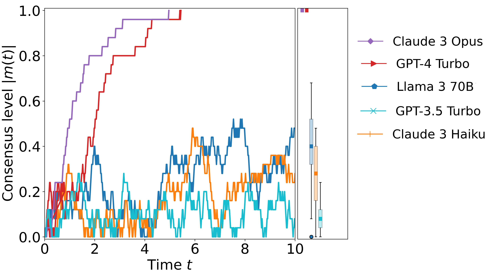
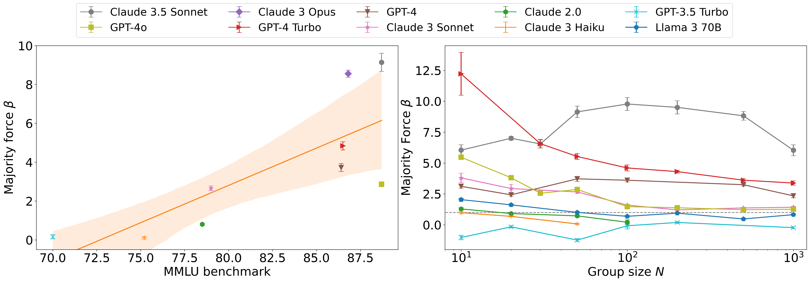
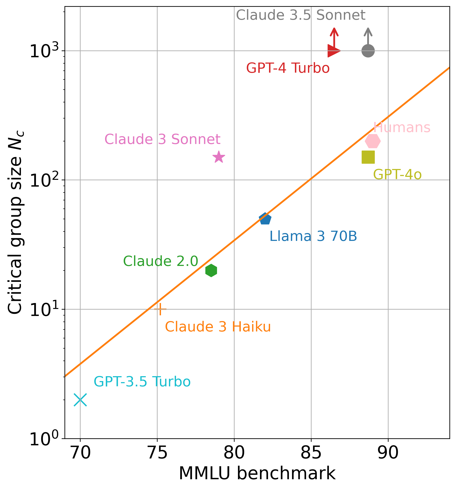

```{r xaringan-themer, include=FALSE, warning=FALSE}
#This block contains the theme configuration for the CSS lab slides style
library(xaringanthemer)
library(showtext)
style_mono_accent(
  base_color = "#5c5c5c",
  text_font_size = "1.5rem",
  header_font_google = google_font("Arial"),
  text_font_google   = google_font("Arial", "300", "300i"),
  code_font_google   = google_font("Fira Mono")
)
```

```{r setup, include=FALSE}
options(htmltools.dir.version = FALSE)
```

layout: true
<div class="my-footer"><span>David Garcia - Social Data Science - ETH Zurich</span></div> 

---

# LLMs Within Society

.center[]
- AI agents promise to interact with each other in our behalf
- Coordination and competition (reservations, negotiations, applications)
- **Could norms emerge, for example rules to be more efficient?** 
- **Could they have systemic risks, like flash crashes?**

---

# LLMs as Social Brains
.pull-left[]
.pull-right[

- Group formation and sustainability: size depends on cognitive ability


- Memory of identity to predict behavior and cooperation


- Essential coordination on arbitrary norms without ground truth
  - E.g. pack moves left or right


- Language as a tool for humans to make larger groups:
  - Dunbar's number (150-250)


]
---

# Opinion Dynamics in LLM Agents
.pull-left[.center[]]
.pull-right[
- Simulation of a tight group of N interacting agents
- Agents start with a random opinion of two options
- Each iteration, they see the opinions of all others (prompt)
- They respond to the question of their opinion
- Opinion labels need to be random and shuffled to avoid token biases
- Consensus is achieved if all have the same opinion
]

---

# LLM-Dependent Consensus Formation
.center[]
Some LLMs can reach consensus for completely arbitrary decisions (50 agents)

---

# Understanding LLM Opinion Dynamics

.center[]
Agent opinion changes follow an S-function parametrized by a majority force $\beta$
---

# Majority Force Factors
.center[]
- Majority force is higher for models with higher language understanding capabilities (MMLU benchmark)
- Majority force decreases for larger group sizes

---

# Ising model warning

</br>

> <font size="45">
No please, not another Ising model
</font> 

</br>

*<div style="text-align: right"> 
David Garcia, Vienna, 2017-2020, every week
</div>*


---
## Critical Group Size and Consensus Time $T_c$
.pull-right[]

- Analysis of critical group size $N_c$


- $N>N_c$: time to consensus grows expontentially with $N$


- Above critical size, consensus is unfeasible and happens only by chance


- $T_c$ can be calculated from $\beta$ as in the Curie-Weiss model (i.e. time to magnetization as a function of inverse temperature)

- $N_c$ can be derived from  $\beta$ as the point of phase transition of $T_c$ ( $\beta_c=1$ )


---

# Group Size and Language Understanding
.pull-right[]

- Analysis of majority force and exhaustive simulations to measure **critical consensus size**

- Exponential function of MMLU benchmark

- Humans close to the line

- GPT4 and Claude 3.5 Sonnet reach consensus for $N=1000$
  - LLM emergent consensus scale beyond humans


---

# Summary

- LLM consensus scale predicted by language understanding capabilities
- LLMs can reach emergent consensus at scales beyond humans
- **Opportunity: decision-making or coordination?**
- **Risk: undesired synchronization like a flash crash?**
- **Future: Social simulation with LLMs **

<a href="https://arxiv.org/abs/2409.02822"> Language Understanding as a Constraint on Consensus Size in LLM Societies. G de Marzo, C. Castellano, D. Garcia. Arxiv (2014) </a>

.center[**More at: [www.dgarcia.eu](https://dgarcia.eu)**]
.center[**[Bluesky: @dgarcia.eu](https://bsky.app/profile/dgarcia.bsky.social)**]

