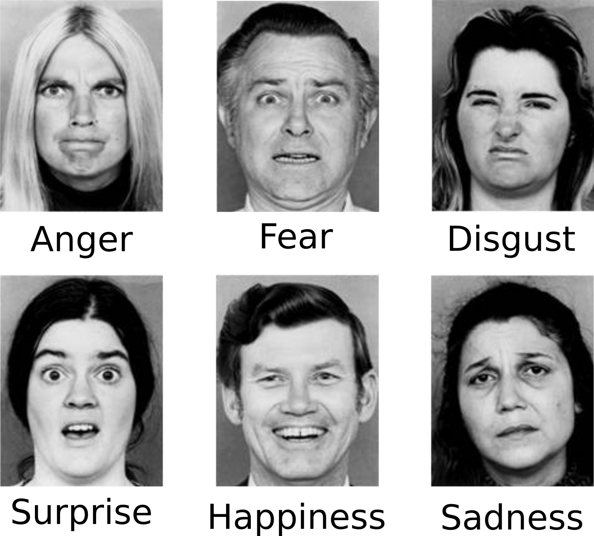
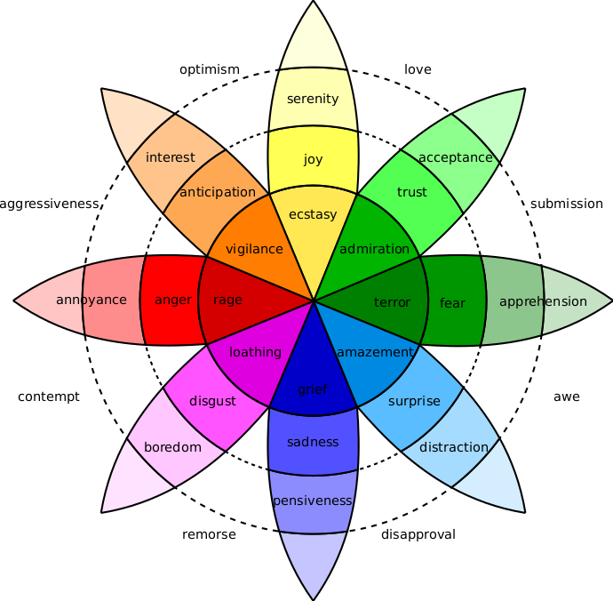
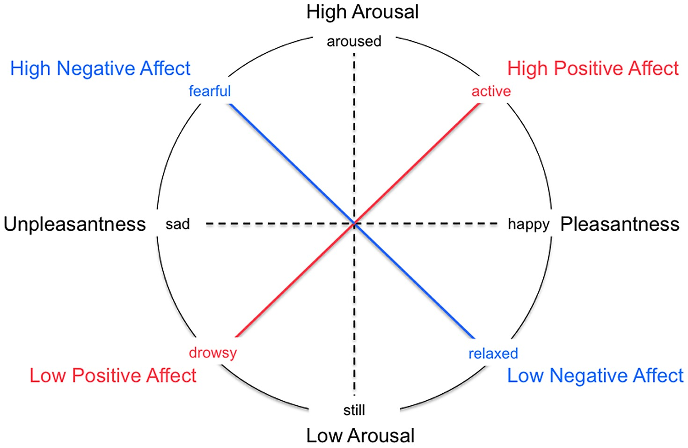
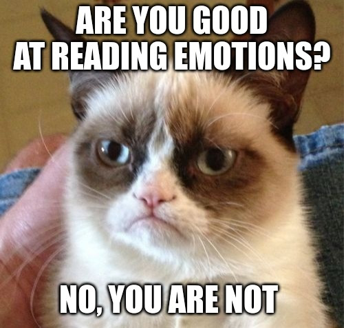

```{r xaringan-themer, include=FALSE, warning=FALSE}
#This block contains the theme configuration for the CSS lab slides style
library(xaringanthemer)
library(showtext)
style_mono_accent(
  base_color = "#5c5c5c",
  text_font_size = "1.5rem",
  header_font_google = google_font("Arial"),
  text_font_google   = google_font("Arial", "300", "300i"),
  code_font_google   = google_font("Fira Mono")
)
```

```{r setup, include=FALSE}
options(htmltools.dir.version = FALSE)
```

layout: true

<div class="my-footer"><span>David Garcia - Social Data Science - ETH Zurich, Chair of Systems Design</span></div> 

---

# What are emotions?

> Emotions as **core affect**: Short-lived psychological states that consume the individual's energy and strongly influence cognition and behavior, for example expression.

Emotional or affective behavior of an individual takes place at various timescales:


- Reflex reactions: fast physiological responses  
- Core affect: relax quickly and are triggered by a stimulus
- Mood: slow-changing and constant emotional state 
- Personality traits are lifelong behavior patterns, some about emotions

---

# Computational Affective Science

> **Affective Science** is the (interdisciplinary) scientific study of emotions. 

> **Computational Affective Science** applies methods from Computer Science and Data Science to Affective Science. Some examples are:

- **Affective Computing:** Development of systems that detect, process, and elicit emotion  
- **Cyberpsychology of Affect:** Understanding the interplay between emotions and ICT  
- **Emotion Recognition:** Identification of human emotion using any kind of modality: text, voice, facial expression, physiological signals (skin conductance, muscle activity, EEG, fMRI), etc  
- **Sentiment Analysis:** Detection of subjective states from (textual) data, including emotion

---

# Measuring emotions

Emotions can be measured through various signals and observable behaviors:


In the following, we are going to cover four models of how to capture emotions in quantitative research. Some approaches are better for some modes or signals (e.g. text, facial expression) than others.

---

# Ekman's basic emotions model

.center[]
Developed by **Paul Ekman** to classify facial expression of emotions. 
---

# Plutchik's wheel of emotions
.center[]

---

# The circumplex model of affect

.center[]

---

# Dimensions in the circumplex model


> **Valence:** the degree of pleasure experienced in an emotion  
  
- Explains the most variance from positive/pleasant to negative/unpleasant
- It can be measured physiologically with smiling and frowning muscle activity
- It is the most common dimension of emotions included in text analysis  

> **Arousal:** the level of activity associated with an emotion  

- Explains less variance than valence but it is informative to differentiate emotions  
- It can be measured with skin conductance and heart rate sensors  
- Not so common in text analysis but can be estimated from voice tone  

---

# Positive And Negative Affect Schedule

.center[]

---

.center[]

