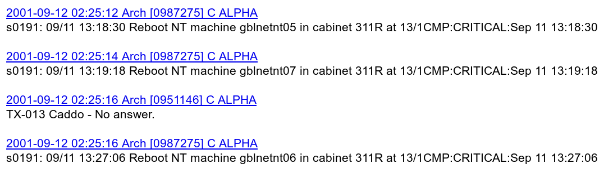

```{r xaringan-themer, include=FALSE, warning=FALSE}
#This block contains the theme configuration for the CSS lab slides style
library(xaringanthemer)
library(showtext)
style_mono_accent(
  base_color = "#5c5c5c",
  text_font_size = "1.5rem",
  header_font_google = google_font("Arial"),
  text_font_google   = google_font("Arial", "300", "300i"),
  code_font_google   = google_font("Fira Mono")
)
```

```{r setup, include=FALSE}
options(htmltools.dir.version = FALSE)
```

layout: true

<div class="my-footer"><span>David Garcia - Social Data Science - ETH Zurich, Chair of Systems Design</span></div> 

---

#  The digital traces of pagers

.center[]
Back in the 90s, [pagers](https://en.wikipedia.org/wiki/Pager) were a common form of mobile communication. To send a message to a pager, you could call a special phone number, say your message, and the text of the message would appear in the screen of the pager.


---
###  Emotions in pagers after 9/11 .center[]
---

## Not so angry americans
More than a third of anger words appeared in messages like these:

"Reboot NT machine [name] in cabinet [name] at [location]:CRITICAL:[date and time]."  

The word "critical" is contained in the anger word list of LIWC!

---
### Anger timeline without REBOOT messages
.center[]


## The issue of machine-generated traces

<div style="float:right">
  
</div>

Not all digital traces are generated by humans, a large volume of data is generated by machines. 

During the summer of 2018, Twitter made a big bot cleanse, but independent estimates before reported that between [9% and 15% of Twitter accounts were likely to be bots](https://ojs.aaai.org/index.php/ICWSM/article/view/14871/14721). 

One of the most widely used methods to detect bots on Twitter is [Botometer](https://botometer.osome.iu.edu/), which is in constant development by the [OSoMe lab at Indiana University](https://osome.iu.edu/).
Even if you clean bots from your data, you should always take a good look at your text. You can make word clouds, word shift graphs, or just browse through it to see if you notice anomalous patterns. To sum up:

> Take home message: Do not just analyze text, also look at it!


---
.center[]

