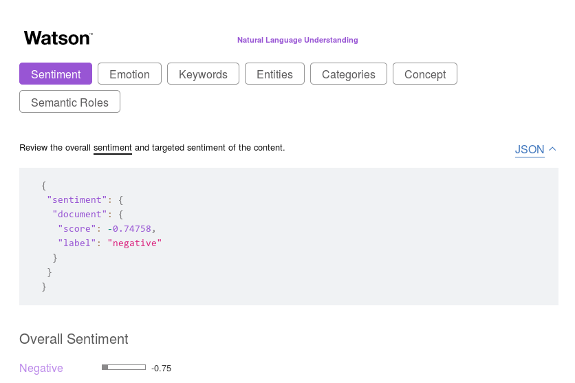
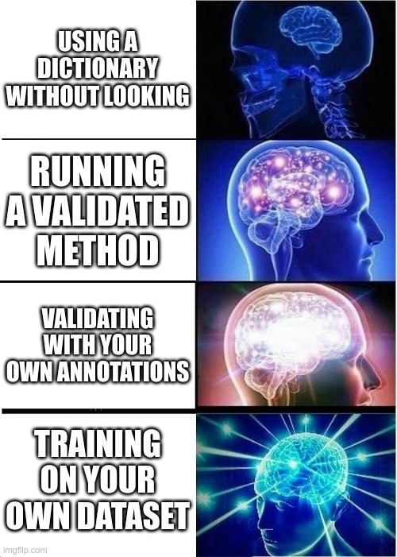

```{r xaringan-themer, include=FALSE, warning=FALSE}
#This block contains the theme configuration for the CSS lab slides style
library(xaringanthemer)
library(showtext)
style_mono_accent(
  base_color = "#5c5c5c",
  text_font_size = "1.5rem",
  header_font_google = google_font("Arial"),
  text_font_google   = google_font("Arial", "300", "300i"),
  code_font_google   = google_font("Fira Mono")
)
```

```{r setup, include=FALSE}
options(htmltools.dir.version = FALSE)
```

layout: true

<div class="my-footer"><span>David Garcia - Social Data Science - ETH Zurich, Chair of Systems Design</span></div> 

---

# How to train your model
.center[] 

1. **Training:** Texts with annotations of sentiment are used to fit the model  
2. **Validation:** A second set of annotated texts not used for training are used to evaluate the quality of the model: $Q_{1}$  
3. **Testing:** One last evaluation run of the fitted model with a leave-out sample of annotated texts. None of these texts should have been part of the validation or training steps. Testing quality $Q_2$ measures predictive quality of the model.
---

# Gold Standards and Ground Truths


pos | neg | text  
------------- | ------------- | -------------
0 | 0 |  I wana see the vid Kyan  
0 | 1 | I cant feel my feet.. that cant be good..  
1 | 0 | 10 absolutely jaw dropping concept car designs http://ow.ly/15OnX  
0 | 0 | Phil Collins- You Can’t Hurry Love

- Supervised sentiment analysis needs a set of labeled texts to learn from.
- Labels can come from the author of the text or from reading raters
- The above table is an example from a real dataset with two annotations: a positivity score and a negativity score
- Other ground truths  might have numeric scores in a scale or text labels for basic emotional states.

---

# Text preprocessing

.center[]

Pre-processing from [Text Analytics for Beginners using NLTK, Navlani, 2019](https://www.datacamp.com/community/tutorials/text-analytics-beginners-nltk)

---

# What model to use?

Common approaches are:  
1. **Naive Bayes:** Takes features as independent signals and fits the label according to Bayes Rule  
2. **Support Vector Machine:** Finds a separator given a (non-)linear combination of features  
3. **Random Forest:** Finds hierarchical decision rules that divide the texts in classes

In supervised sentiment analysis, generating the ground truth data is the most critical part and is required to train the model. Producing sufficient annotations from readers or authors can be expensive. Supervised methods are usually not out-of-the-box like unsupervised tools, you would have to fit your own model to a ground truth dataset.

---
<div style="float:right">

</div>
# Evaluating classifiers 

- True positives $TP$: All positive cases that are correctly predicted

- False positives $FP$: All negatives that were wrongly predicted as positive

- True negatives $TN$: All negative cases that are correctly predicted 

- False negatives $FN$: All positive cases that were incorrectly predicted as negative

---

# Accuracy, Precision, and Recall
$$Accuracy = \frac{TP+TN}{TP+FP+TN+FN}$$
$$Precision = \frac{TP}{TP+FP}$$
$$Recall = \frac{TP}{TP+FN}$$  
- The measure of precision answers the question "How sure am I of this prediction?"
- The measure of recall answers the question  "How many of the things that I’m looking for are found?"

---

# Balancing precision and recall

A way to compute a trade-off between Precision and Recall is the $F_1$ score, which is a harmonic mean of Precision and Recall:

$$F_1= 2 ∗ \frac{ Precision ∗ Recall} {Precision + Recall}$$

The $F_1$ score is often used as a way to summarize the quality of classifiers. When more than one class is possible, you should look at the mean of $F_1$ over the classess or to the $F_1$ of each class separately. The $F_1$ score is often used in sentiment analysis competitions to chose the best tools, for example in the [SemEval 2017 competition](https://alt.qcri.org/semeval2017/index.php?id=tasks).

---

# Let someone else do it: Black-box APIs

.center[]

Easy to use but data and methods unknown. Do your own evaluation!

---
.center[]