```{r xaringan-themer, include=FALSE, warning=FALSE}
#This block contains the theme configuration for the CSS lab slides style
library(xaringanthemer)
library(showtext)
style_mono_accent(
  base_color = "#5c5c5c",
  text_font_size = "1.5rem",
  header_font_google = google_font("Arial"),
  text_font_google   = google_font("Arial", "300", "300i"),
  code_font_google   = google_font("Fira Mono")
)
```

```{r setup, include=FALSE}
options(htmltools.dir.version = FALSE)
```

layout: true

<div class="my-footer"><span>David Garcia - Social Data Science</span></div> 

---

# Outline

## 1. The semantic differential

## 2. Word embeddings

---

### Psycholinguistics: How individuals use and adopt language

.center[]   

**De Saussure's model of language**
- Language as association between signified (meaning) and signifier (word)
- Associations are normative and agreed through learning
- Human communication is composed of two steps: 
  1. **Encoding:** Transforming thoughts into words
  2. **Decoding:** Translating words into thoughts

---

# Connotative vs denotative meanings

 


- **Denotative meaning:** Definition of a word in reference to other meanings
- **Connotative meaning:** Emotional association of the use of a word
- Sentiment analysis aims to measure the **connotative meaning** of texts

---

# The Semantic Differential

**Charles Osgood's Semantic Differential:**
 Rating scales to measure the connotative meanings of words, objects, events (or symbols in general)

Osgood's method to find the dimensions of meaning:

  1. Select a set of objects/words/symbols to measure their meaning
  2. Design a large set of questions or scales about the symbols
  3. Ask some people to rate the symbols according to the scales
  4. Apply dimensionality reduction/factor analysis
  5. Interpret factors into dimensions of meaning

*The measurement of meaning. C. Osgood, G. Suci, P. Tannenbaum, 1957*

---

# Word ratings for the semantic differential

.center[]   


- Stimulus: One word, in this case *polite*
- Response: Ratings of each participant for the word in relation to adjectives

---

## Semantic differential example: fonts

.center[]

---
.center[]
---

## Dimensionality reduction: Factor analysis
.center[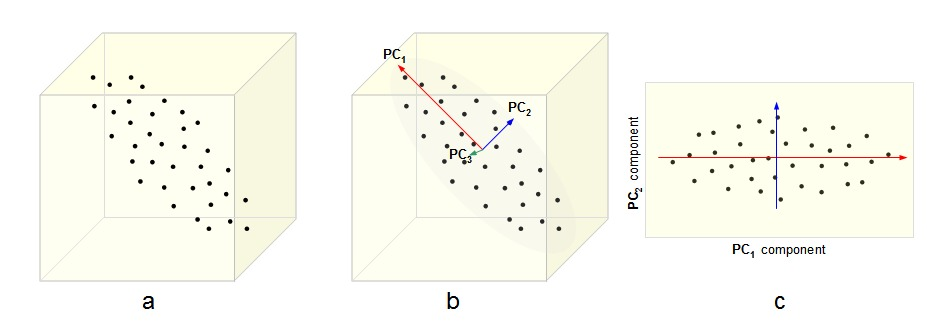]

- The N-dimensional cloud of (average) ratings of words is processed with factor analysis
- Each factor is a vector in the N-dimensional space. Factors are orthogonal
- Factors are ordered such that the first one has the most variance
- The result is a smaller set of dimensions that represents the ratings of words to certain extent (explained variance)

---

# Three dimensions of meaning

.pull-left[.center[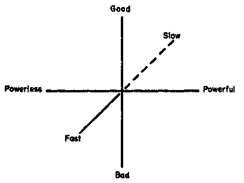]]

.pull-right[

The dimensions of the Semantic Differential (EPA):
- **Evaluation:** good, desirable -- bad, undesirable
- **Potency:** strong, powerful -- weak, powerless
- **Activation:** active, fast -- passive, slow]

- Evaluation has the most variance, i.e is the most explanatory
- Potency and Activation have similar explanatory level below Evaluation

---

# Word embeddings

## 1. The semantic differential

## *2. Word embeddings*

---

layout: true

<div class="my-footer"><span>Speech and Language Processing. Daniel Jurafsky & James H. Martin. (2023)</span></div> 

---

# Documents as vectors

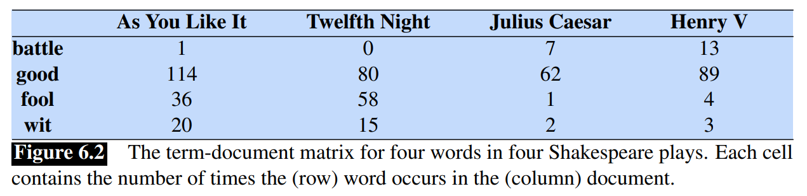

- Remember bag of words: term frequency counts ignoring order
- Example just for four words in four books as documents
- Here, each book is represented by a four-dimensional vector (vertical here)

[Speech and Language Processing. Daniel Jurafsky & James H. Martin. (2023)](https://web.stanford.edu/~jurafsky/slp3/6.pdf)

---
# Documents as vectors

.center[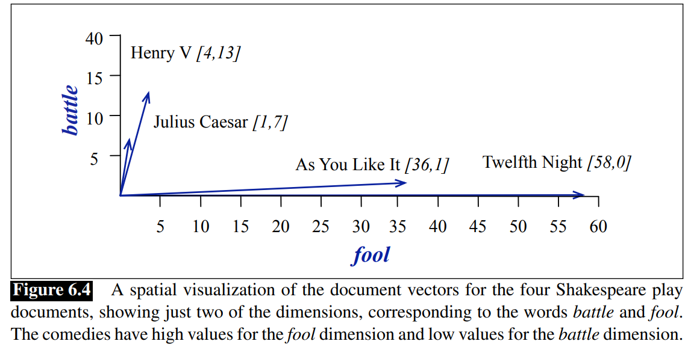]

---
# Measuring similarity

The similarity between the content of two documents can be measured with the cosine similarity of their vector representations:

$$sim(u,v) = cos(\theta) = \frac{u\cdot v}{\|u\| \|v\|} = \frac{\sum^n_{i=1}{u_iv_i}}{ \sqrt{\sum^n_{i=1} u_i^2} \sqrt{\sum^n_{i=1} v_i^2}}$$

$$sim(d_1, d_2) = \frac{1*0 + 114*80 + 36 * 58 + 20 * 15}{\sqrt{1+114^2+36^2+20^2} \sqrt{80^2+58^2+15^2}} \sim 0.95$$
- $d_1$: As You Like It
- $d_2$: Twelfth Night

---

# Cosine similarity example

.center[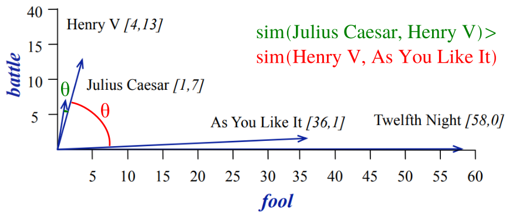]
---

# Words as vectors

.center[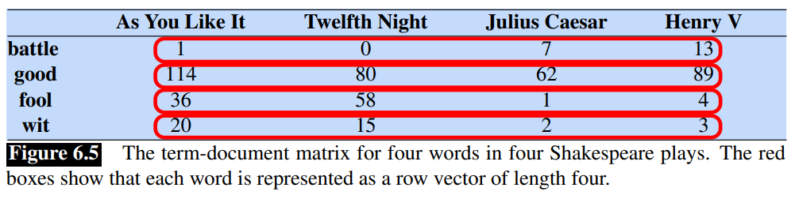]

- Instead of looking at document vectors, we can use word vectors
- These vectors can approximate the meaning similarity between words
- $sim(fool, wit) \sim 0.93$
- $sim(fool, battle) \sim 0.09$
- *fool* is not a synonym of *wit*, but its meaning is closer to *wit* than to *battle*

---

## Language sparsness and the curse of dimensionality

.pull-left[
- Human languages have lots of different words
- Heap's law: Vocabulary size grows (sublinearly) with corpus size
  - More documents, more words
- Word and document matrices become too sparse
  - Hard to do statistics or train models when the vast majority of variables are zeroes
  - Larger corpora might not exist!
]
.pull-right[
Number of distinct words (vocabulary size) versus corpus size (in tokens)]

---

# Latent Semantic Analysis

- Aim of LSA: making word and document vectors denser (less dimensions)
- Idea: Singular Value Decomposition of word-document matrix
- Problem: Very computationally intensive as soon as matrix gets large

.center[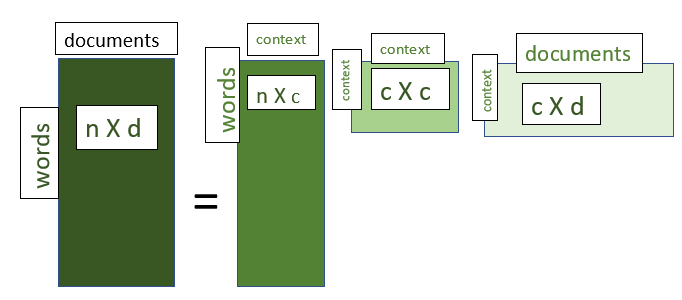]

https://www.geeksforgeeks.org/latent-semantic-analysis/

---

# Distributed representations

**The distributional hypothesis: Words that occur in similar contexts tend to have similar
meanings** -- "You Shall Know a Word by the Company It Keeps"

.center[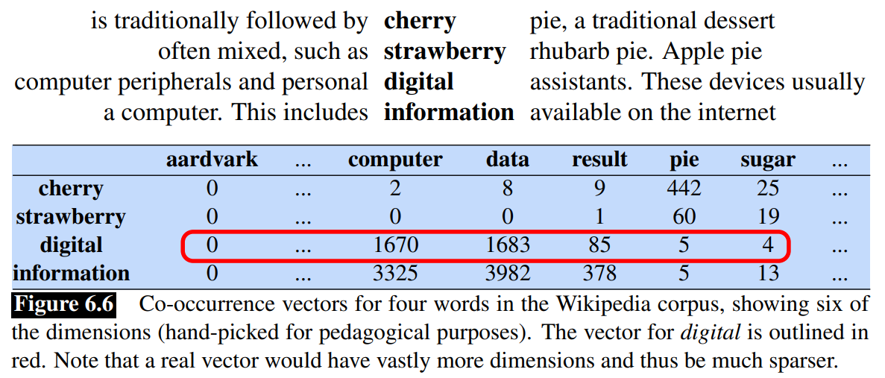]

---

## Self-supervision: Continuous Bag Of Words

- Idea: training a model to predict words from their context:

.center[the quick brown fox ... over the lazy dog]

- Self-supervision: train it with corpus, without annotations
- Represent each word $w$ with a vector $\mu_{w}$ in a lower-dimensional space compared to the word-document matrix (50-700 dimensions)
- Fit the values of $\mu_w$ with self-supervision such that:

$$ argmax_{\mu_w} = \frac{exp(\mu_w \cdot \vec{v})}{\sum_j exp(\mu_j \cdot \vec{v})} $$
where $\vec{v}$ is the mean vector for the words in the context and $j$ iterates over the words in the language

---

layout: true

<div class="my-footer"><span>David Garcia - Social Data Science</span></div> 

---
.pull-left[
# ML Warning

In this lecture we focus on applications, not development

We will gloss over details, see references and related courses to learn more
]

.pull-right[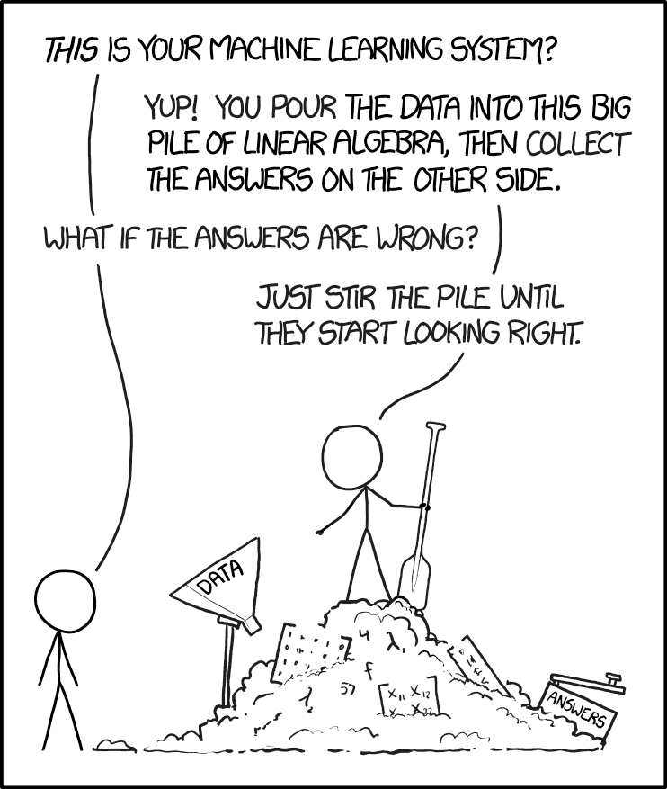]

---
# Word embeddings

- After fitting, the resulting $\mu_w$ are called **word embeddings**
- Also called word representations: $R(w)$
- Operating on embeddings space allow us to extract dimensions of meaning or compute analogies:
.center[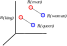]
---

# Word embeddings in practice

You don't need to fit your own word embeddings model, several alternatives exist that are already trained:

- word2vec [(Mikolov, Chen, Corrado, and Dean, 2013)](https://arxiv.org/abs/1301.3781)
    - Developed by Google - trained against Wikipedia
    - Based on CBOW and Skipgrams (predict context from word)
 
    
- GloVe [(Pennington, Socher, Manning, 2014)](https://aclanthology.org/D14-1162/)
    - "global" embeddings using a larger definition of context
    - Developed by Stanford NLP group, similar to word2vec


- fastText [(Bojanowski, Grave, Joulin, Mikolov, 2017)](https://arxiv.org/abs/1607.04606)
    - Developed by Facebook - trained against Wikipedia in many languages
    - Uses character-level tokenization: it can embed new words based on how they are written (e.g. composite words from the embeddings of lemmas)

---
# Distributed Dictionary Representation
.center[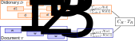]

[Dictionaries and distributions: Combining expert knowledge and large scale textual data content analysis. J. Garten, J. Hoover, K. Johnson, R. Boghrati, C. Iskiwitch & M. Dehghani. Behavior Research Methods (2018)](https://link.springer.com/article/10.3758/s13428-017-0875-9)

---

# Distributed Dictionary Representation
.center[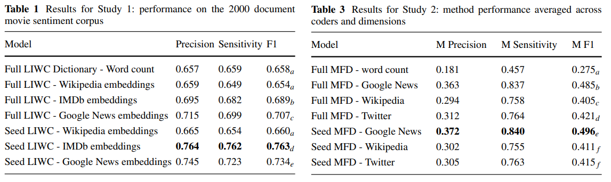]

- Two tests: predicting if movie reviews are positive or negative and identifying moral foundations in tweets
- DDR outperforms word counting and performs best when applied on a smaller dictionary - larger dictionaries is not better in this case

