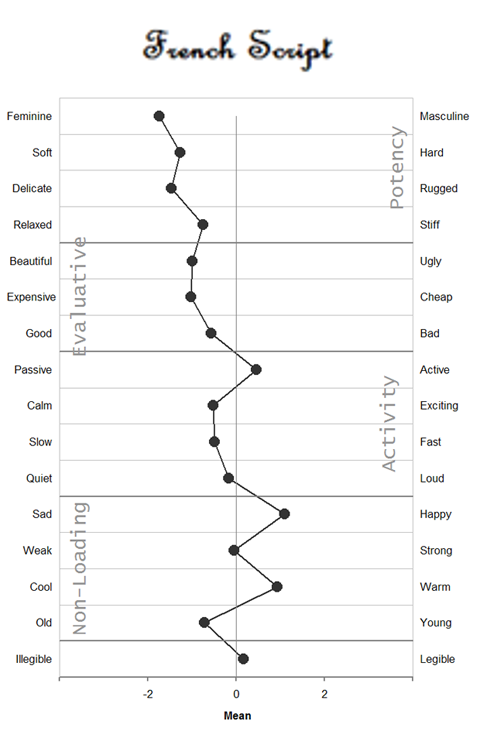
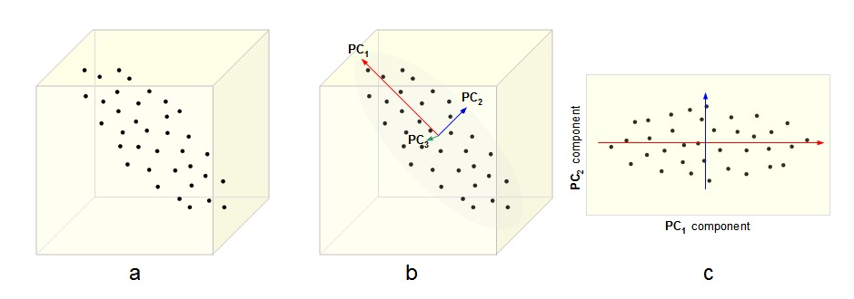

```{r xaringan-themer, include=FALSE, warning=FALSE}
#This block contains the theme configuration for the CSS lab slides style
library(xaringanthemer)
library(showtext)
style_mono_accent(
  base_color = "#5c5c5c",
  text_font_size = "1.5rem",
  header_font_google = google_font("Arial"),
  text_font_google   = google_font("Arial", "300", "300i"),
  code_font_google   = google_font("Fira Mono")
)
```

```{r setup, include=FALSE}
options(htmltools.dir.version = FALSE)
```

layout: true

<div class="my-footer"><span>David Garcia - Social Data Science - ETH Zurich</span></div> 

---

### Psycholinguistics: How individuals use and adopt language

.center[]   

**De Saussure's model of language**
- Language as association between signified (meaning) and signifier (word)
- Associations are normative and agreed through learning
- Human communication is composed of two steps: 
  1. **Encoding:** Transforming thoughts into words
  2. **Decoding:** Translating words into thoughts

---

# Connotative vs denotative meanings

 


- **Denotative meaning:** Definition of a word in reference to other meanings
- **Connotative meaning:** Emotional association of the use of a word
- Sentiment analysis aims to measure the **connotative meaning** of texts

---

# The Semantic Differential

**Charles Osgood's Semantic Differential:**
 Rating scales to measure the connotative meanings of words, objects, events (or symbols in general)

Osgood's method to find the dimensions of meaning:

  1. Select a set of objects/words/symbols to measure their meaning
  2. Design a large set of questions or scales about the symbols
  3. Ask some people to rate the symbols according to the scales
  4. Apply dimensionality reduction/factor analysis
  5. Interpret factors into dimensions of meaning

*The measurement of meaning. C. Osgood, G. Suci, P. Tannenbaum, 1957*

---

# Word ratings for the semantic differential

.center[]   


- Stimulus: One word, in this case *polite*
- Response: Ratings of each participant for the word in relation to adjectives

---

## Semantic differential example: fonts

.center[]

---
.center[]
---

## Dimensionality reduction: Factor analysis
.center[]

- The N-dimensional cloud of (average) ratings of words is processed with factor analysis
- Each factor is a vector in the N-dimensional space. Factors are orthogonal
- Factors are ordered such that the first one has the most variance
- The result is a smaller set of dimensions that represents the ratings of words to certain extent (explained variance)

---

# Three dimensions of meaning

.pull-left[.center[]]

.pull-right[

The dimensions of the Semantic Differential (EPA):
- **Evaluation:** good, desirable -- bad, undesirable
- **Potency:** strong, powerful -- weak, powerless
- **Activation:** active, fast -- passive, slow]

- Evaluation has the most variance, i.e is the most explanatory
- Potency and Activation have similar explanatory level below Evaluation
- More advanced methods in NLP can extract more nuanced representations of meanings: Latent Semantic Annotation, word embeddings, etc
