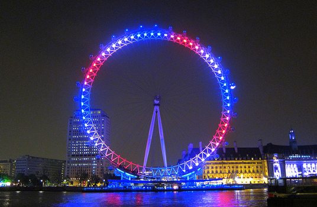
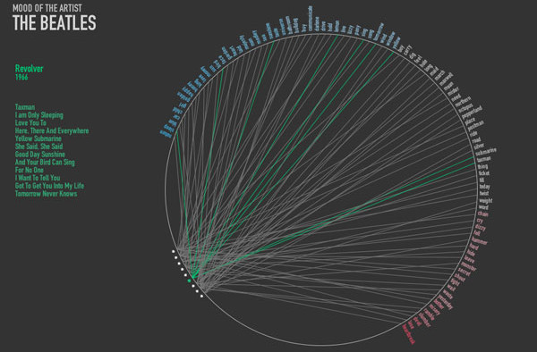
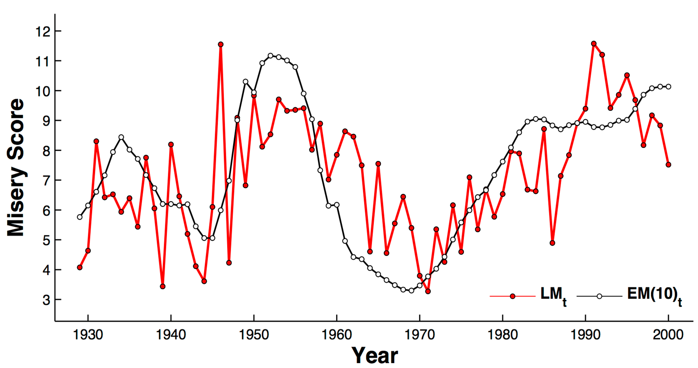
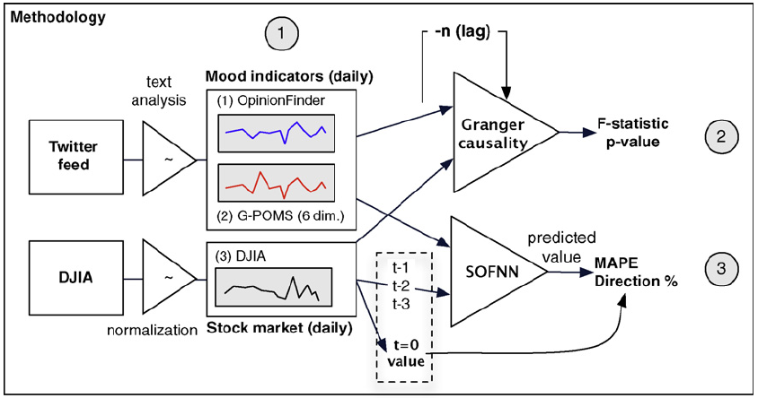
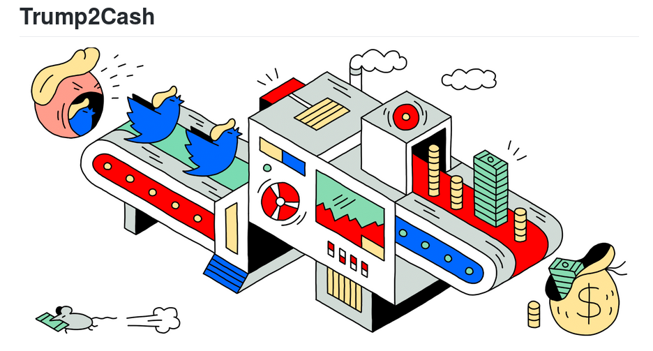
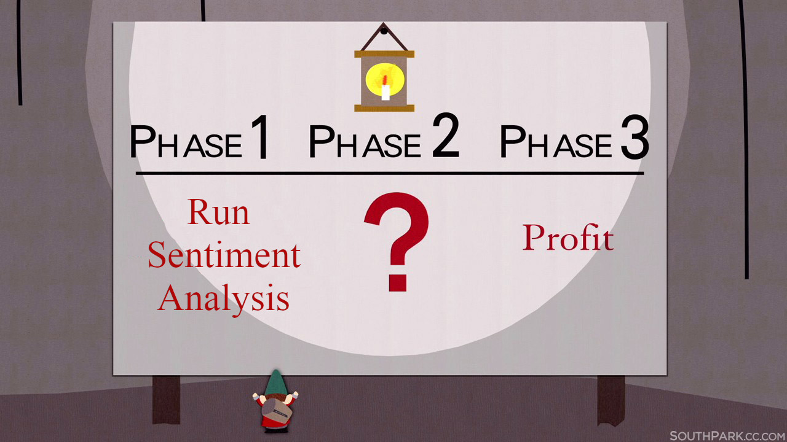

```{r xaringan-themer, include=FALSE, warning=FALSE}
#This block contains the theme configuration for the CSS lab slides style
library(xaringanthemer)
library(showtext)
style_mono_accent(
  base_color = "#5c5c5c",
  text_font_size = "1.5rem",
  header_font_google = google_font("Arial"),
  text_font_google   = google_font("Arial", "300", "300i"),
  code_font_google   = google_font("Fira Mono")
)
```

```{r setup, include=FALSE}
options(htmltools.dir.version = FALSE)
```

layout: true

<div class="my-footer"><span>David Garcia - Social Data Science - ETH Zurich</span></div> 

---

# Applications of sentiment analysis

</br>
## 1. Example applications to art and design

## 2. Applications in the digital humanities

## 3. Applications in business and finance

---

# London eye
.center[] 
- London Eye showing sentiment in Tweets during the 2012 Olympics
- The output of SentiStrength was converted to the color over the ferris wheel

---

# Automated album covers
.center[] 
- Visualization of emotions in the titles of songs of an album
- Word classification combining ANEW and SentiStrength

---

# Digital humanities: Music lyrics

.center[] 
- Application of ANEW lexicon to lyrics of songs since the 1960's
- Downward trend replicated in several later articles

---
# Syuzhet: plot sentiment
.center[] 
- Application of MPQA lexicon to the text of novels
- Used to identify the six patterns of plots theorized by Kurt Vonnegut
---

# Google books misery

.center[] 

- Literary misery in Google Books: LIWC NA score (Germany example)
- Literary misery is correlated with economic misery of the previous decade

---

# Business: Sentiment about products

.center[] 

- Netbase Brand passion indices using Twitter, Facebook, product reviews...
- Vaguely documented sentiment analysis: rule-based method with lexicon

---

# Twitter mood and the stock market

.center[] 

- MPQA lexicon, also called OpinionFinder, applied to "I feel" tweets + adaptation of POMS (Profile of Mood States)
- Predicting movements of the Dow Jones Industrial Average (DJIA) using sentiment aggregates from tweets (Bollen et al, 2011)

---

# Trump2Cash

.pull-left[
- Google NLP API to classify sentiment about companies in Trump's tweets and trade
- **What do you think was its return in early 2017?**

]  
.pull-right[] 

---



---

# Summary of day 3

- **The Semantic Differential**
  - Quantifying meanings of symbols through adjective ratings
  - Dimensionality reduction shows three dimensions:  
  Evaluation, Potency, and Activation


- **Supervised Sentiment Analysis**
  - Using labelled texts to train a model
  - Text representation and model selection are important
  - Evaluation metrics: Precision, Recall, $F_1$


- **Applications of Sentiment Analysis**
  - Applications to art, digital humanities, and business
  - Always think whose sentiment you are measuring!