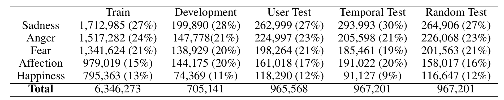
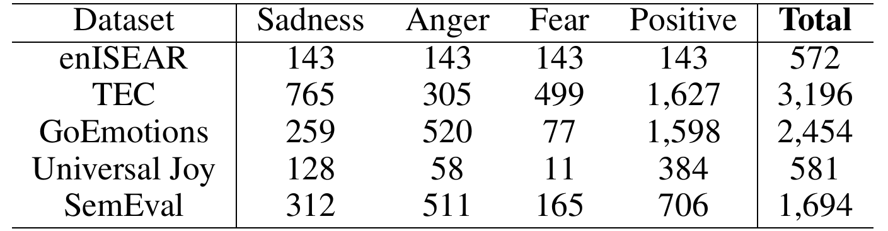
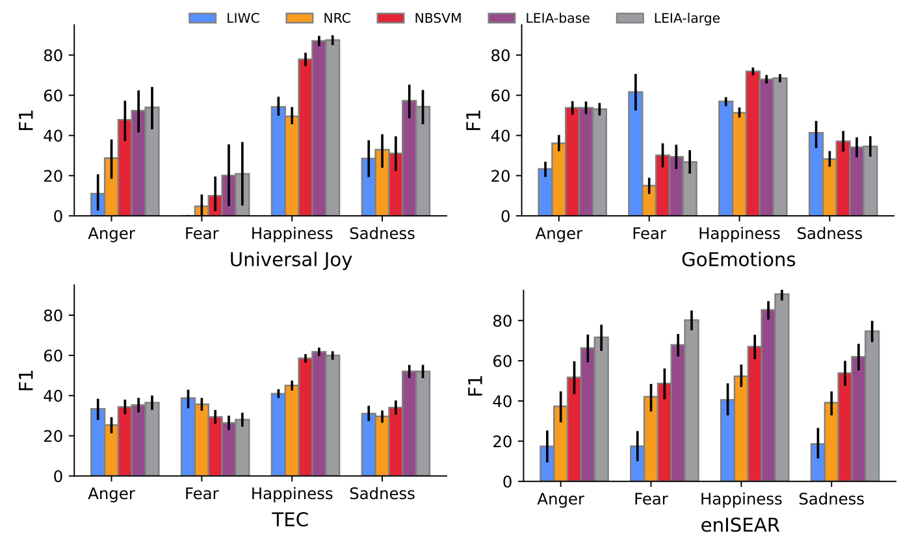
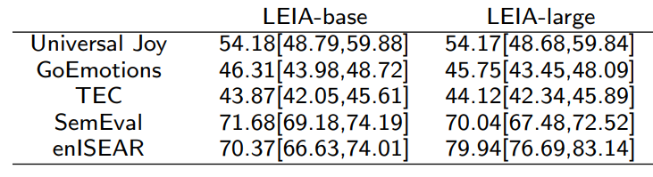
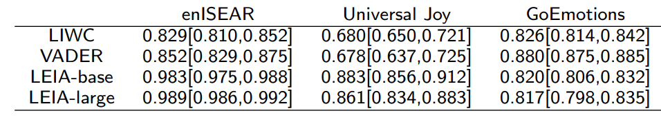
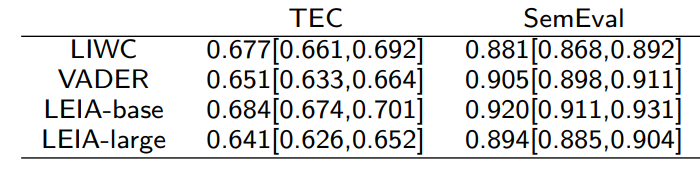
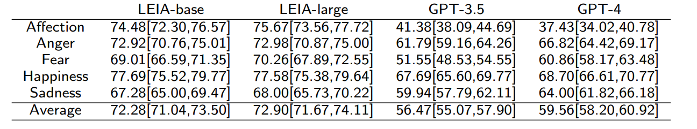

```{r xaringan-themer, include=FALSE, warning=FALSE}
#This block contains the theme configuration for the CSS lab slides style
library(xaringanthemer)
library(showtext)
style_mono_accent(
  base_color = "#5c5c5c",
  text_font_size = "1.5rem",
  header_font_google = google_font("Arial"),
  text_font_google   = google_font("Arial", "300", "300i"),
  code_font_google   = google_font("Fira Mono")
)
```

```{r setup, include=FALSE}
options(htmltools.dir.version = FALSE)
```


layout: true
<div class="my-footer"><span>David Garcia - LEIA: Linguistic Embeddings for the Identification of Affect </span></div> 

---

## Challenges in individual emotion detection

**The problem with sentiment analysis: Writer versus reader emotions**

```{r, echo=FALSE, out.width=950, fig.align='center'}
knitr::include_graphics("figures/communication.png")
```

Current sentiment analysis approaches assume that the **ground truth** is an annotation of emotions by **a reader**, often a student or a crowdsourcing worker

---

### LEIA: Linguistic Embeddings for the Identification of Affect


---

# Datasets summary

- Vent dataset samples:


- Out-of-domain validation datasets:
<center>  </center>

---

# Results in Vent

<center>  </center>

LEIA outperforms supervised and unsupervised methods for all emotions and test datsets. $F_1$ values between 70 and 80.

---

# Out-of-domain results

.center[]

---

# Out-of-domain results

.center[
]
- LEIA is best or tied with the best in all out-of-domain tests
- LEIA is best or tied with the best in all emotions except Fear in TEC


---

# The Star Wars showdown

- LEIA vs VADER vs LIWC in sentiment classification
- Task: detect positive/negative sentiment
- Metric: AUC in Out-Of-Domain datasets

.center[
]


---

# Comparing with GPT models

.center[]

- Evaluation on a sample of 1000 texts per emotion label from the user test sample
- Both LEIA versions outperform GPT-3.5-turbo and GPT-4 in each emotion

---

# Comparing with GPT models

.center[]

- Evaluation on full OOD datasets (only test samples)
- Both GPT models outperform LEIA in GoEmotions, TEC, SemEval, and enISEAR
- LEIA en par with GPT for Universal Joy
- Model contamination? test samples for all these datasets are public and GPT models could have been trained with them
- Universal Joy is the newest dataset and might be younger than the cutoff date

---


# Error analysis with LIME

.center[]

Try it yourself:
https://huggingface.co/saroyehun/LEIA-large

---

# For More Information

.center[]

<a href="https://epjdatascience.springeropen.com/articles/10.1140/epjds/s13688-023-00427-0"> LEIA: Linguistic Embeddings for the Identification of Affect. S. Aroyehun, L. Malik, H. Metzler, N. Haimerl, A. Di Natale, D. Garcia. EPJ Data Science (2023)</a>


