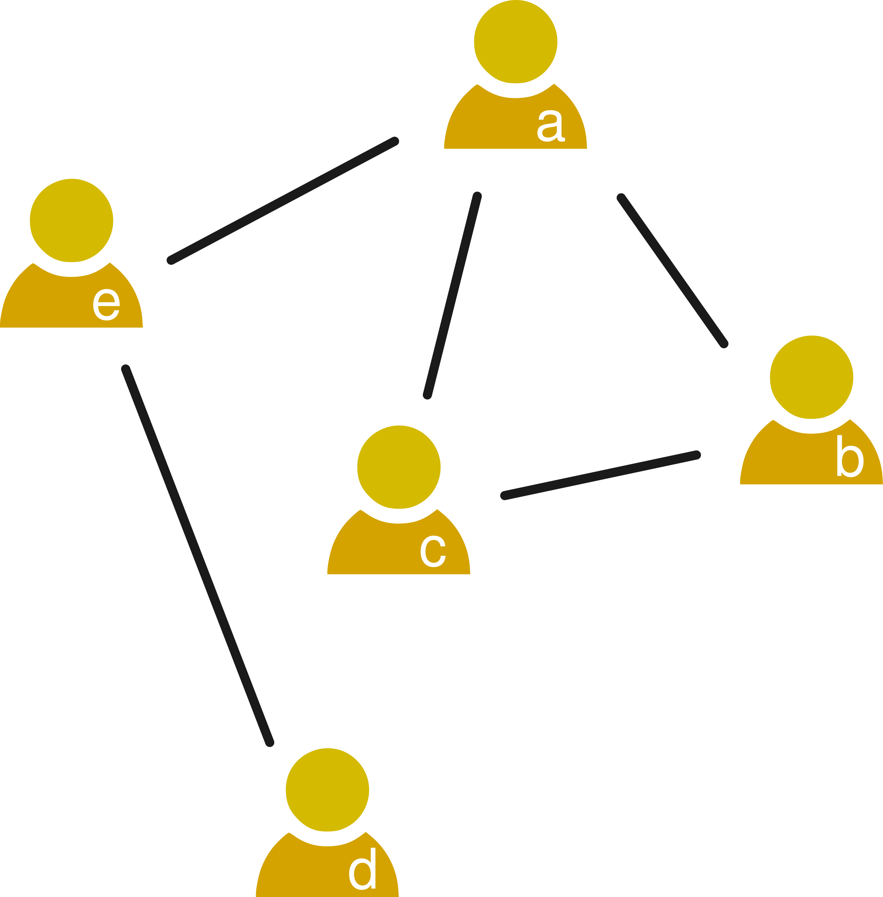
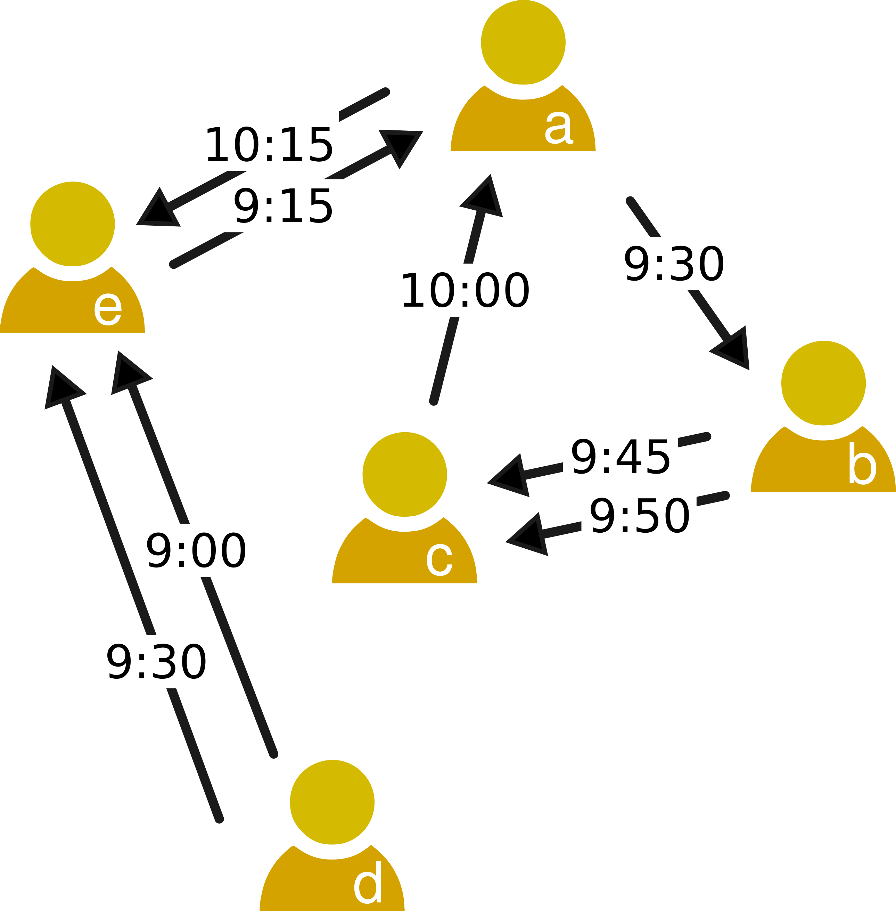
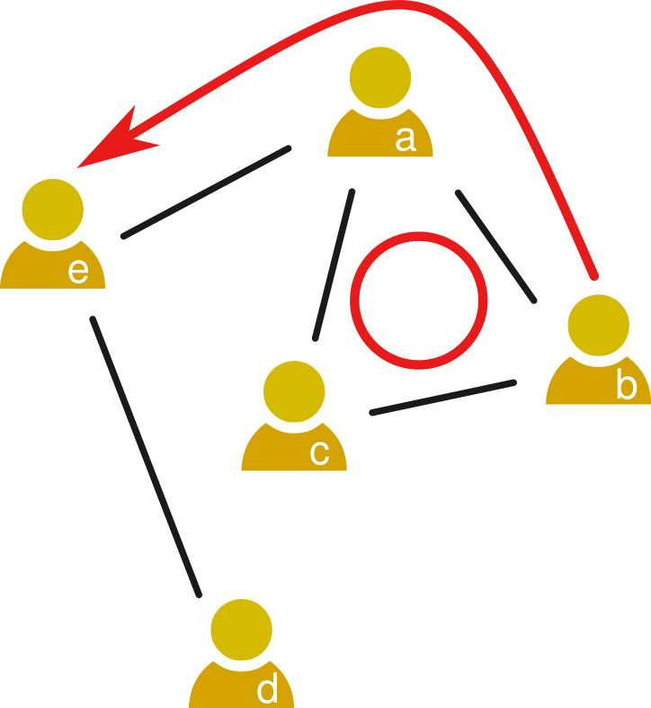
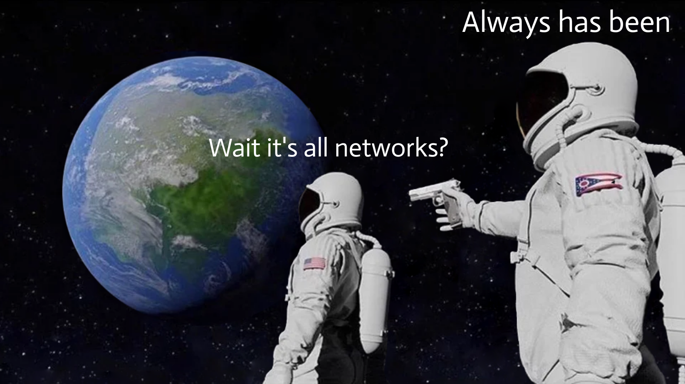

```{r xaringan-themer, include=FALSE, warning=FALSE}
#This block contains the theme configuration for the CSS lab slides style
library(xaringanthemer)
library(showtext)
style_mono_accent(
  base_color = "#5c5c5c",
  text_font_size = "1.5rem",
  header_font_google = google_font("Arial"),
  text_font_google   = google_font("Arial", "300", "300i"),
  code_font_google   = google_font("Fira Mono")
)
```

```{r setup, include=FALSE}
options(htmltools.dir.version = FALSE)
```

layout: true

<div class="my-footer"><span>David Garcia - Social Data Science - ETH Zurich</span></div> 

---

# Social networks
<div style="float:right">
  
</br>
Jacob Moreno's sociogram
</div>

Social Networks are models to represent individuals and the relationships between them. The minimal components of a social network are:  

- **Nodes** (or vertices), which represent individuals. These individuals are social actors, for example humans, animals, fictional characters...
- **Links** (or edges) are relationships between individuals, for example friendship, family ties, interaction, communication...

**Guess: what is the data behind this network?**
---

# Representing social networks
<div style="float:right">
  
</div>
A graph or network is a tuple $G = (V, E)$  
  - V is a set of vertices or nodes  
  - E ⊆ V × V is a set of edges or links  
  - V × V is the Cartesian product (i.e. the set of all possible links)  

Edges are denoted as ordered pairs $(i, j)$, which means that a link points from node $i$ to node $j$. 

The example of the picture can be written as:  
$V = {a, b, c, d, e}$  
$E = {(b, a),(c, a),(e, a),(d, e),(c, b),(b, c)}$

---

# Adjacency matrix
<div style="float:right">
  
</div>

The above list is what is called an *edge list*, but there are other ways to represent a network. A common one is to use an **adjacency matrix** $\mathbf{A}$ with 1 in the entries of nodes connected by an edge and 0 otherwise. 

|a|b|c|d|e
--|--|--|--|--
a|0|0|0|0|0
b|1|0|1|0|0
c|1|1|0|0|0
d|0|0|0|0|1
e|1|0|0|0|0
---

# Undirected networks
<div style="float:right">
  
</div>

Networks might be **undirected** if a link between two nodes is always reciprocal.  

Their adjacency matrices satisfy the condition $A_{ij}=A_{ji}$. 

An example of an undirected network is the network of friendships on Facebook.

---

# Mulit-edge networks

<div style="float:right">
  
</div>

In a **multi-edge network**, multiple links are allowed from one node to another. Multi-edge networks can be both directed and undirected. 

The adjacency matrix of multi-edge networks is not well-defined, as each entry of the matrix would have to contain more than just a number.

A common example is a network of phone calls between people, where edges can be differentiated by the timestamp when the call was initiated. 

---

# Weighted networks

<div style="float:right">
  
</div>

The nodes of a network can have weights associated to them, then we talk about a **weighted network**. 

The weighting function $w$ maps links to weights:  $w:E \rightarrow \mathbb{R}$. 

Weighted networks can be represented by adjacency matrices with real values in their entries that correspond to the link weights: $A_{ij}= w(i, j)$.
 
---

# Paths and cycles

<div style="float:right">
  
</div>

One of the most important concepts in a network is that of a **path**. A path is defined as a sequence of nodes, where any pair of consecutive nodes is connected by a link.

A **cycle** is a path starting and ending in the same node. A **triangle** is a cycle of length 3, in the example the nodes $a$, $b$ and $c$ form a triangle.

---

# Self-loops

<div style="float:right">
  
</div>

Some networks might contain **self-loops**, which are links that start and end in the same node, i.e. they have the form $(i,i)$. 

Self-loops appear as ones in the diagonal of the adjacency matrix. 

Self-loops are rare in social networks. They can appear in some communication networks, for example when a Twitter user retweets their own tweet or sends an email to themselves.
---

# Connected components

<div style="float:right">
  
</div>

A network is **connected** if, for each pair of nodes in the network, there is at least one path connecting them. 

If a network is not connected, it can be divided in **connected components**, which are maximally connected subgraphs. The example is not a connected network, as it has two connected components.

---

# Node degree

A node's **degree** measures the number of links connected to it. 

In undirected networks there is only one measure of degree $d(i)$, which is exactly the number of edges connected to the node $i$. 

In directed networks there are two kinds of degree: 
- **in-degree** $d_{in}(i)$ that is the number of edges ending in $i$, i.e. $(j,i)$
- **out-degree** $d_{out}(i)$ that is the number of edges leaving from $i$, i.e. $(i,j)$. In the first network example above, $d_{in}(c) = 1$ and $d_{out}(c) = 2$.

In weighted networks, **weighted node degrees** are sums of incoming and outgoing link weights. This way there are two weighted node degrees, the weighted in-degree and the weighted out-degree.
---

# Distance

<div style="float:right">
  
</div>

The **distance** between nodes $v$ and $w$ is denoted as $dist(v,w)$ and measures the minimum length among all the paths connecting $v$ and $w$. 

If there is no path between $v$ and $w$, the distance between them is defined as $dist(v,w) := \infty$. 

Example: $dist(b, e) = 2$ 

In directed networks, it might happen that $dist(v,w) \neq dist(w,v)$. 

**proximity:** $prox(v,w)=\frac{1}{dist(v,w)}$. 

---
