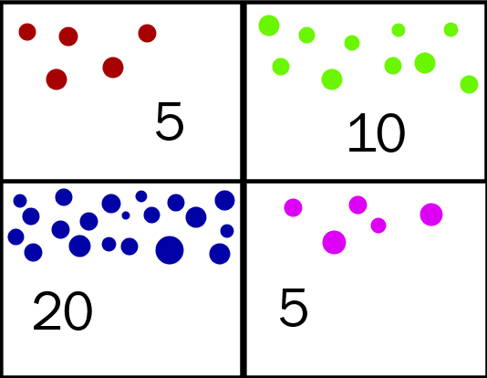

```{r xaringan-themer, include=FALSE, warning=FALSE}
#This block contains the theme configuration for the CSS lab slides style
library(xaringanthemer)
library(showtext)
style_mono_accent(
  base_color = "#5c5c5c",
  text_font_size = "1.5rem",
  header_font_google = google_font("Arial"),
  text_font_google   = google_font("Arial", "300", "300i"),
  code_font_google   = google_font("Fira Mono")
)
```

```{r setup, include=FALSE}
options(htmltools.dir.version = FALSE)
```

layout: true

<div class="my-footer"><span>David Garcia - Social Data Science - ETH Zurich, Chair of Systems Design</span></div> 

---

# Friendship and social comparison

<div style="float:right">
  
</div>

- **five** girls have fewer friends than the average of their friends (Betty, Jane, Pam, Dale, Tina), two have more friends  
- **two** have more friends than the average of their friends (Sue and Alice)  
- **one** has as many friends as the average of her friends (Carol)  

Most girls will think that they have less friends than the norm! If we average all numbers, the average number of friends is **2.5** and the average number of friends of friends is **2.99**.

**Guess: what is the average number of friends of Facebook users?**

---

# The Friendship paradox

> **The Friendship Paradox**:
The fact that most people have less friends than the average number of friends of their friends

.center[]  

---

# The class size paradox

.center[]

---

# Random sampling

.center[]

---

# Stratified sampling 

.center[]

---

# Self-selection bias

.center[]

---

.center[]


