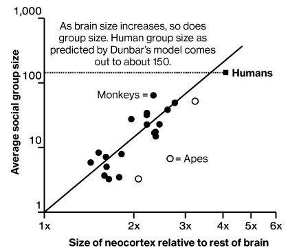

```{r xaringan-themer, include=FALSE, warning=FALSE}
#This block contains the theme configuration for the CSS lab slides style
library(xaringanthemer)
library(showtext)
style_mono_accent(
  base_color = "#5c5c5c",
  text_font_size = "1.5rem",
  header_font_google = google_font("Arial"),
  text_font_google   = google_font("Arial", "300", "300i"),
  code_font_google   = google_font("Fira Mono")
)
```

```{r setup, include=FALSE}
options(htmltools.dir.version = FALSE)
```

layout: true

<div class="my-footer"><span>David Garcia - Social Data Science - ETH Zurich, Chair of Systems Design</span></div> 

---


# The concept of centrality

Social network analysis can be used to measure the importance of a person as a function of the social structure of a community or organization. 

In social networks, **centrality** measures this kind of structural importance of the node of a person. There are various centrality measures that stem from different kinds of structural importance. 

In this topic you will learn about three centrality measures:

1. Degree centrality
2. Betweenness centrality
3. Closeness centrality

+ Coreness centrality (in social resilience topic)

---

# Degree centrality

<div style="float:right">
  
</div>

A node's **degree centrality** measures the number of links connected to it. 

In directed networks:
- **in-degree** $d_{in}(i)$ that is the number of edges ending in $i$, i.e. $(j,i)$ 
- **out-degree** $d_{out}(i)$ that is the number of edges leaving from $i$, i.e. $(i,j)$

$d_{in}(c) = 1$ and $d_{out}(c) = 2$

If importance on Twitter is the number of followers of an account, in-degree centrality is a way to measure it.
---

# Betweenness Centrality

<div style="float:right">
  
</div>

Sometimes the importance of a person is quantified as the number of shortest paths between two other people that pass through this person. In this case, **betweenness** centrality measures importance:
$$C_B(i) = \sum_{s \neq i, t \neq i} n_i(s,t)$$

Where $n_i(s,t)$ is the number of shortest paths from $s$ to $t$ that pass through $i$.

Example: $C_B(b) = 16$

---

# Closeness Centrality

<div style="float:right">
  
</div>

Sometimes the most important people in a group are the ones that can reach everyone with the least effort. In these cases, **closeness** centrality measures importance as:
$$C_C(i) = \frac{n-1}{\sum_{j\neq i} dist(i,j)}$$
Where $dist(i, j)$ is the distance from $i$ to $j$ and $n$ is the number of nodes in the network. 

Example: $C_C(d)=0.75$

---


## Neocortex Size as a limit to degree centrality



---


## Dunbar's number in Online Social Networks

.center[]


---


# Dunbar's number on Twitter

.center[]

