```{r xaringan-themer, include=FALSE, warning=FALSE}
#This block contains the theme configuration for the CSS lab slides style
library(xaringanthemer)
library(showtext)
style_mono_accent(
  base_color = "#5c5c5c",
  text_font_size = "1.5rem",
  header_font_google = google_font("Arial"),
  text_font_google   = google_font("Arial", "300", "300i"),
  code_font_google   = google_font("Fira Mono")
)
```

```{r setup, include=FALSE}
options(htmltools.dir.version = FALSE)
```

layout: true

<div class="my-footer"><span>David Garcia - Social Data Science</span></div> 

---

# When social research can do harm

.pull-left[
```{r, echo=FALSE, out.width=550, fig.align='center'}
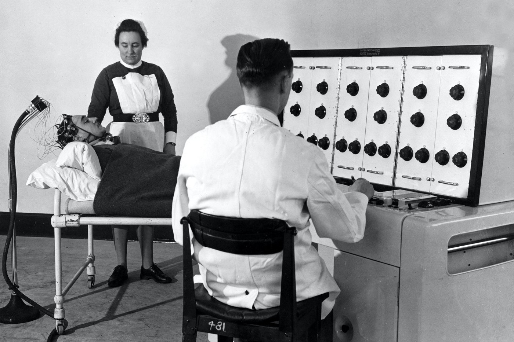
```

Milgram's authority experiment (1961)
]

.pull-right[
```{r, echo=FALSE, out.width=450, fig.align='center'}

```

Zimbardo's prison experiment (1971)

]

---

# Research ethics

- **Beneficence and No harm principle:** The purpose of research is to discover new information that would be helpful to society. The purpose of research should never be to hurt anyone or find out information at the expense of other people.

- Researchers often seek to evaluate benefits and harms of their research to indicate that **benefits greatly outweigh potential harms**.

- **Institutional Review Boards (IRB)** for ethics: University processes to safeguard ethical principles in academic research. Scientists submit research designs and the board reviews them and makes a statement about whether the design respects the ethics regulations of the university.


[First do no harm: An exploration of researchers' ethics of conduct in Big Data behavioral studies. Favaretto et al (2020)](https://journals.plos.org/plosone/article?id=10.1371/journal.pone.0241865)

---

## Ethics Commission at ETH Zurich

.center[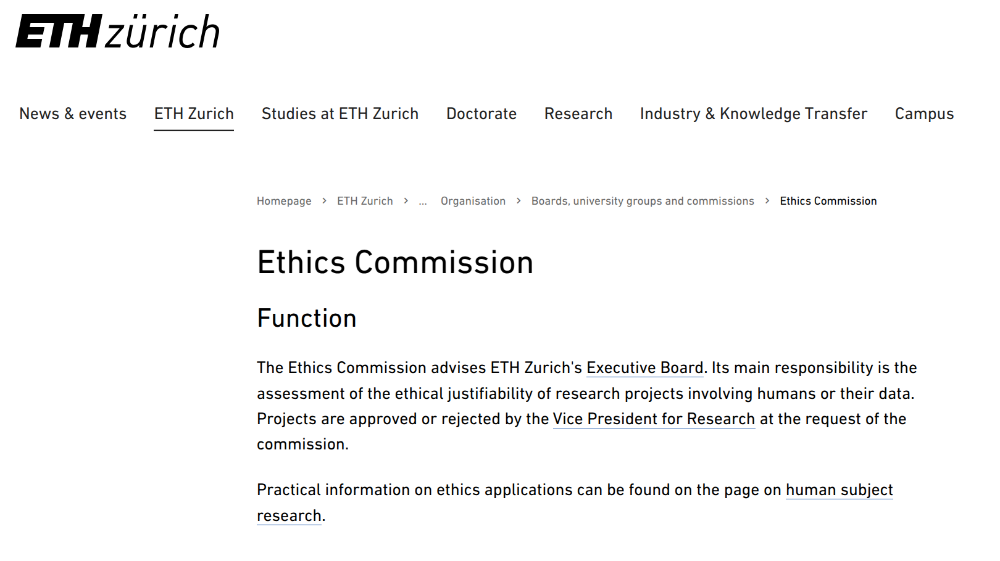]

https://ethz.ch/en/the-eth-zurich/organisation/boards-university-groups-commissions/ethics-commission.html
---

## Example reference: the Declaration of Helsinki

.center[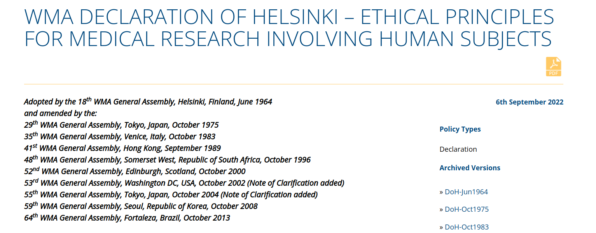]
https://www.wma.net/policies-post/wma-declaration-of-helsinki-ethical-principles-for-medical-research-involving-human-subjects/
---
# Ethics of social media research

Beyond the No harm principle:
 - Respecting privacy expectations of **data subjects**: Data are people
 - Downstream consequences of technological development
 - Right to information in the digital society
 
There is no *magic rule* or *solution* in research ethics: Every research design has to be evaluated in detail and its risks and benefits considered carefully

How to do that is evolving over time, building on examples that expose research ethics issues. Here we are going to see a few that have shaped current research ethics in the analysis of social media data and other digital traces

[Internet Research: Ethical Guidelines 3.0. Association of Internet Researchers (2019)](https://aoir.org/reports/ethics3.pdf)

---

# Preventing harm: Informed consent
.pull-left[
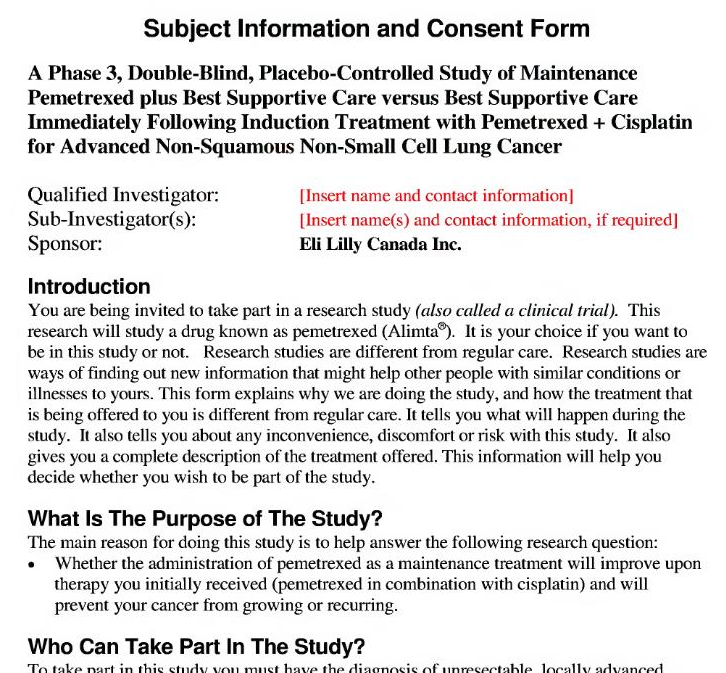
]

.pull-right[

- A way to verify that harm is reduced is to check that research subjects consent to participate in the experiment
- Gathering that consent in an informed way can be challenging
  - Long forms with jargon
  - Unconscious participants
  - Non-invasive or in vivo research

[Users' Views of Ethics in Social Media Research: Informed Consent, Anonymity, and Harm. Williams et al, 2017](emerald.com/insight/content/doi/10.1108/S2398-601820180000002002/full/html)
]
---

## When can you say that consent was informed?

```{r, echo=FALSE, out.width=1200, fig.align='center'}
knitr::include_graphics("figures/Kramer.svg")
```

[Experimental evidence of massive-scale emotional contagion through social networks. Kramer et al, PNAS (2014)](https://www.pnas.org/content/111/24/8788)
---


## When can you say that consent was informed?

```{r, echo=FALSE, out.width=900, fig.align='center'}
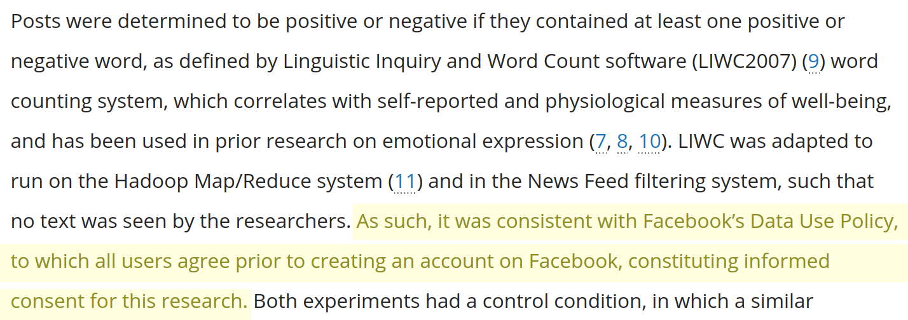
```

- "Blanket consent" without explicit purpose is not considered informed
- The GDPR regulates this and similar clauses are not legal in the EU any more

[Experimental evidence of massive-scale emotional contagion through social networks. Kramer et al, PNAS (2014)](https://www.pnas.org/content/111/24/8788)
---

## Use expectations: when public is not enough

```{r, echo=FALSE, out.width=1300, fig.align='center'}
knitr::include_graphics("figures/Kosinski.png")
```

[Deep Neural Networks Are More Accurate Than Humans at Detecting Sexual Orientation From Facial Images. Kosinski and Wang (2018)](https://www.gsb.stanford.edu/sites/default/files/publication-pdf/wang_kosinski.pdf)

---
## Downstream consequences: coding stereotypes

.center[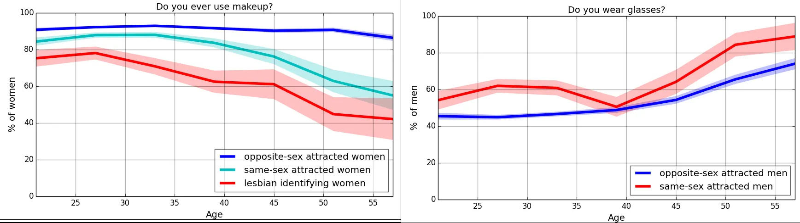]

[Do algorithms reveal sexual orientation or just expose our stereotypes? Blaise Aguera y Arcas, Alexander Todorov and Margaret Mitchell (2018)](https://medium.com/@blaisea/do-algorithms-reveal-sexual-orientation-or-just-expose-our-stereotypes-d998fafdf477)

---
## Downstream consequences: coding stereotypes

.center[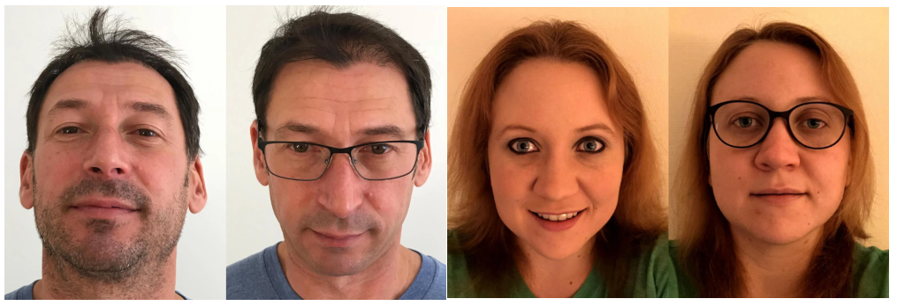]

[Do algorithms reveal sexual orientation or just expose our stereotypes? Blaise Aguera y Arcas, Alexander Todorov and Margaret Mitchell (2018)](https://medium.com/@blaisea/do-algorithms-reveal-sexual-orientation-or-just-expose-our-stereotypes-d998fafdf477)

---

# A note on "ethics approval"

.center[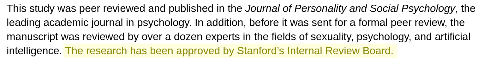]

- IRB only provide statements that a research project design complies with the regulations of the institution regarding human subjects research
- IRB are not "ethics approvals" or "ethics certificates", but they are proof that researchers have followed certain due process to consider ethics issues
- IRB focus on direct harm in experiments (e.g. health adverse effects) and do not consider other downstream social or technical risks

[Authors' note: Deep neural networks are more accurate than humans at detecting sexual orientation from facial images. M. Kosinski & Y. Wang (last update 2022)](https://docs.google.com/document/d/11oGZ1Ke3wK9E3BtOFfGfUQuuaSMR8AO2WfWH3aVke6U)

---

## Downstream consequences: technology misuse
.center[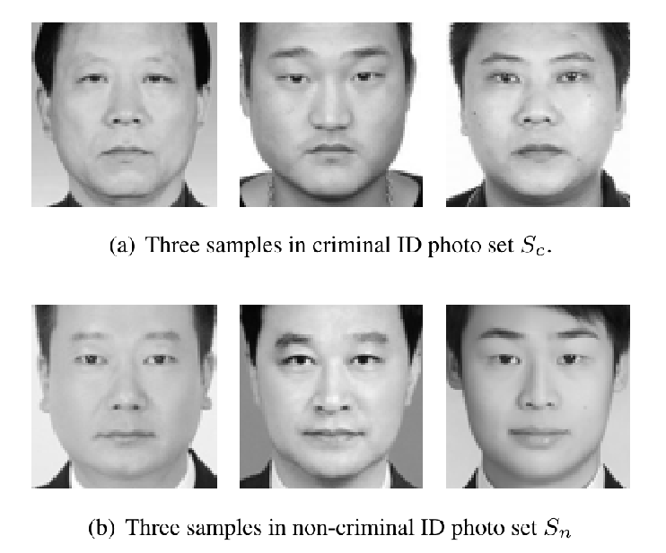]
[Responses to Critiques on Machine Learning of Criminality Perceptions (Addendum of arXiv:1611.04135), Wu and Zhang (2017)](https://arxiv.org/abs/1611.04135)

---

# Terms of Service vs Right to Information

```{r, echo=FALSE, out.width=1000, fig.align='center'}
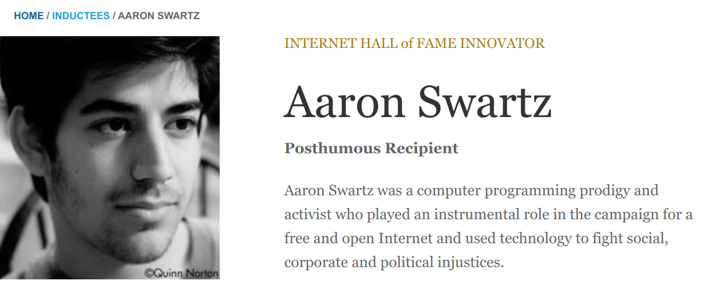
```

[Federal Court Rules 'Big Data' Discrimination Studies Do Not Violate Federal Anti-Hacking Law. Americal Civil Liberties Union (2020)](https://www.aclu.org/press-releases/federal-court-rules-big-data-discrimination-studies-do-not-violate-federal-anti)

---

# A recent case: Koko and GPT-3

.center[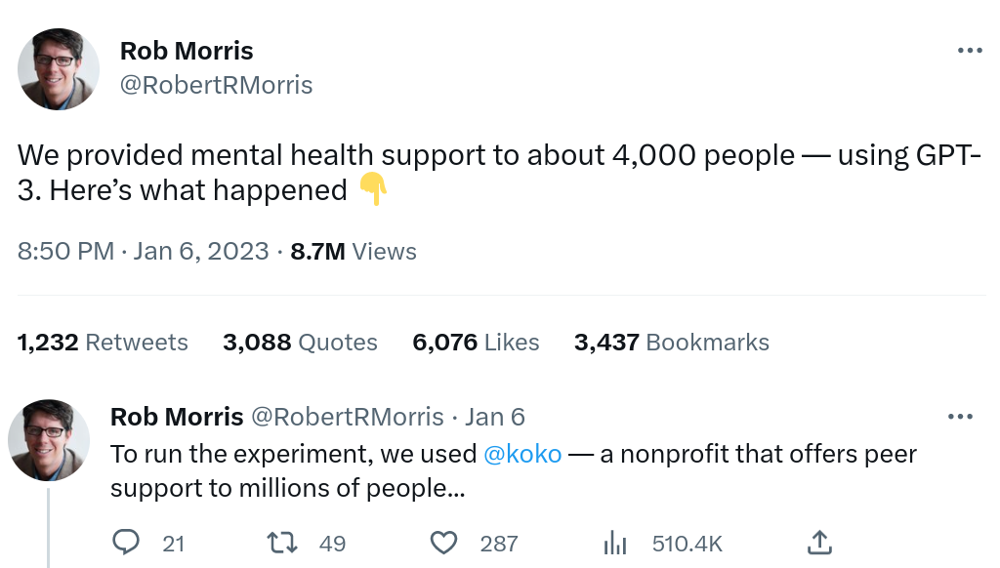]
---

# A recent case: Koko and GPT-3

.center[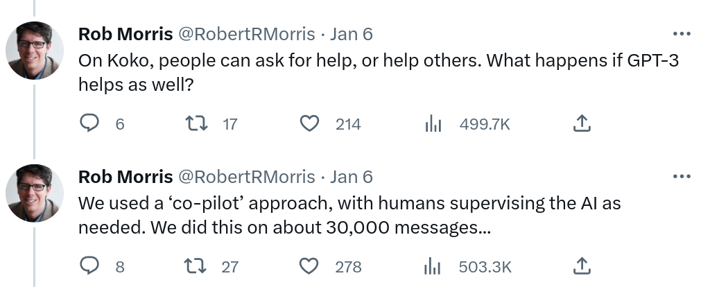]
---

# A recent case: Koko and GPT-3
.center[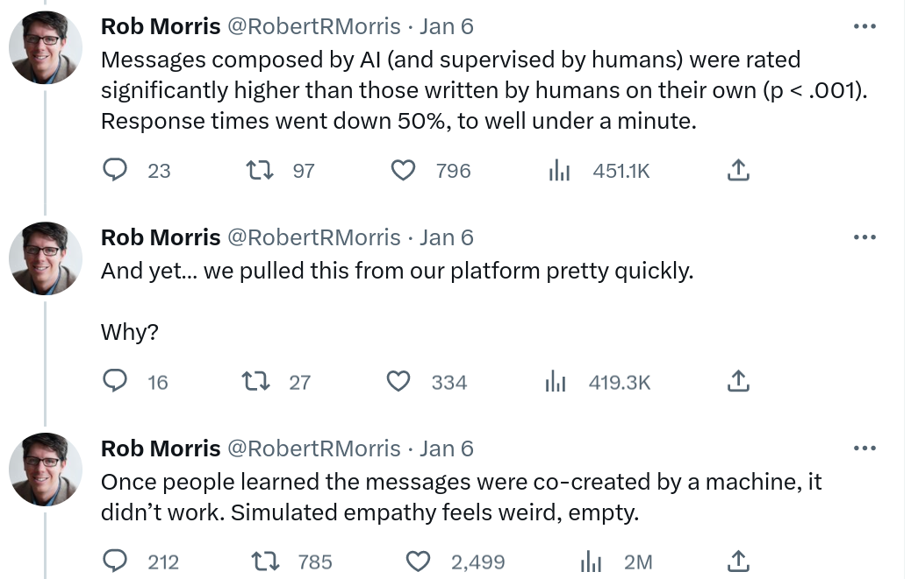]
---

# Summary

- **Ethics in social media data analysis**
  - No harm principle
  - Cases of previous ethical issues in digital trace data research
  - Recommendations for Big Data research

  
- **A recent case**
  - Reasons to do it? benefit for participants and society?
  - Risks to participants? Harm or also privacy?
  - Other downstream risks/benefits

