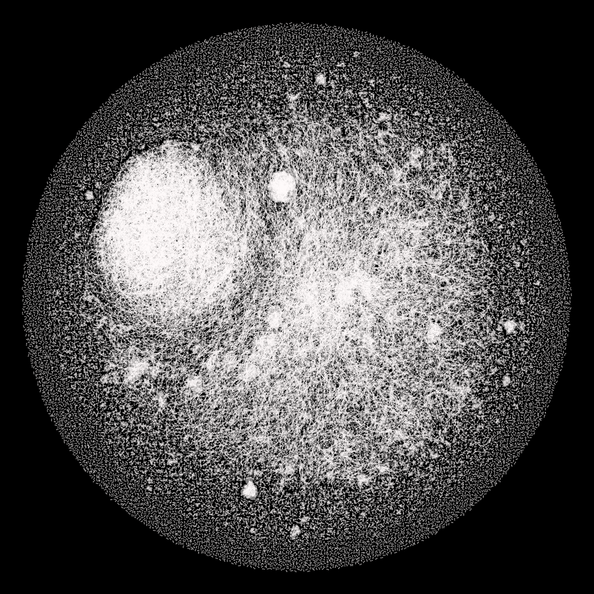
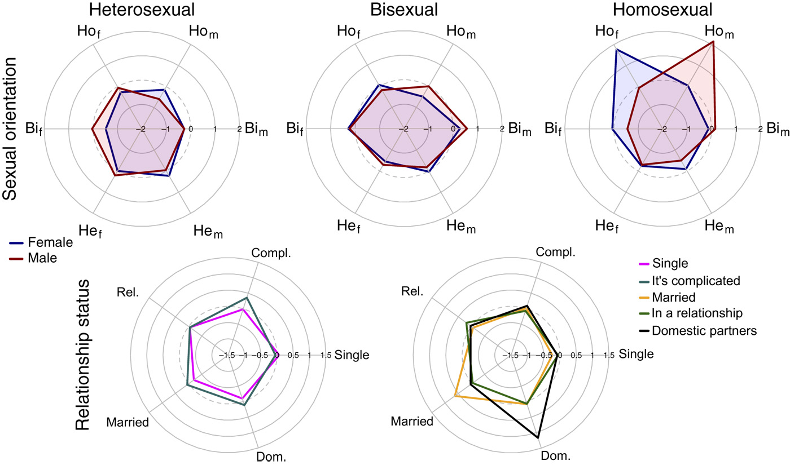
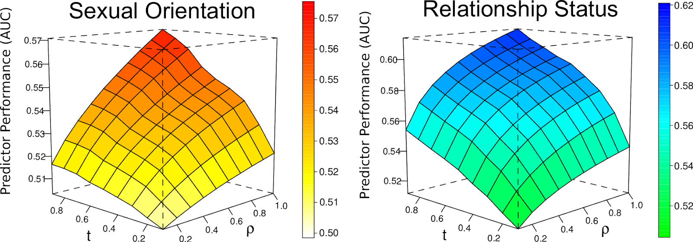
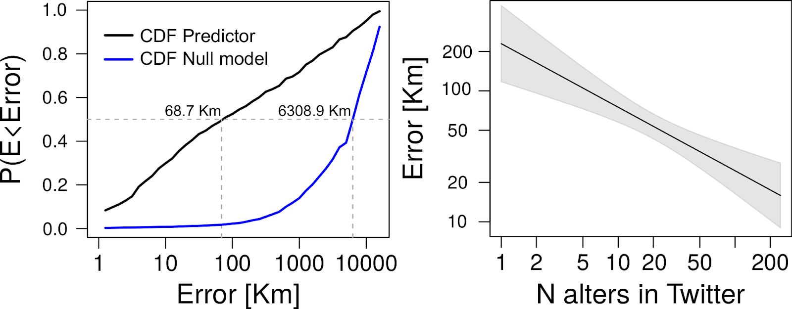
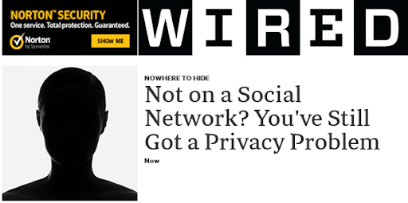

```{r xaringan-themer, include=FALSE, warning=FALSE}
#This block contains the theme configuration for the CSS lab slides style
library(xaringanthemer)
library(showtext)
style_mono_accent(
  base_color = "#5c5c5c",
  text_font_size = "1.5rem",
  header_font_google = google_font("Arial"),
  text_font_google   = google_font("Arial", "300", "300i"),
  code_font_google   = google_font("Fira Mono")
)
```

```{r setup, include=FALSE}
options(htmltools.dir.version = FALSE)
```

layout: true
<div class="my-footer"><span>
<a href=https://advances.sciencemag.org/content/3/8/e1701172.full> Leaking privacy and shadow profiles in online social networks. David Garcia. Science Advances (2017) </a></span></div>

---

# Privacy Risks in Online Platforms

- A risk for informational self-determination:
Private traits and attributes are predictable from digital records of human behavior [(Kosinski et al, 2013)](https://www.pnas.org/content/110/15/5802)

- Facebook Likes predict personality, sexual orientation, etc

Individualized solutions to privacy risks
> ”Providing users with transparency and control over their information, leading to an individually controlled balance between the promises and perils of the Digital Age.” *(Kosinski et al, 2013)*

<center>
**Can we guarantee individual control over online privacy?**

---
background-size: 20%
background-image: url(figures/puzzle.jpg)
background-position: 98% 70%

## The Problem of Shadow Profiles

**Facebook Shadow Profile:**  
A file that Facebook keeps on you containing data it pulls from looking at the information that your friends voluntarily provide. [*(Digital Trends, 2013)*](https://www.digitaltrends.com/social-media/what-exactly-is-a-facebook-shadow-profile/)

- 2011: Europe-vs-Facebook files complaint on shadow profiles

- 2013: Bug reveals private information of 6 million users

- Some users notice their shadow profiles with mobile numbers

- Apr 2014: 1B users of Facebook for mobile share  contact lists

- Aug 2016: Whatsapp and Facebook share information

Not a problem unique to Facebook: also in Twitter, Google, Amazon...

---

## Auditing Shadow Profiles

**Shadow profile hypothesis:**
The data shared by the users of an online platform predicts of personal information of non-users

```{r, echo=FALSE, out.width=600, fig.align='center'}
knitr::include_graphics("figures/shadowidea.png")
```
**Approach:** historical audit to evaluate how social networking sites could have predicted information of individuals who were not users yet 
<div style="font-size:15pt"> 
[One Plus One Makes Three (for Social Networks). Emöke-Ágnes Horvát, Michael Hanselmann, Fred Hamprecht, Katharina Zweig. Plos ONE (2012)](https://journals.plos.org/plosone/article?id=10.1371/journal.pone.0034740)

---

## Study 1: Friendster
.pull-left[
```{r, echo=FALSE, out.width=550, fig.align='center'}
knitr::include_graphics("figures/FriendsterLogo.png")
```
- Internet Archive dataset
- Full track of publicly available data
- Focus on first 20 million users
- 3M profiles with public information
- Profiles contain gender, marital status, and relationship interests
]
.pull-right[
```{r, echo=FALSE, out.width=450, fig.align='center'}

```
]

---

## Assortativity of sensitive features in Friendster

```{r, echo=FALSE, out.width=870, fig.align='center'}

```
---

## Unsupervised prediction based on friends

<br>

```{r, echo=FALSE, out.width=1100, fig.align='center'}
knitr::include_graphics("figures/ROCs.png")
```

---
### Predictive power grows with network size and disclosure

```{r, echo=FALSE, out.width=1100, fig.align='center'}

```

<center>
Performance of predictor of personal information of non-users grows with: 
network size (t), disclosure tendencies of users (ρ), and their product (t∗ρ)

---

layout: true
<div class="my-footer"><span>
<a href=https://epjdatascience.springeropen.com/articles/10.1140/epjds/s13688-018-0130-3> Collective aspects of privacy in the Twitter social network. David Garcia, Mansi Goel, Amod Agrawal, Ponnurangam Kumaraguru. EPJ Data Science (2018)</a></span></div>

---

## Study 2: Location in Twitter

.pull-left[
```{r, echo=FALSE, out.width=1100, fig.align='center'}
knitr::include_graphics("figures/TwitterLocation.png")
```
]
.pull-right[
- Random sample of 1,017 users
  - excl. bots, mass media
- Ego network of reply links
  - 68,447 alters
- Timelines: 157M tweets
- Location from profile text + Google Maps API
- Tweet metadata to identify users sharing contact lists
]

---

## Twitter shadow profile test

```{r, echo=FALSE, out.width=1100, fig.align='center'}
knitr::include_graphics("figures/TwitterProblem.png")
```

- Data represents a bidirectional social network
- Joined date of users shows network growth
- Tweet metadata contains posting app: disclosing users are only those who post at least once from Twitter mobile apps (shared contact lists)
- Predicting location of users who didn't join yet based on disclosing friends already on Twitter
---

## Location prediction and heterogeneity

```{r, echo=FALSE, out.width=1000, fig.align='center'}

```

- Location prediction of non-users greatly outperforms null model
- Individuals with more alters sharing contact lists in Twitter have lower error

---

## Shadow profiles after leaving a social network

```{r, echo=FALSE, out.width=800, fig.align='center'}
knitr::include_graphics("figures/Shadow2.png")
```
<div style="font-size:15pt"> 
[**Privacy beyond the individual.** David Garcia. Nature Human Behavior (2019)](https://www.nature.com/articles/s41562-018-0513-2)

[**Information flow reveals prediction limits in online social activity.** James Bagrow, Xipei Liu & Lewis Mitchell. Nature Human Behavior (2019)](https://doi.org/10.1038/s41562-018-0510-5)

---

### Complex privacy: Online privacy as a collective phenomenon

.pull-left[
- The decision of individuals to share data is mediated by the decisions of others
- Privacy externalities of the contract between a user and a platform
- Complex problems, collective solutions: International data cooperatives
]
.pull-right[
```{r, echo=FALSE, out.width=500, fig.align='center'}

```
]
<div style="font-size:16pt"> 
[**Online privacy as a collective phenomenon.** E. Sarigol, D. Garcia, F. Schweitzer. Second ACM Conference on Online Social Networks (COSN) (2014)](https://dl.acm.org/doi/10.1145/2660460.2660470)  
[**Leaking privacy and shadow profiles in online social networks.** D. Garcia, Science Advances, 3 (8) e1701172 (2017)](https://advances.sciencemag.org/content/3/8/e1701172.full)  
[**Collective Aspects of Privacy in the Twitter Social Network.** D. Garcia, M. Goel, A. Agrawal, P. Kumaraguru, EPJ Data Science, 7(3) (2018)](https://epjdatascience.springeropen.com/articles/10.1140/epjds/s13688-018-0130-3)  
[**Privacy beyond the individual.** D. Garcia. Nature Human Behavior (2019)](https://www.nature.com/articles/s41562-018-0513-2)
