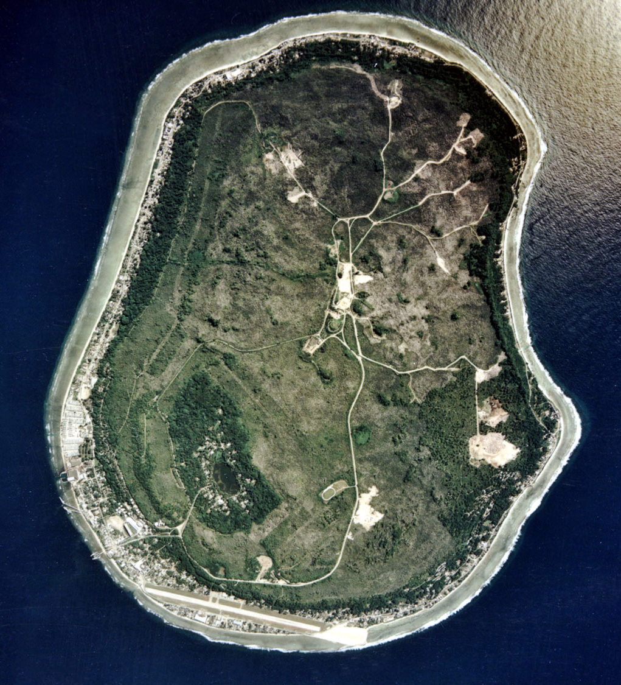
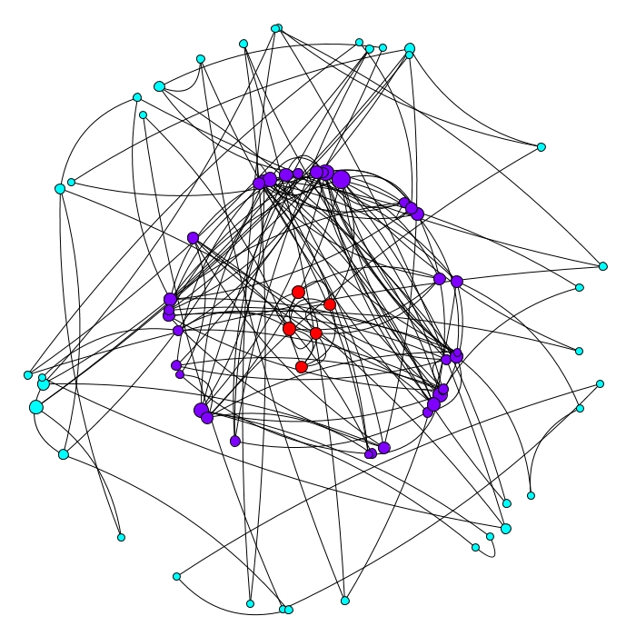
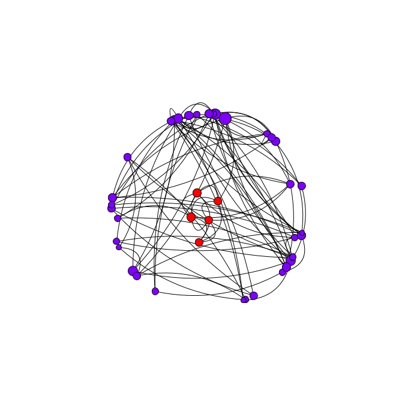
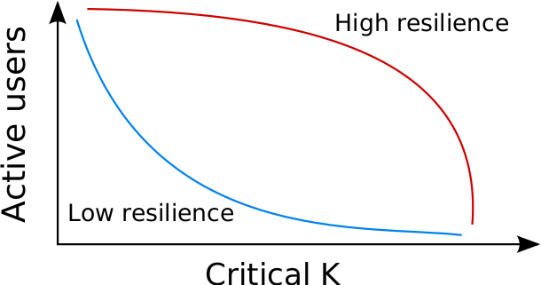
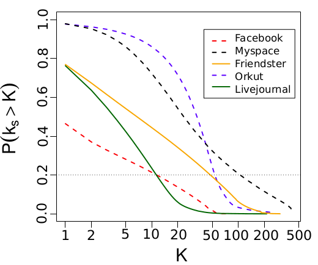

```{r xaringan-themer, include=FALSE, warning=FALSE}
#This block contains the theme configuration for the CSS lab slides style
library(xaringanthemer)
library(showtext)
style_mono_accent(
  base_color = "#5c5c5c",
  text_font_size = "1.5rem",
  header_font_google = google_font("Arial"),
  text_font_google   = google_font("Arial", "300", "300i"),
  code_font_google   = google_font("Fira Mono")
)
```

```{r setup, include=FALSE}
options(htmltools.dir.version = FALSE)
```

layout: true

<div class="my-footer"><span>David Garcia - Social Data Science - ETH Zurich, Chair of Systems Design</span></div> 
---


# The question of social resilience
<div style="float:right">

</div>

> **Social Resilience:** The ability of a community to withstand external stresses, disturbances, and environmental changes

Nauru as an example of lack of resilience:

- Environmental shock in phosphate mining
- Loss of population and employment

What makes a society lose less or even gain from adversity?

---

# Why do online social networks collapse?

.center[]

---

# Modelling social resilience online

Social resilience can be modelled as a process of how users stay active or inactive in a social networking site. 

If we consider social network users as rational, they will respond to incentives to stay active or to abandon social networks depending on **benefits and costs**.

**Benefits** can be quantified through the content users receive from their friends (shares, comments) and through the attention and support given by their friends (likes, votes).

A simple way to model monotonic benefits is proportionally to the active friends of a user $k_u$:

$$benefit_u = b * k_u$$
---

# Costs of using an online social network

<div style="float:right">

</div>
**Costs:** Using social network is not only benefits, there are also costs associated with being active, for example:  

- Time spent to learn to use the interface of the platform  
- Risks of disclosing personal information  
- Opportunity costs: you could be doing something else  
- Economic costs, for example membership fees.

A common assumption about costs is that they are relatively similar for all users, thus modeling them as a constant $c$. Then, a user will become inactive when the total benefits are below the cost:

$$ b *k_u < c $$

---
.center[]
---
.center[]
---
.center[]
---

# The k-core decomposition

The graph remaining after the cascade above is what is called a k-core

> **k-core**: A k-core of a graph $G$ is a maximal connected subgraph of $G$ in which all vertices have degree at least k.

For any network, you can calculate its k-core decomposition as follows:  

- Start with $k_s=1$  
- Remove all nodes with degree less than or equal to $k_s$ and their links  
- Repeat until all nodes have degree larger than $k_s$  
- Increase $k_s$ by one and repeat until no nodes are left

The nodes and the edges removed for certain of $k_s=k$ is called the **k-shell**.  
A **k-core** is the set of all k-shells with $k_s \geq k$.

---

# Coreness centrality

.center[]

The k-shell number of a node is also called **coreness centrality**.

[Kitsak et al.](https://www.nature.com/articles/nphys1746) showed that coreness centrality is a better predictor of simulated spreading cascade sizes than other centrality measures like degree and betweeness.

---

# Coreness and social resilience

The cost to benefit ratio $c/b$ defines a critical value of the degree $K$, below which users with degree $k_u<K$ will leave the social network. The remaining active social network is the k-core corresponding to $K$. The cumulative function of coreness values in the network serves as a **resilience function**:

.center[]

---

# Empirical resilience functions

.center[]
