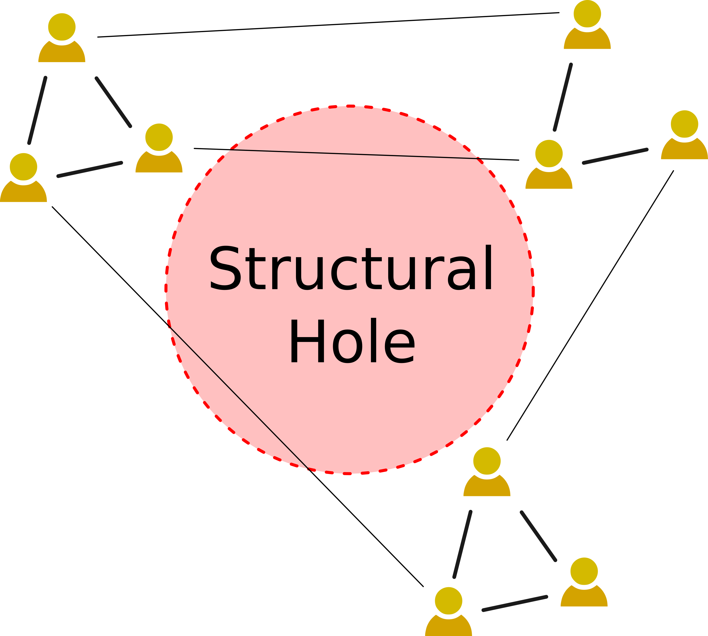
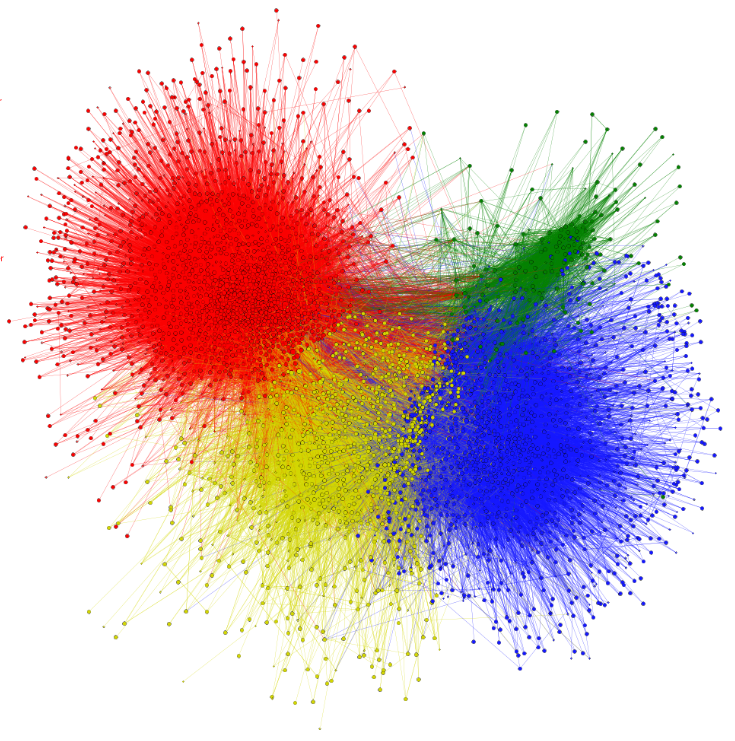
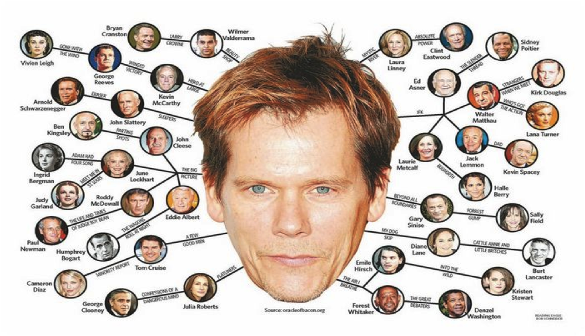

```{r xaringan-themer, include=FALSE, warning=FALSE}
#This block contains the theme configuration for the CSS lab slides style
library(xaringanthemer)
library(showtext)
style_mono_accent(
  base_color = "#5c5c5c",
  text_font_size = "1.5rem",
  header_font_google = google_font("Arial"),
  text_font_google   = google_font("Arial", "300", "300i"),
  code_font_google   = google_font("Fira Mono")
)
```

```{r setup, include=FALSE}
options(htmltools.dir.version = FALSE)
```

layout: true

<div class="my-footer"><span>David Garcia - Social Data Science - ETH Zurich, Chair of Systems Design</span></div> 

---

# Triadic closure


<div style="float:right">

</div>

>  **Triadic closure:** The tendency of individuals in social networks to create links to neighbors at distance 2

**Local clustering coefficient**:

$$C_i = \frac{2*t(i)}{d_i *(d_i−1)}$$

- $d_{out}(i)$ is the outdegree of $i$ (>1) 
- $t(i)$ is the number of pairs of neighbors of $i$ that are connected
- can be averaged or computed globally

---

# The strength of weak ties

<div style="float:right">

</div>

**Strong ties:** People who are very close to you (family, friends, etc.)
- Provide reciprocal emotional support
- Long-lasting, require energy and time

**Weak ties:** People you know but not very close to you (colleagues from work, school, etc.)
- Provide information, for example about employment and housing
- Are also faster to disappear

> **The strength of weak ties:** Weak ties are weaker than strong ties, but are also many more than strong ties. (Mark Granovetter) 

---

# Structural holes and communities

.center[]

---

### Measuring modularity

The measure of [**modularity**](https://www.pnas.org/content/103/23/8577.short) quantifies the tendency of a network to be divided in densely connected subgroups that are sparsely connected across groups.   
**Q-modularity** measures this tendency:

$$Q = \frac{1}{2m} \sum_{u,v} [ A_{u,v} - \frac{k_u k_v}{2m} ]\delta(c_u, c_v)$$
- $u$ and $v$ are two nodes of the network. The sum goes over all pairs of nodes.
- $m$ is the number of edges  
- $A$ is the adjacency matrix ($A_{u,v} = 1$ if and only if u and v are connected)  
- $k_u$ and $k_v$ are the degrees of $u$ and $v$  
- $c_u$ is the community of $u$ and $c_v$ is the community of $v$  
- $δ(c_u,c_v)$ takes value $1$ if and only if u and v are in the same community, otherwise it's $0$  


---

## Finding community structures

.center[]  
.center[Example: Louvain algorithm]


---

## When holes are bridged: The small world concept

Small world networks have the following three properties:  
- Most nodes are not neighbors (sparse network)  
- The mean distance between two nodes is small  
- They have high global clustering coefficient

<div style="float:right">

</div>


**Stanley Milgram's experiment:**

- 160 people in Omaha try to reach one person in Boston by mail to their acquitances
- 44 letters reached the target with six steps on average
- Short path length as evidence of small-world
- Average path length on Facebook is 4.5


---

# The Bacon number
.center[]


