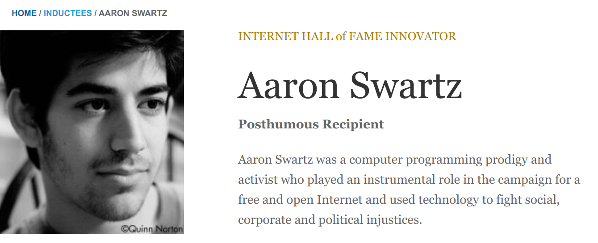

```{r xaringan-themer, include=FALSE, warning=FALSE}
#This block contains the theme configuration for the CSS lab slides style
library(xaringanthemer)
library(showtext)
style_mono_accent(
  base_color = "#5c5c5c",
  text_font_size = "1.5rem",
  header_font_google = google_font("Arial"),
  text_font_google   = google_font("Arial", "300", "300i"),
  code_font_google   = google_font("Fira Mono")
)
```

```{r setup, include=FALSE}
options(htmltools.dir.version = FALSE)
```

layout: true

<div class="my-footer"><span>David Garcia - Foundations of Computational Social Systems</span></div> 

---

# When research can do harm

.pull-left[
```{r, echo=FALSE, out.width=550, fig.align='center'}

```

Milgram's authority experiment (1961)
]

.pull-right[
```{r, echo=FALSE, out.width=450, fig.align='center'}
knitr::include_graphics("figures/Zimbardo.jpg")
```

Zimbardo's prison experiment (1971)

]

---

# Research ethics

- **Beneficence and No harm principle:** The purpose of research is to discover new information that would be helpful to society. The purpose of research should never be to hurt anyone or find out information at the expense of other people.

- **Institutional Review Boards (IRB)** for ethics: University processes to safeguard ethical principles in academic research. Scientists submit research designs and the board reviews them and makes a statement about whether the design respects the ethics regulations of the university.

- Researchers often seek to evaluate benefits and harms of their research to indicate that **benefits greatly outweigh potential harms**.

[First do no harm: An exploration of researchers' ethics of conduct in Big Data behavioral studies. Favaretto et al (2020)](https://journals.plos.org/plosone/article?id=10.1371/journal.pone.0241865)

---
# Ethics of social media research

Beyond the No harm principle:
 - Respecting privacy expectations of **data subjects**: Data are people
 - Downstream consequences of technological development
 - Right to information in the digital society
 
There is no *magic rule* or *solution* in research ethics: Every research design has to be evaluated in detail and its risks and benefits considered carefully

How to do that is evolving over time, building on examples that expose research ethics issues. Here we are going to see a few that have shaped current research ethics in Computational Social Systems

[Internet Research: Ethical Guidelines 3.0. Association of Internet Researchers (2019)](https://aoir.org/reports/ethics3.pdf)

---

# Preventing harm: Informed consent
.pull-left[

]

.pull-right[

- A way to verify that harm is reduced is to check that research subjects consent to participate in the experiment
- Gathering that consent in an informed way can be challenging
  - Long forms with jargon
  - Unconscious participants
  - Non-invasive or in vivo research

[Users' Views of Ethics in Social Media Research: Informed Consent, Anonymity, and Harm. Williams et al, 2017](emerald.com/insight/content/doi/10.1108/S2398-601820180000002002/full/html)
]
---

## When can you say that consent was informed?

```{r, echo=FALSE, out.width=1200, fig.align='center'}

```

[Experimental evidence of massive-scale emotional contagion through social networks. Kramer et al, PNAS (2014)](https://www.pnas.org/content/111/24/8788)
---

## What is personally identifiable information (PII)? 
.pull-left[

```{r, echo=FALSE, out.width=1200, fig.align='center'}

```

[NYT article on AOL data deanonymization](https://www.nytimes.com/2006/08/09/technology/09aol.htmlz)

]

.pull-right[

```{r, echo=FALSE, out.width=1200, fig.align='center'}

```

[Artificial Intelligence magazine on the Netflix challenge deanonymization](https://ai.plainenglish.io/ahh-the-computer-algorithm-still-can-find-you-even-there-is-no-personal-identifiable-information-6e077d17381f)
]
---

## Privacy expectations: when public is not enough

```{r, echo=FALSE, out.width=1300, fig.align='center'}

```

[Deep Neural Networks Are More Accurate Than Humans at Detecting Sexual Orientation From Facial Images. Kosinski and Wang (2018)](https://www.gsb.stanford.edu/sites/default/files/publication-pdf/wang_kosinski.pdf)

---

## Downstream consequences: technology misuse

```{r, echo=FALSE, out.width=500, fig.align='center'}
knitr::include_graphics("figures/criminals.png")
```

[Responses to Critiques on Machine Learning of Criminality Perceptions (Addendum of arXiv:1611.04135), Wu and Zhang (2017)](https://arxiv.org/abs/1611.04135)

---

# Terms of Service vs Right to Information

```{r, echo=FALSE, out.width=1000, fig.align='center'}

```

[Federal Court Rules 'Big Data' Discrimination Studies Do Not Violate Federal Anti-Hacking Law. Americal Civil Liberties Union (2020)](https://www.aclu.org/press-releases/federal-court-rules-big-data-discrimination-studies-do-not-violate-federal-anti)

---

# Recommendations about ethics in CSS

- Weigh benefit and risk before deciding to start research

- Public data is not automatically fair game: data are people

- Privacy is not binary: Is my research in the interest of the data subjects?

- Ethical data sharing: do share research data, but carefully

- Informed consent is not ticking a box. Do debriefing

- Consider downstream consequences: how can my science be misused?

- Society has a right to information: critically consider Terms of Service


[Ten simple rules for responsible big data research. Zook et al. (2017)](https://journals.plos.org/ploscompbiol/article?id=10.1371/journal.pcbi.1005399)


