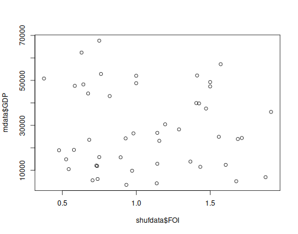

```{r xaringan-themer, include=FALSE, warning=FALSE}
#This block contains the theme configuration for the CSS lab slides style
library(xaringanthemer)
library(showtext)
style_mono_accent(
  base_color = "#5c5c5c",
  text_font_size = "1.5rem",
  header_font_google = google_font("Arial"),
  text_font_google   = google_font("Arial", "300", "300i"),
  code_font_google   = google_font("Fira Mono")
)
```

```{r setup, include=FALSE}
options(htmltools.dir.version = FALSE)
```

layout: true

<div class="my-footer"><span>David Garcia - Foundations of Computational Social Systems</span></div> 

---

# Null models

Once we have measured something or got a statistical result from our analysis, we might ask ourselves: What is the probability that this result can appear due to chance alone? 


- If the coin is fair: P(H) = 1/2 and P(HHHHH) = 1/32
- In the case of getting five heads, how plausible is that the coin is fair?

---

# Permutation tests

- Example: correlation coefficient between two variables $X$ and $Y$: $\rho(X,Y)$
- What is the probability that we could measure a similar or even stronger correlation if $X$ and $Y$ were completely independent?
- We can answer this questions with a permutation test 
- A permutation test has four components:

1. A **test statistic**,  e.g. $\rho(X,Y)$
2. A **null hypothesis**, which is a statement about the value of our test statistic when "nothing interesting happens". 
  - It is often denoted as $H_0$ and in this case it would be $H_0: \rho(X,Y)=0$.

---
# Permutation tests
1. A **test statistic**,  e.g. $\rho(X,Y)$
2. A **null hypothesis**, which is a statement about the value of our test statistic when "nothing interesting happens". 
  - It is often denoted as $H_0$ and in this case it would be $H_0: \rho(X,Y)=0$.
3. An **alternative hypothesis**, which is another statement about the value of the test statistic that stems from our theory or research question. It is often denoted as $H_1$ and, for example, it could be $H_1: \rho(X,Y)>0$. 
  - The alternative hypothesis and the null hypothesis have to be contradictory. Both can't be true at the same time, but both could be false.
4. A **permutation set** with $N$ random permutations or shuffles of the data. Permutations in this set model a world in which the null hypothesis is true and any measurement different than the one specified in the null hypothesis is due to chance alone.

---

# Permutation tests in R: FOI and GDP


.pull-left[
- Example: correlation between the Future Orientation Index and the GDP per capita of countries

Correlation in this example: 0.6841329
]
.pull-right[

]
---

# Permuted data

.pull-left[
- If we shuffle one of the columns, the correlation will be close to zero, for example 0.08600673

- Idea: repeat this many times to estimate the chances of having a high correlation even though data was permuted
]
.pull-right[

]

---


# Histogram of permutation results

.center[]

The red line shows the original correlation without reshuffling

---

# The p-value of a permutation test

The p-value is a way to summarize the results of a permutation test. 

> **p-value:** Given that the null hypothesis is true, the p-value is the probability that we measure a statistic at least as extreme as the observed result

- **A common misconception is that the p-value measures the probability that the null hypothesis is true**. 

- The p-value measures the plausibility of what we measure under the null hypothesis, which is very different. 
---

# Calculating a p-value 

- *one-sided p-value*: proportion of permutations with a value of the statistic at least as large as the observed one. 
- *two-sided p-value*: proportion of permutations with an absolute value of the statistic at least as large as the observed one.


We can calculate the one-sided p-value from the permutation test:
```{r, eval=F, echo=T}
p_value_Cor = (sum(corPerm>=corObserved)+1)/length(corPerm)
```
 
- We add one to the numerator to ensure we don't say zero
- The result is "significant" (p<0.05), but careful interpreting that word!
- How many times to permute: $10000$ times is safe for (p<0.05)

---

# Summary of block 8

- **Social network structures**
  - Triadic closure
  - The strength of weak ties
  - Structural holes and communities
  - Small worlds


- **Assortativity: when nodes have attributes**
  - Assortativity coefficient
  - Three processes to generate assortative networks


- **Permutation tests**
  - How plausible is that I get a result as extreme as this purely by chance?
  - Permuting to simulate a null model
  - P-values as a way to summarize the result
