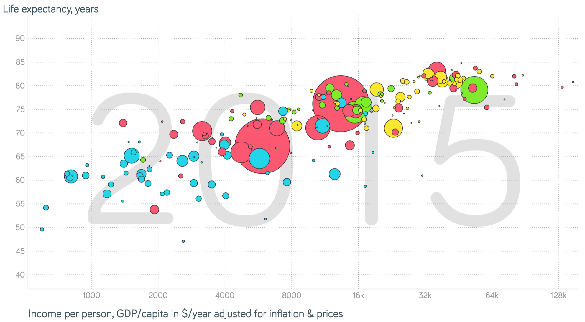
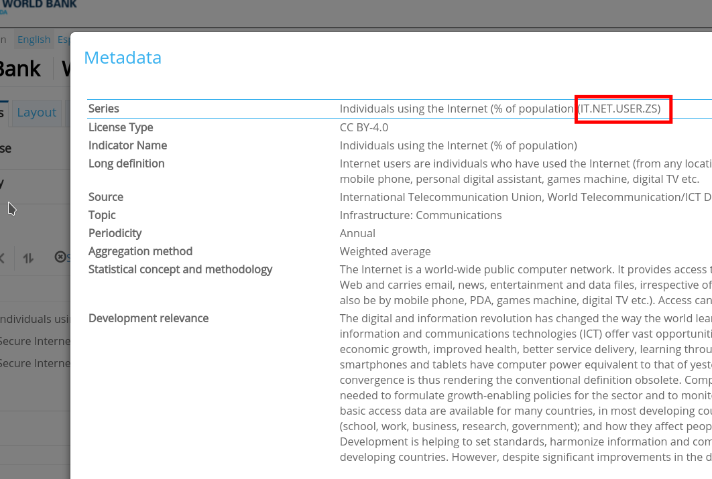

### The World Bank Development Indicators

The World Bank was founded in 1944 with the goal of reducing poverty in the world. It contains five agencies and almost every country is a member of the World Bank. One of its functions is to keep track of the economic development of many countries. [The World Development Indicators (WDI)](https://databank.worldbank.org/source/world-development-indicators) is a collection of data for different countries over as long as possible. You can explore the database through their [online interface](https://databank.worldbank.org/source/world-development-indicators).

This kind of development data can give great insights. You can find great examples of visualizations of development indicators at https://www.gapminder.org/tools/ like this one:



To know more, check Hans Rosling's talk ["The best stats you’ve ever seen."](https://www.ted.com/talks/hans_rosling_shows_the_best_stats_you_ve_ever_seen
)

### The WDI package

You can access the WDI database directly from R with [the WDI package](https://cran.r-project.org/web/packages/WDI/index.html). You can install it with the install.packages() function:

```{r eval=FALSE}
install.packages("WDI")
```

and load it with the library() function:
```{r load}
library(WDI)
```

The package contains a function also called WDI() that you can use to query the database. You can find information about how the function works with the help command:
```{r}
?WDI
```

The most important parameters of WDI are the following:  
- indicator: id of the indicator in the database, see next section for more details.  
- country: country or list of countries for which you want data. You can leave it empty or say "all" to get all available countries and regions.  
- start and end: numbers of the years to cover with the request  
- extra: set it to TRUE if you want additional columns per country, like region, iso3 code, etc

For example to get the GDP per capita with purchase power correction for all countries between 2012 and 2014:
```{r}
df <-  WDI(indicator="NY.GDP.PCAP.PP.KD", country="all", start = 2012, end = 2014)
head(df)
```
The columns in the response depend on the query (e.g. extra=TRUE), but in general you get a column for the iso code of the region, the name, the value of the indicator, and the year.

### How to find an indicator

The WDI package has a function to search for the id of an indicator from R: WDIsearch(). You can put a term describing the indicator in the query and it will match it against fields of the description of the indicator in the database. For example for "GDP":

```{r}
results <- WDIsearch("GDP")
head(results)
```
This can be useful for some quick lookups for indicators you forgot the id for, but it is pretty limited if you are trying to find out the indicator for the first time. First, it just does a blind match without a relevance ranking, so sometimes you have huge result sets (e.g. for GDP you can get more than 500) and if you did not get the term right, you can easily have zero results. Second, the description for indicators is pretty poor, just from the short name it is hard to know how it is calculated, how many countries have that indicator available, for how many years, etc.

To search more carefully for indicators, you can do so at the [WDI online interface](https://databank.worldbank.org/source/world-development-indicators). Here the search is much smarter and you can find more information on each indicator. On the tab "Series" in the left menu, you can search for an indicator. For example, if you are searching for internet penetration:

{width=50%}

You can look up the detailed description of an indicator by clicking on the "i" button next to its name:

{width=50%}

I recommend you to take a look at the data on the WDI online interface to check that the countries you expect have the indicator. You can easily procue a plot with the time series of an indicator in a country or a table for you to take a closer look. Some indicators are repeated and might have worse coverage, so make sure you find the right one for your analysis!

### Some useful indicators

Finally, here's a list of indicators that I have found useful in previous work:

- NY.GDP.PCAP.PP.KD: GDP per capita in international USD, i.e. corrected for purchase power  
- SP.POP.TOTL: Total population  
- IT.NET.USER.SZ: Internet penetration  
- SP.POP.TOTL.FE.ZS: % of female population
- SL.UEM.TOTL.NE.ZS: Unemployment as % of labor force  
- GB.XPD.RSDV.GD.ZS: Research & Development expenditure as % of GDP


