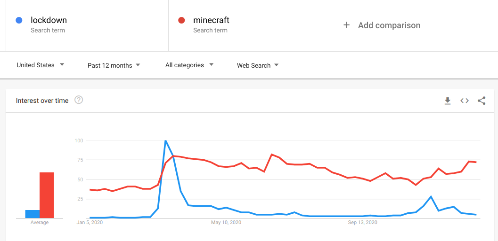

### Exporting a Google Trends time series as csv

You can visit https://trends.google.com/ to make a query and download the data as csv. For example, if you query the terms "lockdown" and "minecraft", the first graph you see is this one:



The arrow button allows you to download a csv version of the data behind the plot. The first lines of the file will look approximately like this:

```
Category: All categories
   
Week,lockdown: (United States),minecraft: (United States)
2020-01-05,1,37
2020-01-12,1,36
2020-01-19,1,38
```

You might see the headers in another language if you are using a Google account with certain language settings.

We can read the data in R, but we want to ignore the first two lines of header. It is also a good practice to rename columns to something familiar:

```{r}
df <- read.csv("multiTimeline-lockdown.csv", skip=2)
names(df) <- c("week","lockdown","minecraft")
head(df)
```

And you can do your own plot of the time series to make sure that you loaded the data well.

```{r, fig.height=3}
plot(as.Date(df$week), df$lockdown, type="l", col="blue", 
     lwd=2, ylab="volume", xlab="date")
lines(as.Date(df$week), df$minecraft, col="red", lwd=2)
```

### Exporting a Google Trends map as csv

Below the time series plot, Google Trends offers a map comparing a region. The above query was for the US, but you can configure it for the whole world or for another country or area:


Clicking on the same download symbol, you will download a file that looks like this:  
```
Category: All categories

Region,lockdown: (1/3/20 - 1/3/21),minecraft: (1/3/20 - 1/3/21)
Utah,8%,92%
Alaska,6%,94%
Idaho,8%,92%
```

Same as before, you can read it ignoring the first two lines and renaming the columns. 

```{r}
geodf <- read.csv("geoMap-lockdown.csv", skip=2)
names(geodf) <- c("region","lockdown","minecraft")
head(geodf)
```

Those percentage signs are a problem. The fractions are read as character strings rather than as numeric. We can convert them by removing the percentage sign and converting to numeric like this:

```{r}
geodf$lockdown <- as.numeric(gsub("%", "", geodf$lockdown))
geodf$minecraft <- as.numeric(gsub("%", "", geodf$minecraft))
head(geodf)
```

### The gtrendsR package

The [gtrendsR package](https://cran.r-project.org/web/packages/gtrendsR/index.html) provides a way to access Google Trends from R. It is useful to make searches reproducible, but **do not make many calls in a short period of time because Google will block you.** Always save the data as soon as you got it.

Installing the package is as simple as any other package:
```{r, eval=F}
install.packages("gtrendsR")
```

And loading it as well:
```{r}
library(gtrendsR)
```

Its main fuction is call gtrends, which allows you to query Google Trends automatically. Take a look to the documentation of the function with this command:
```{r}
?gtrends
```

Among its parameters, four are important for us:

- keyword: term or terms to query  
- geo: identifier of the regions to cover with the query  
- time: a time identifier as in Google Trends URLs, see the help  
- low_search_volume: should be set to TRUE if you want to include small countries  

For example, we can search for the terms "2013" and "2015" from all over the world including low search volume regions and on the year 2014:
```{r}
result <- gtrends(keyword = c("2013","2015"), geo = "", time="2014-01-01 2014-12-31", low_search_volume = T)
```

The result is an object with various data frames. For example, interest_over_time contains the time series with the volume on its column "hits":
```{r}
head(result$interest_over_time)
```
 
And interest_by_country contains the volume across countries:
```{r}
head(result$interest_by_country)
```

### Appendix: Disambiguated trends

On Google Trends you can also search for freebase entries. This way, Google disambiguates and translate search terms, mapping them to entry terms like "Zürich (city in Switzerland)" to the code "/m/08966". You can see the freebase entry for Zurich at https://freebase.toolforge.org/m/08966 . You can do the same for any code, appending it at the end of https://freebase.toolforge.org to see what the database entry refers to.

For example, you can search for terms across languages like this:


Here, "Jesus" has been disambiguated to the id "/m/045m1_" and "Mohammad" to the id "/m/04s9n". Google trends shows the volume aggregated for queries including the way to say both words in other languages.

And you can use the freebase ids  in gtrendsR to get the data directly:

```{r}
result <- gtrends(keyword = c("/m/045m1_","/m/04s9n"), low_search_volume = T)
head(result$interest_by_country)
```

