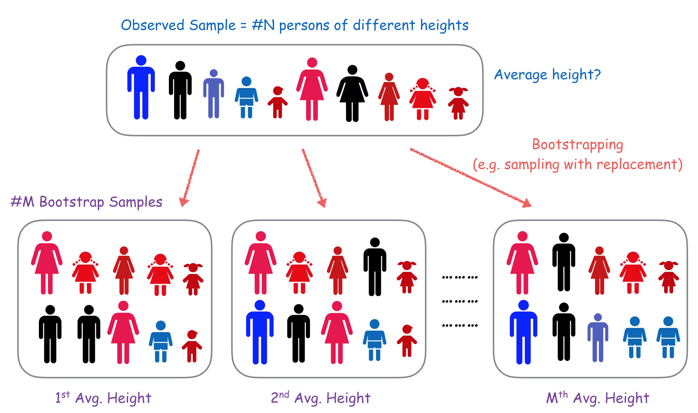

### What is bootstrapping?

Bootstrapping is a method to understand the uncertainty of a measurement on a sample. Bootstrapping is based on resampling and repeating the measurement to have an idea of its distribution of possible values over other samples of the same size.

Imagine that we want to measure the mean height of the people in a country. To have an idea of that value, we can draw a representative sample of people in the country such that it has similar fraction of people of the gender, age, ethnicity, etc as the country. We can measure the mean over that sample, but how certain are we of that measure? What other values for the mean could we expect if we produced another sample?

{width=70%}

To perform bootstraping, we generate bootstrap samples from the original sample we had. Bootstrap samples are samples of the same size as our original sample but **with replacement**, which means that every time we sample an element, we put it back and it could be sampled again. This way we could sample some elements more than once and others maybe not even once. Then over this bootstrap sample, we measure the same metric, in our example is the mean of the height of people. Then we repeat this bootstrap sampling many times, for example 10000 times, and record the same metric on every sample. The resulting distribution of metric values gives us an idea of what would be the value of the mean if we applied it to other subsamples of the total population.

When we bootstrap we are simulating the sampling process that gave us the original sample. It is a good way to understand the uncertainty of the metric if the original sample we had was representative of the total population. You can learn some examples of what can happen when samples are not representative in the Social [Data Science Story about predicting elections with Twitter](https://dgarcia-eu.github.io/SocialDataScience/4_SNA/043_TwitterOpinions/TwitterOpinions.html).

### R example 1: the mean of a variable

Bootstrapping in R is very easy and given the computational power we have nowadays, it is easily an option to understand the uncertainty of a measurement. For our first example in R we are going to use the data from a health survey and to apply bootstrapping to the mean height in the sample.

First, we load the data and measure the mean over our sample:
```{r }
# Height Data from National Health Interview Survey (NHIS) 2007
DataFrame <- read.csv("NHIS2007.csv")
ObservedHeights <- DataFrame$height
mean(ObservedHeights)
```

Now we resample once with replacement and compute the mean over the resulting bootstrap sample:
```{r }
BootSample <- sample(ObservedHeights, replace = T)
mean(BootSample)
```

You will see that this mean value is slightly different as the first one. We have simulated what would be another sample from the total population, assuming that the first sample was representative of the total population.

Now we can repeat the boostrap sample and measurement a lot of times, here we do it 10000 with a loop, saving the results in a vector:
```{r }
# obtaining M bootstrap samples and calculate mean value of each bootstrap sample
M <- 10000
r.mean <- numeric(M)
for(i in 1:M)
{
  BootSample <- sample(ObservedHeights, replace = T)
  r.mean[i] <- mean(BootSample)
}
```

It might take a few seconds for this small sample but with larger ones, you might want to try 1000 or 5000 samples only unless you want to leave the analysis running overnight.

Over the results we can now see the median, which is the point that separates 50% of the results on one side and 50% on the other:

```{r }
median(r.mean) # median of the bootstrap samples
```
This medias is extremely close to the mean we calculated over the full sample. This means that our measurement was *unbiased*, but this might not always happen. It is good to compare these two values because intuition might be wrong.

Now we can assess the uncertainty of the measurement by surveying the distribution of measurements over the bootstrap samples:
```{r }
hist(r.mean) # plot histogram of the measured means over the boostrap samples
```

The histogram is pretty concentrated around the median value, we can barely see any example below 69.1 or above 70. To be more precise about this we can calculate the standard deviation of this distribution or the 95% high density interval, which is the interval between the 2.5% lowest value and the 97.5% highest value:

```{r }
sd(r.mean) # standard deviation of the bootstrap samples
quantile(r.mean, probs=c(0.025, 0.975))
```
As you see, the standard deviation is very low, way less than one, and 95% of the examples fell between ```r quantile(r.mean, 0.025)``` and ```r quantile(r.mean, 0.975)```. This way we can say that we are pretty confident that the mean over the total population will be close to the value we measured over our sample.

### R example 2: the slope of a regression model

We can apply bootstrapping to many measurements. The estimation of a regression coefficient or of a correlation coefficient are examples where you can apply bootstrapping. Let's see how bootstrapping can be useful in the case of the regression model of [GDP as a function of FOI](https://dgarcia-eu.github.io/SocialDataScience/2_SocialDynamics/024_LinearRegression/LinearRegression.html) we saw earlier.

First, we load the data, fit the model, and see the value of the slope we got in our fit:
```{r echo=F, message=F, results='hide'}
library(dplyr)
df <- read.csv("FOI.csv")
df$GDP <- df$NY.GDP.PCAP.PP.KD
df %>% filter(SP.POP.TOTL*IT.NET.USER.ZS/100 > 5000000) -> df

model <- lm(GDP~FOI, df)
model$coefficients[2]
```

Now we can do as we did for the mean, but instead we fit the regression model and save the coefficient in our vector. We also save intercepts to make plots later. Here our sample is countries, so we always select a new sample of countries and use their corresponding pairs of GDP and FOI:
```{r }
# obtaining M bootstrap samples and calculate mean value of each bootstrap sample
M <- 10000
bootSlopes <- numeric(M)
bootIntercepts <- numeric(M)
for(i in 1:M)
{
  BootSample <- sample(nrow(df), replace = T)
  bootmodel <- lm(df$GDP[BootSample] ~ df$FOI[BootSample])
  bootSlopes[i] <- bootmodel$coefficients[2]
  bootIntercepts[i] <- bootmodel$coefficients[1]
}
```

Now we can have an idea of the bias in the measurement and its uncertainty by looking at the values we got from bootstrapping:
```{r }
median(bootSlopes)
sd(bootSlopes)
hist(bootSlopes)
quantile(bootSlopes, probs = c(0.025, 0.975))
```

The measurement is unbiased but there is quite a variance in the results. The standard deviation is about 7000 and the 95% density interval goes from about 40000 to almost 70000. We can be safe that it is larger than zero, but the real value for a larger sample could vary quite a bit.

We can have an idea of how the fits vary if we plot many of them over the scatterplot. Using transparent lines over 1000 of the samples, we can see how the line varies:

```{r}
plot(df$FOI, df$GDP, xlab="FOI", ylab="GDP per capita")
for(i in 1:1000)
{
  abline(bootIntercepts[i], bootSlopes[i], col=rgb(1,0,0,0.01))
}
abline(model$coefficients[1], model$coefficients[2], col="red")
```

### Faster bootstrapping with the boot library

Bootstrapping with loops as above is a good way to start, but you can do it much, much faster with the boot library. First, you have to code a function that calculates your metric over the bootstrap sample when given the indices of the entries to use in the calculation. Here is an example for the mean: 

```{r }
library(boot)
ReturnMean <- function(datav, sampleindices) 
{
  d <- datav[sampleindices] # we will use this for bootstrapping
  return( mean(d) )
}
```

In the above function, the first parameter is the full sample and the second one is the sampled indices, which will be recalculated for every bootstrap sample.

Now you can use the boot() function. It takes the full dataset, the function we coded above, and the number of samples we want to make: 

```{r }
## Bootstrapping with 10000 replications
results <- boot(data=as.vector(ObservedHeights), statistic=ReturnMean, R=10000)
```

This is much faster than a loop! Now you have the results of the measurement over each bootstrap sample in the $t$ field of the result. Here's the histogram:

```{r }
hist(results$t)
```

The boot function is very useful when you are doing all kinds of resampling tasks. For example, if you want to speed up your computations in the [permutation tests tutorial](https://dgarcia-eu.github.io/SocialDataScience/5_SocialNetworkPhenomena/056_PermutationTests/PermutationTests), you can use boot() with the parameter *sim* set to 'permutation'.
