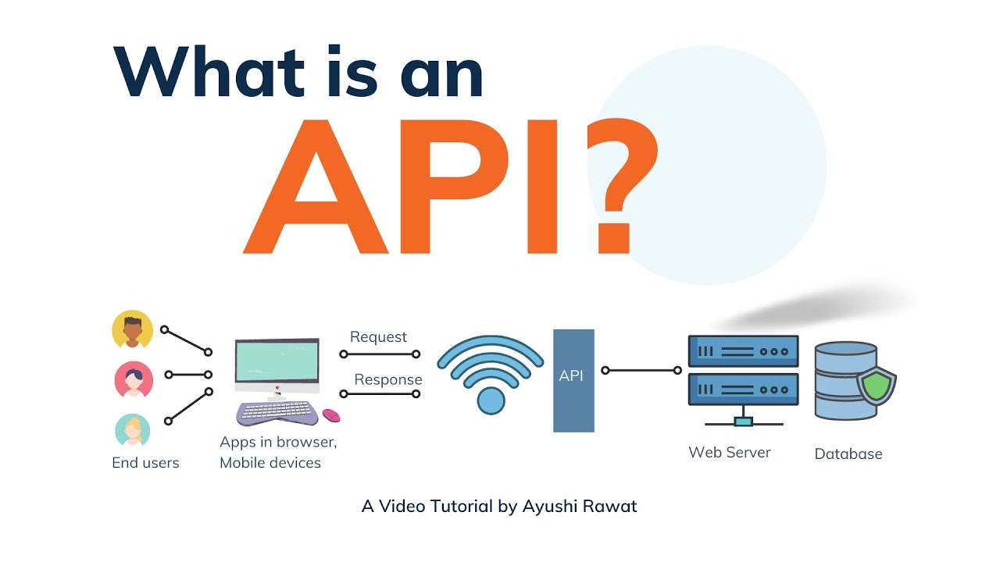
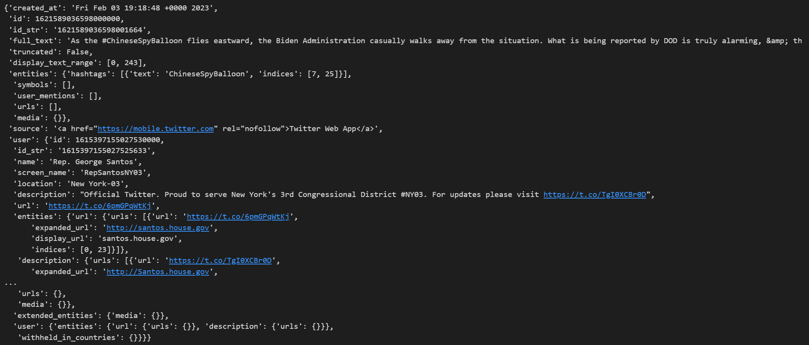

# What is an API?

An API (Application Programming Interface) is, as the name states, an interface that enables the exchange of information and data between two agents (i.e. a website or database and a user). The API itself is not the instance, that contains the data, but purely for the communication between the two sides, that want to exchange data. 

There are many kinds of API:

- The big social media platforms usually have an API which you can use to retreive data i.e. 
    - [X (previously known as Twitter)](https://developer.twitter.com/en/docs/twitter-api) (to retreive information on users and tweets, dates, likes and retweets - unfortunately behind a paywall now)
    - [YouTube](https://developers.google.com/youtube/v3/docs) (for information on channels, videos, followers, clicks etc.)
    - [Reddit](https://www.reddit.com/dev/api/) (on subreddits and comments) 
    - [Spotify](https://developer.spotify.com/documentation/web-api) (on artists, songs, albums)
- Imagine you have a company producing a product which you are selling online. Your website should display the correct stock of each item, which is stored in a (external) warehouse. The warehouse has its own system to keep track of the stocks (and could potentially be changed). If you are using an API to provide information on stocks from the warehouse system to your website, you are independant of the actualy system, the warehouse is using. 
- You can also use APIs for services like i.e. classification. 
    - The [Perspective API](https://perspectiveapi.com/) is an API which classifies the degree of toxicity in a text (on a scale of 0 to 1)
    - The [Spotify API](https://developer.spotify.com/documentation/web-api) can determine some features of a song (danceability, tempo, instrumentalness, etc.)



There are different types of APIs, differing in their architectural structure and usage (for more information, see this [blog](https://blog.postman.com/soap-vs-rest/)). The two major types are:

### SOAP APIs

SOAP stands for **S**imple **O**bject **A**ccess **P**rotocol and is a type of API that is usually associated with enterprises.
SOAP APIs have

- Strict security requirements and regulations (stricter contract-based usage)
- Therefore, better fit for systems that send and receive highly sensitive data, i.e. financial and healthcare information
- Mostly designed around actions


### REST APIs

REST is an acronym for **RE**presentational **S**tate **T**ransfer and is an API architecture designed for access to web services (whose structure can change often).

The REST architecture ensures consistent access based on some priciples:

* Statelessness: the client (user) provides all necessary details so that the server does not have to care about the clients state 
* Consistent interface: ensures consistent and simple interactions using common HTTP methods like GET or POST
* Standard media type support: provide resources in standard data formats like i.e. JSON
* Separation of concerns: ensures that client (user) and server are completely de-coupled and can evolve independently from each other
* Layered architecture: so that the system can be modular and maintainable

REST APIs are typically used for public APIs and are ideal for fetching data from the Web. They are much lighter and closer to the HTTP specification than SOAP.
REST APIs are what we are usually interested in.


# Why to use an API?

Maybe you are wondering "Why the hell should I care about APIs if I can also download a csv-file or scrape a website?"

Well, there are several reasons:

**APIs provide a standardised way to access the data.** In order to retreive the data, you *don't have to know or understand the internal structure* of how the data is stored, but just the command (sytax) on how to communicate, what you want to get. If you are webscraping a page, for example, you have to know the structure to specifically define the html-elements, you want to retreive. Image the website being updated or resturctured. Now, your code won't run again, because the html-structure changed. With an API, you have an interface between the actual data and yourself, the user, which *ensures that the data access remains consistent*, even if the websites layout or database layout changes.

**You want to retrieve only small pieces if data.** When downloading csv-files, you usually get the whole data and then need to filter for i.e. users or dates you are actually interested in. With APIs you can immediately define, which data you need (in i.e. terms of users, YouTube channels or time frames) and only collect this data.

**Less repeated computation.** You can use services and functions, someone else already programmed and do not have to do everything yourself. 

APIs therefore provide a standardized way of accessing the data and enable fast and efficient exchange, indepenadent of whether the websites layout or data base structure changes of not. 

### Retrieving data from an API

In the same way as with webscraping we also have to make *requests* to an API in order to get a *response*.


* 1. The first step is to **request** a URL. 
    - APIs have (multiple) so called **endpoints**. These are different endings (suffixes) to the same base URL and provide access to different parts and pieces of information. For example with the YouTube API you have endpoints for channels, for videos, for comments for playlists etc. This way, you can clearly specify, which exact information you need to retreive. 
        - `https://www.googleapis.com/youtube/v3/videos`
        - `https://www.googleapis.com/youtube/v3/channels`
        - `https://www.googleapis.com/youtube/v3/comments`

    - Using the APIs **parameters** you can further refine your request. For example specify certain channel ids, for which you would like to retrive data (instead of getting them for all channels)
        - channel id 
        - statistics will encapsulate a channels statistics (like viewCount, commentCount etc.)
        - status (privat or public channel)
 

* 2. Once you've send the request, you will **get a response** in return (usually in JSON format) which you have to further process to extract and store the desired data.


**Documentation pages**

If you are wondering how to find out about the possible endpoints and parameters, each **APIs documentation page** will give you an overview. 
* The documentation pages might seem quiet messy and complex at first. Take your time to read and understand them. Usually, they are built in similar ways so you will get used to working with them.
* You will find all relevant information on there
    - i.e. regarding possible endpoints
    - or regarding query parameters
    
* Usually, there are also some examples or a sandbox, where you can pre-test your query to see, if it works
* Additionally, the documentation pages provide information the the returned response, its content and format

**API-Keys**

Not all APIs are free and publically available. Often, you will have to register for the API access. 
This means, you need to sign in in some way (usually by providing an e-mail adress) in order to get a so called API-key for authentication.
It depends on the specific API if this is free or if you need to pay for the access.

Once you've got an API-key it needs to be provided as a parameter in you API call.
Additionally, you have to be aware that for some APIs there can be a limit in i.e. the number of requests, you can make using this key. 

# Trying an API

There are three easy (and free) APIs that predict a persons age, gender and nationality based on a given name.

We are going to start with the age-API.

The documentation tells us that, in order to request the predicted age of a name, we have to access the following url where we hand over the query-parameter, here the name for example michael: https://api.agify.io?name=michael

First, we need the *httr* R package, which allows us to send requests to an API and gather their results. 

```{r setup}
library(httr)
```

The httr package has a function called GET that we can use to make the request. Requests are based on a url, for example, to get the age prediction for the name David in Spain:

```{r nameReq}
result <- GET(paste0("https://api.agify.io?name=David&country_id=ES"), accept_json())
result
```

Apart from that, we also get the response content. This content-body is stored in a JSON-format, which you can traverse as a set of lists and data frames. In this case, the content is simple, just a list with three named elements: count, name, and age

```{r name}
rescontent <- content(result, type="application/json")
rescontent
```

In our request above, "https://api.agify.io" is what we call the *endpoint* part of the URL, which allows us to set the values of some parameters to configure what we get. The part "?name=David&country_id=ES" contains the parameter value list, which starts with *?* and has parameter initializations of the form *parameter=value* separated by *&*. Depending on the endpoint you have different parameters and the documentation tells you about the parameters and the limits of requests you can make: https://agify.io/documentation

**More on JSON**

JSON is the short version for 'JavaScript Object Notation' and is an easy to read data format.
Since it is independent of a programming language is is mainly used to exchange information between applications.

JSON-files are in their structure similar to named lists or data frames. Below you can see a response-example from the Twitter API:



# Reddit API example

Reddit as an API to access its content. You can make an account and authenticate to make a lot of requests following its documentation, but you can also make simple requests for JSON versions of what you see while browsing. For example, you can request the frontpage of a subreddit like this:

```{r subreddit}
srd <- "funny"
srresults <- GET(paste0('https://www.reddit.com/r/',srd,'.json'), accept_json())
srjson <- content(srresults, type="application/json")
```

The structure of the content is more complicated than for agify.io, but you can see that in "$data$children", you have a list with the data visible on the page. Each element has its own $data field with information like the title and the score of the post:

```{r subredditData}
srlist <- srjson$data$children

srlist[[3]]$data$title
srlist[[3]]$data$score
as.Date(as.POSIXct(srlist[[3]]$data$created, origin="1970-01-01")) # We skip the first two results because they are pinned mod posts
```

Depending on the endpoint, you will have parameters you can set. For example, you can query the *top* results of the subreddit configuring the time period and the number of results (up to 100):

```{r subreddit2}
srresults <- GET(paste0('https://www.reddit.com/r/',srd,'/top.json?t=year&limit=100'), accept_json())
srjson <- content(srresults, type="application/json")
srlist <- srjson$data$children

srlist[[1]]$data$title
srlist[[1]]$data$score
as.Date(as.POSIXct(srlist[[1]]$data$created, origin="1970-01-01")) # post in the last year with the highest score
```


You have to be careful when accessing Redddit's API this way, without registering. Reddit will limit the number of requests you can make per minute and it's good to have a waiting time of about 15 seconds between requests. If you want to get more data, you can make a free account in the API to get a key you can use for your requests, you can find more information here: https://www.reddit.com/wiki/api/ .