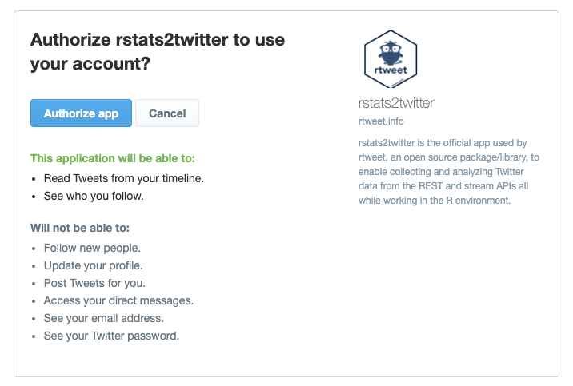

### Twitter

<div style="float:right">
  
<center>Twitter's logo</center>
</div>
A quick overview of [Twitter](www.twitter.com):  

- Users write public tweets of limited length. In the beginning the maximum length was 140 characters, now it is 280  
- A user can follow another to see their tweets in their feed  
- Tweets can be copied by other users, or retweeted  
- Tweets can contain links and @ mentions to other users  
- Hasthags start with # and identify discussion topics  
- In 2016, Twitter had more than 300 million active users  
- User profiles are public unless set as private. Public Twitter user profiles can be seen by anyone, even without a Twitter account. For example www.twitter.com/dgarcia_eu  

Twitter has an Application Programming Interface (API) to access tweets and user data. You can access this API from various packages in programming languages like R, python, or java. To access the API you need to make a Twitter account, and when you do so you agree to the [terms of Twitter](https://twitter.com/en/tos) to access their service and their data. There is an additional set of [terms for developers](https://developer.twitter.com/en/developer-terms/agreement-and-policy) that access the API and to limit how data can be shared outside Twitter. All exercises in this course respect the Twitter terms of service and the developer policy, but you should keep in mind these rules in case you do further projects with the Twitter API.

### The rtweet package

There are several R package to access the Twitter API. The Twitter API changes very often and package developers have to adapt their packages if they want them to keep on working as expected. As of 2021 the best maintained package for R is [rtweet](https://cran.r-project.org/web/packages/rtweet/). You can find many examples and functionalities of the package in its [github repository](https://github.com/ropensci/rtweet) and documentation about its functions at [https://docs.ropensci.org/rtweet/reference/index.html](https://docs.ropensci.org/rtweet/reference/index.html).

You can install it with the typical install.packages() call. This tutorial will use some functions of rtweet that need you to have the package httpuv installed too:
```{r eval=FALSE}
install.packages("rtweet")
install.packages("httpuv")
```

To start using rtweet, you only need to load it with the library() function. The dependencies with httpuv are handled inside rtweet, so you only need to load one package:
```{r}
library(rtweet)
```

### Connecting to the Twitter API

rtweet allows a very easy way to access the Twitter API from R thanks to the rstats2twitter application. Before you run this code, open a browser and log into your Twitter account. Then in an interactive R session (for example what you have in the Console of RStudio), call one of rtweet functions like this one:

```{r, message=F, warning=F}
result <- lookup_users("dgarcia_eu")
```

The first time you run this function will open a window in your browser asking for permissions to the rstats2twitter app in your Twitter account. This app on Twitter will allow you to use the API with your Twitter account. If you do not want to use rtweet this way in the future, you can always disconnect the app from your Twitter account at https://twitter.com/settings/connected_apps.

{width=80%}

Once you have given permissions, rtweet will save your connection in your R configuration and you can access the Twitter API from R from now on. This will work from interactive R sessions like when you are running R chunks in RStudio. If you want to run automated scripts or knit markdown, you will need to connect with a token as a developer. Check the appendix at the end of this tutorial if you want to learn more.

### User profiles

We can get the basic profile information of a user with the lookup_users() function of rtweet. You can request information on many users at once and get a data frame with a row for each user. Here is an example that uses the dplyr function glimpse() to format such large output:
```{r, message=F, warning=F}
library(dplyr)
result <- lookup_users("dgarcia_eu")
glimpse(result)
```

As you see, not all the fields of a user object are filled. Some of the most useful fields are:  

- **user_id**: a long number that identifies the user in all Twitter data
- **screen_name**: the screen name of the user could be changed by the user at some point. For that reason is better to use user ids for reference
- **name**: name of the account, which is usually a person or organization name. This doesn't have to be unique on Twitter.
- **location**: a user-provided character string describing the user location. This could be a city, a country, could be empty, or something nonesense. Does not have to match the real location of the user, but often it does.
- **description**: user-provided description text. Here users often describe their job, their hobbies, they sometimes provide their preferred pronouns, or link to their other profiles or websites.
- **protected**: a binary value whether the account is public or not. Protected accounts are not public and you cannot get further information on their profile or tweets.
- **followers_count**, **friends_count**, etc: various counts on the user activity and properties. friends_count refers to the number of accounts followed by this user.
- **account_created_at**: timestamp of the creation of the account with second resolution.
- **verified**: a binary value of whether the user has been verified by Twitter, i.e. they got the blue tick next to their name.

The result contains also the information of the latest tweet of the user. Some of the columns in this data frame are for that tweet, for example **text** and **is_retweet**. 

### User timelines

If you want more than just the last tweet of a user, you can use the get_timeline() function to get the latest tweets of a user:

```{r}
glimpse(get_timeline(user="dgarcia_eu", n=10))
```

We use the dplyr glimpse() function again to make the output readable. We get a data frame with one row per tweet and one column for each of the fields of the tweets. Twitter has restrictions on how to share this data, but you can always share the tweet numeric ids and other developers can request the content of the tweets themselves through the API.

The parameter n=10 told rtweet that we just want the latest 10 tweets. You can get up to the latest 3200 tweets from a user. Twitter has 
[rate limits](https://developer.twitter.com/en/docs/rate-limits) on the number of requests per 15-minute windows you can make. The get_timeline() function needs to make one request per 200 tweets, so plan accordingly in case you want to make many requests.

### Tweet content

You can look up the content of individual tweets if you know their numeric ids. This is very useful in case you got a dataset just with tweet ids but no other data. Take care of making sure that you treat these ids as strings because they are such long numbers that they can be truncated if you treat them as integers. Here is an example of the result:
```{r}
tweet <- lookup_tweets("1344740446069809152")
glimpse(tweet)
```

The results has many fields, some of the most useful ones are:

- **user_id**: numeric id of the user who created the tweet
- **created_at**: timestamp of the tweet creation with second resolution
- **text**: text of the tweet
- **source**: app or service used to post the tweet. This is often a Twitter phone app or the Twitter web.
- **reply_to_status_id**: if this tweet is a reply, the id of the tweet being replied to
- **reply_to_user_id**: if this tweet is a reply, the numeric id of the user who posted the tweet that is being replied to
- **is_retweet**: Boolean value of whether the tweet is a retweet or not
- **favorite_count, retweet_count**, etc: counts of user engagements with the tweet
- **lang**: Twitter-detected language of the tweet
- **retweet_status_id**: if this tweet is a retweet, the id of the retweeted tweet
- **retweet_user_id**: if this tweet is a retweet, the numeric id of the user who posted the original tweet being retweeted

There are many other functions in the rtweet package. We will learn more in the [Twitter networks tutorial]() but you can already start looking at them in the [documentation of rtweet](https://docs.ropensci.org/rtweet/reference/index.html).

### Appendix: connecting as developer

Using the Twitter API as a developer is more convenient because it allows you to run R codes automatically and it provides more stable and easy-to-track permissions.

The rtweet package provides an excellent vignette explaining how to connect like this. You will have to fill a form for Twitter to give you access as a developer. In this form, they will ask you questions about what you want to do with the API. In the part "tell us how this app will be used", explain in your own words that this app is for a Social Data Science course (mention that you are enrolled if that is the case) and say that you won't interact with users in any way. This is important so Twitter can avoid developers from creating malicious bots that automatically interact with real users, if you don't say this or are not specific enough, your application might take long to be approved.

Running the following code will take you to the vignette. Follow the steps in the vignette to set up your access token:

```{r eval=F} 
vignette("auth", package = "rtweet")
```

Once you have the token created, it will be saved and you can loaded automatically in future R sessions. Other tutorials and exercises in this course will use this functionality, for example the [Twitter network data tutorial](https://dgarcia-eu.github.io/SocialDataScience/4_SNA/047_TwitterNetwork/TwitterNetwork.html), but if you run the code in an interactive R session, you can still run the tutorial even if you didn't get a developer account yet.

